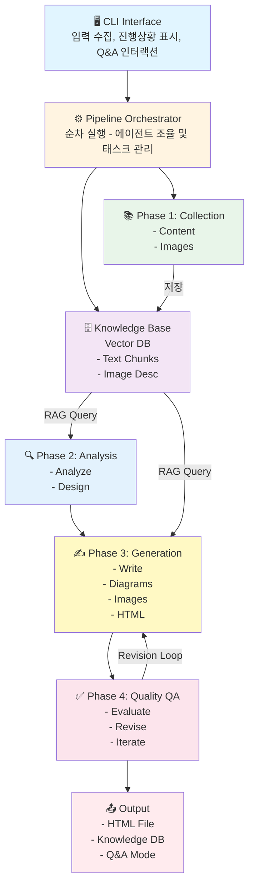

# LectureForge Pro - AI-Powered Lecture Material Generator

> **프로젝트 상태**: 🌟 **Production Ready+** (RMC Self-Review)
> **버전**: 0.6.2 | **최종 수정**: 2026-04-27
> **PyPI**: https://pypi.org/project/lecture-forge/

## 📚 프로젝트 개요

### 목적
다양한 소스(PDF, URL, 인터넷 검색)로부터 정보를 자동 수집하여 고품질 강의자료를 생성하는 Multi-Agent 파이프라인 시스템

### 핵심 기능
1. **멀티소스 컨텐츠 수집**: PDF, URL, 키워드 검색을 통한 포괄적 정보 수집
2. **지식창고 + RAG 기반 Q&A**: 수집된 정보를 벡터 DB에 저장하고 대화형 탐색 지원
3. **다국어 지원**: 자동 언어 감지, Cross-lingual 검색, 한영 혼합 PDF 지원
4. **고급 RAG 품질**: 400단어 구조화 답변, 15+15 듀얼 쿼리, Rich 렌더링, 신뢰도 수정
5. **고성능 RAG 캐싱**: 쿼리 결과 캐싱으로 60% 성능 향상
6. **멀티모달 처리**: 텍스트 + 이미지 자동 추출 및 활용
7. **Location-based 이미지 매칭**: RAG 컨텍스트 페이지 기반 이미지 자동 배치 (+750% 활용률)
8. **대화형 이미지 편집**: 생성된 강의의 이미지 삭제/교체 (Vector DB 기반 대안 검색)
9. **자동 품질 보증**: 6차원 평가 + 반복적 개선 (최대 3회)
10. **구조화된 HTML 출력**: Mermaid 다이어그램, 검색 인덱스, 이미지/다이어그램 클릭 확대
11. **프레젠테이션 슬라이드**: Reveal.js 기반 자동 슬라이드 변환 (`--to-slides`) — 발표자 노트 기본 포함, `--without-notes`로 제외 — 섹션별 LLM 재작성 기본 포함 (≤35자, 말줄임표 없음)
12. **KB 기반 재평가·보충**: 기존 강의 품질 재평가 + 미반영 청크 보충 추가 (`--re-evaluate`, `→ *_enhanced.html`)
13. **영문 PDF 번역** (v0.4.1+): 영어 PDF → 한국어 강의자료 (`translate` 명령어) — TOC 감지, 아티팩트 제거, 용어 사전, 이미지 자동 배치
14. **사용자 친화적 디렉토리**: `~/Documents/LectureForge/` + `home` 커맨드로 빠른 접근
15. **예외 처리 시스템**: 구조화된 예외 계층 (9개 카테고리)
16. **템플릿 기반 프롬프트**: 재사용 가능한 프롬프트 템플릿
17. **Async I/O 지원**: 병렬 I/O 처리로 컨텐츠 수집 70% 성능 향상
18. **RMC 자기검토**: 에이전트 내부 2단계 자기반성 (커리큘럼 논리, 콘텐츠 품질, Q&A 할루시네이션 검출)
19. **웹 기반 강의 편집기**: 3-패널 SPA 에디터 — 섹션 CRUD, Markdown 편집 (EasyMDE), 이미지 갤러리·대안 검색 (`edit` 명령어, v0.5.0)
20. **Ollama LLM 지원** (v0.5.5+): 로컬 LLM(`LLM_PROVIDER=ollama`)으로 OpenAI 없이 강의 생성 — `create_llm()` 팩토리로 provider 추상화, `OLLAMA_MODEL`/`OLLAMA_BASE_URL` 환경변수 설정
21. **Agent-Evaluator 계측** (v0.6.1+, opt-in): `create --eval <DIR>` — Gate A–G 파이프라인 품질 계측; `pip install "lecture-forge[eval]"` 또는 `pip install agent-evaluator`

### 기술 스택
- **Framework**: LangChain
- **LLM**: OpenAI GPT-4o-mini (기본), GPT-4o (Vision); **Ollama** (로컬 LLM, `LLM_PROVIDER=ollama`)
- **Vector DB**: ChromaDB (로컬)
- **CLI**: Click, Rich, prompt-toolkit (Enhanced Input)
- **다국어**: langdetect (언어 감지), GPT-4o-mini (번역)
- **예외 처리**: 구조화된 예외 계층 (9개 카테고리)
- **프롬프트**: 템플릿 기반 관리 시스템
- **Async I/O**: httpx (async HTTP), aiofiles (async file I/O), asyncio
- **배포**: pip installable package
- **Python**: 3.11-3.13 (전체 지원)

### 의존성 배포 전략

`lecture-forge[eval]`은 `agent-evaluator>=0.9.0`을 설치한다. 버전 정책:

| 계층 | 설치 | 포함 패키지 |
|------|------|-----------|
| 기본 (`pip install lecture-forge`) | 코어만 | numpy, pandas, openai, anthropic 등 |
| `[eval]` (`pip install "lecture-forge[eval]"`) | + agent-evaluator 코어 | 평가 메트릭, LLMJudge |
| Phoenix/OTEL 추적 필요 시 | + `agent-evaluator[otel]` | arize-phoenix, opentelemetry-* |
| 대시보드 필요 시 | + `agent-evaluator[serve]` | fastapi, uvicorn, jinja2 |

**핵심 원칙**: 무거운 패키지(`arize-phoenix` 등)는 절대 하드 `dependencies`에 넣지 말 것. pip의 백트래킹 해소기가 `resolution-too-deep` 오류를 낸다. Optional extras로만 선언하고, 실제 기능 진입점에서 lazy import + 미설치 경고 패턴을 사용한다.

---

## 🏗️ 시스템 아키텍처

### 전체 워크플로우



---

## 🤖 에이전트 시스템

### 12개 에이전트 구성

| 에이전트 | 역할 | 주요 기능 |
|---------|------|----------|
| **Content Collector** 📚 | 텍스트 수집 | PDF 파싱, 웹 크롤링, 검색, 벡터화 |
| **Image Collector** 🖼️ | 이미지 수집 | PDF/웹 이미지 추출, API 검색, 중복 제거 |
| **Content Analyzer** 🔍 | 컨텐츠 분석 | 엔티티 추출, 토픽 클러스터, 난이도 분석 |
| **Curriculum Designer** 📋 | 강의 설계 | 학습 목표, 섹션 분할, 시간 배분, RMC 검토 |
| **Content Writer** ✍️ | 컨텐츠 생성 | RAG 기반 섹션별 작성, 이미지 배치, RMC 검토 |
| **Content Enhancer** 🔧 | 콘텐츠 보강 | KB 기반 재평가·미반영 청크 보충 (`--re-evaluate`) |
| **Diagram Generator** 📊 | 다이어그램 | Mermaid 코드 자동 생성 |
| **HTML Assembler** 🎨 | HTML 생성 | 템플릿 렌더링, 스타일링, 검색 인덱스 |
| **Quality Evaluator** ✅ | 품질 평가 | 6차원 평가, LLM-as-Judge |
| **Revision Agent** 🔄 | 개선 | 자동/반자동 수정, 반복 개선 |
| **Q&A Agent** 🤖 | 대화형 Q&A | RAG 기반 질문 응답, 소스 인용, RMC 검토 |
| **PDF Translator** 🌐 | PDF 번역 | 영문 PDF → 한국어 강의자료, TOC 감지, 용어사전 |

---

## 📦 프로젝트 구조

### 소스 코드

```
lecture-forge/  (Git 저장소)
├── 📄 README.md                    ✅ 프로젝트 소개
├── 📄 CLAUDE.md                    ✅ 이 파일 (프로젝트 가이드)
├── 📄 .env.example                 ✅ 환경 변수 템플릿
├── ⚙️ setup.py                     ✅ pip 패키지 설정
├── ⚙️ pyproject.toml               ✅ 빌드 설정
├── 📄 requirements.txt             ✅ 의존성
│
└── 📂 src/lecture_forge/
    ├── 🤖 agents/                  ✅ 12개 에이전트 (+ async 변형 1개)
    ├── 🛠️ tools/                   ✅ 9개 도구 (+ async 변형 2개)
    ├── 📚 knowledge/               ✅ Vector DB & RAG (캐싱)
    ├── ✅ quality/                 ✅ 품질 평가 시스템
    ├── 📊 models/                  ✅ 데이터 모델
    ├── 🔧 utils/                   ✅ 유틸리티 (prompt_manager, retry, html_parser, json_utils 포함)
    ├── 🎨 templates/               ✅ HTML 템플릿 + 프롬프트 템플릿 + 에디터 SPA
    ├── 💻 cli/                     ✅ CLI 모듈 (9개 명령어)
    ├── 🎬 slides/                  ✅ Reveal.js 슬라이드 변환
    ├── 🌐 editor/                  ✅ 웹 에디터 서버 (Flask, html_editor, server)
    ├── 🔬 eval/                    ✅ agent-evaluator 계측 모듈 (monitor, adapters, v0.6.1+)
    ├── ⚙️ config.py                ✅ 설정 관리 (자동 마이그레이션)
    └── 🎯 exceptions.py            ✅ 예외 처리 시스템 (9개 카테고리)
```

### 사용자 데이터 (런타임 생성)

```
~/Documents/LectureForge/  (Mac/Linux)
%USERPROFILE%\Documents\LectureForge  (Windows)
│
├── 🔐 .env                         환경 변수 (API 키)
├── 📁 data/
│   ├── 🗄️ vector_db/               ChromaDB (지식베이스)
│   ├── 🖼️ images/                  수집 이미지
│   └── 💾 cache/                   RAG 쿼리 캐시
└── 📤 outputs/                     생성된 강의자료 (HTML)
```

```bash
lecture-forge home          # 메인 폴더 열기
lecture-forge home outputs  # 강의 결과물 확인
lecture-forge home data     # 데이터 폴더
lecture-forge home kb       # 최신 지식베이스
lecture-forge home env      # .env 편집
```

### 주요 모듈

#### 예외 처리 시스템 (`exceptions.py`)

```python
from lecture_forge.exceptions import (
    LectureForgeError,          # 기본 예외
    ContentCollectionError,     # 컨텐츠 수집 오류
    RAGError,                   # RAG/Vector DB 오류
    ImageProcessingError,       # 이미지 처리 오류
    ContentGenerationError,     # LLM 생성 오류
    QualityEvaluationError,     # 품질 평가 오류
    ConfigurationError,         # 설정 오류
    MissingAPIKeyError,         # API 키 누락
    ValidationError,            # 입력 검증 오류
)
```

#### 프롬프트 관리 시스템 (`utils/prompt_manager.py`)

```python
from lecture_forge.utils.prompt_manager import load_prompt

prompt = load_prompt(
    "content_generation",
    topic="Python Basics",
    min_words=1000,
    target_words=1500,
)
```

2개 템플릿: `content_generation`, `content_expansion`

---

## 🚀 빠른 시작

### 1. 설치

#### 방법 1: pipx (가장 간편 ⭐⭐)

```bash
pip install pipx && pipx ensurepath
pipx install lecture-forge
pipx inject lecture-forge playwright
playwright install chromium
```

#### 방법 2: PyPI + conda (권장 ⭐)

```bash
conda create -n lecture-forge python=3.11
conda activate lecture-forge
pip install lecture-forge
playwright install chromium
```

#### 방법 3: 개발 설치

```bash
conda create -n lecture-forge python=3.11
conda activate lecture-forge
pip install -e .
playwright install chromium
```

**Python 버전 지원**: 3.11 (권장) / 3.12 / 3.13 모두 지원

### 2. 환경 변수 설정

```bash
# 필수
OPENAI_API_KEY=sk-proj-...
SERPER_API_KEY=...

# 선택 (이미지 검색)
PEXELS_API_KEY=...
UNSPLASH_ACCESS_KEY=...
```

### 3. 강의 생성

```bash
lecture-forge create                              # 기본 대화형
lecture-forge create --image-search               # 이미지 검색 포함
lecture-forge create --quality-level strict       # 고품질 모드
```

### 4. Q&A 모드

```bash
lecture-forge chat
lecture-forge chat -kb ./data/vector_db/AI_Engineering_20260207_094851
```

---

## 💻 CLI 사용법

### 명령어 요약

```bash
# ===== CREATE: 강의 생성 =====
lecture-forge create                              # 기본 대화형
lecture-forge create --config config.yaml         # 설정 파일 (-c)
lecture-forge create --interactive                # 생성 중 대화형 Q&A (-i)
lecture-forge create --image-search               # 이미지 검색
lecture-forge create --quality-level strict       # 품질 레벨 (lenient/balanced/strict)
lecture-forge create --output my_lecture          # 출력 파일명 (-o)
lecture-forge create --async-mode                 # Async I/O (70% 빠름, 실험적)
lecture-forge create --existing-kb <path>         # 기존 지식베이스 재사용
lecture-forge create --existing-kb <path> --kb-mode extend  # 기존 KB 확장
lecture-forge create --eval eval_results/         # agent-evaluator 계측 (opt-in, v0.6.1+)

# ===== CHAT: Q&A 모드 =====
lecture-forge chat                                # 자동 선택
lecture-forge chat -kb <path>                     # 지식베이스 지정

# ===== TRANSLATE: 영문 PDF → 한국어 강의자료 =====
lecture-forge translate paper.pdf                                    # 기본 번역
lecture-forge translate paper.pdf -o my_lecture_ko                  # 출력명 지정
lecture-forge translate paper.pdf --no-translate                     # 원문 구조만 (번역 없음, 빠름)
lecture-forge translate paper.pdf --audience-level beginner          # 초급 수준 번역
lecture-forge translate paper.pdf --quality-level strict --with-slides  # 고품질 + 슬라이드
lecture-forge translate paper.pdf --with-diagrams                    # Mermaid 다이어그램 생성 (opt-in)

# ===== EDIT: 웹 기반 강의 편집기 =====
lecture-forge edit <html_path>                    # 웹 편집기 실행 (포트 5757)
lecture-forge edit <html_path> --port 8080        # 커스텀 포트
lecture-forge edit <html_path> --no-browser       # 브라우저 자동 오픈 없이 실행

# ===== EDIT-IMAGES: 이미지 편집 =====
lecture-forge edit-images <html_path>             # 대화형 이미지 편집
lecture-forge edit-images <html_path> -o output   # 출력 파일 지정

# ===== IMPROVE: 강의 향상 =====
lecture-forge improve <html_path> --to-slides              # 슬라이드 변환 (발표자 노트 자동 포함)
lecture-forge improve <html_path> --to-slides --without-notes # 발표자 노트 없이 슬라이드 변환
lecture-forge improve <html_path> --re-evaluate            # KB 기반 재평가 + 보충 (→ *_enhanced.html)
lecture-forge improve <html_path> --re-evaluate --quality-level strict  # 엄격한 기준
lecture-forge improve <html_path> --re-evaluate --kb <vector_db_path>   # KB 수동 지정

# ===== CLEANUP: 지식베이스 정리 =====
lecture-forge cleanup                             # 대화형 선택
lecture-forge cleanup --all                       # 전체 삭제 (주의!)

# ===== HOME: 폴더 열기 =====
lecture-forge home                                # 메인 폴더
lecture-forge home outputs / data / kb / env

# ===== 기타 =====
lecture-forge --version
lecture-forge --help
```

---

## 🔧 환경 설정

### API 키 획득

| API | URL | 비용 | 용도 |
|-----|-----|------|------|
| **OpenAI** | [platform.openai.com](https://platform.openai.com) | 사용량 기반 | LLM, 임베딩 (OpenAI 모드) |
| **Ollama** | [ollama.com](https://ollama.com) | 무료 (로컬) | LLM, 임베딩 (Ollama 모드, 선택) |
| **Serper** | [serper.dev](https://serper.dev) | 2,500회/월 무료 | 웹 검색 (필수) |
| **Pexels** | [pexels.com/api](https://pexels.com/api) | 무료 | 이미지 검색 (선택) |
| **Unsplash** | [unsplash.com/developers](https://unsplash.com/developers) | 50회/시간 무료 | 이미지 검색 (선택) |

### .env 파일 예시

**OpenAI 사용 (기본)**:
```bash
OPENAI_API_KEY=sk-proj-...
DEFAULT_MODEL=gpt-5-nano
EMBEDDING_MODEL=text-embedding-3-small
SERPER_API_KEY=...
PEXELS_API_KEY=...           # 선택
UNSPLASH_ACCESS_KEY=...      # 선택
QUALITY_THRESHOLD=80
MAX_ITERATIONS=3
```

**Ollama 사용 (로컬 LLM, API 키 불필요)**:
```bash
LLM_PROVIDER=ollama
OLLAMA_BASE_URL=http://localhost:11434
OLLAMA_MODEL=llama3.2
OLLAMA_EMBEDDING_MODEL=nomic-embed-text
SERPER_API_KEY=...           # 웹 검색용은 여전히 필요
```

---

## 📊 비용 추정 (180분 강의, GPT-4o-mini 기준)

| 작업 | 비용 |
|-----|------|
| Content Collection | $0.01 |
| Content Analysis | $0.02 |
| Curriculum Design | $0.01 |
| Content Writing | $0.06 |
| Diagram Generation | $0.01 |
| Quality Evaluation | $0.03 |
| Revision (1회) | $0.03 |
| **총계** | **~$0.17** (실측 $0.105) |

- 60분 강의: ~$0.035 (실측)
- 180분 강의: ~$0.105 (실측)

---

## 💡 FAQ

**Q: 현재 사용 가능한가요?**
A: **네! Production Ready 상태입니다.**

**Q: 비용이 얼마나 드나요?**
A: 60분 강의 약 $0.035, 180분 약 $0.105 (GPT-4o-mini 실측).

**Q: 오프라인에서 사용 가능한가요?**
A: **Ollama 사용 시**: 강의 생성도 오프라인 가능 (웹 검색 제외). **OpenAI 사용 시**: 생성 시 API 필요. 생성된 HTML과 지식창고는 어느 모드에서든 오프라인 사용 가능.

**Q: 이미지 API 없이도 되나요?**
A: 네, PDF/URL 이미지만으로도 작동합니다. Pexels/Unsplash는 선택사항.

**Q: Python 버전 호환성은?**
A: Python 3.11, 3.12, 3.13 모두 지원합니다 (v0.3.8+).

**Q: 강의 자료는 어디에 저장되나요?**
A: `~/Documents/LectureForge/outputs/`. `lecture-forge home outputs`로 바로 열기 가능.

**Q: Chat 모드 종료 방법은?**
A: `/exit` 또는 `/quit`, 또는 `Ctrl+C`.

**Q: 테스트 실행 방법은?**
A: `pytest tests/ -v` (1,891+ 테스트, ~81% 커버리지)

---

## 📚 참고 문서

- **README.md**: 사용자 안내, CLI 가이드, 변경 이력
- **docs/guides/getting-started.md**: 첫 사용 가이드
- **docs/api/cli.md**: CLI 명령어 상세
- **docs/architecture/system-overview.md**: 아키텍처 상세
- **DEPLOYMENT_GUIDE.md**: PyPI 배포 절차
- **.env.example**: 전체 환경변수 목록
- [LangChain 문서](https://python.langchain.com/docs/)
- [ChromaDB 문서](https://docs.trychroma.com/)
- [OpenAI API](https://platform.openai.com/docs/)

---

## 📊 프로젝트 통계

| 항목 | 수치 |
|------|------|
| 에이전트 | 12개 (+ async 변형 1개) |
| 도구 | 9개 (+ async 변형 2개) |
| CLI 명령어 | 9개 |
| 테스트 | 1,891+, ~81% 커버리지 |
| Type Hints | ~70% (340/489 함수) |
| Python 지원 | 3.11 / 3.12 / 3.13 |
| 비용 | ~$0.035 / 60분 강의 |
| 데이터 저장 | ~/Documents/LectureForge/ |

---

## 📝 변경 이력 (최근)

> 전체 변경 이력은 README.md 참조

### v0.6.2 (2026-04-27) — 📦 agent-evaluator 0.9.0 의존성 정비 + 배포 전략 문서화

- 🐛 **pipx `resolution-too-deep` 수정** (agent-evaluator 0.9.0): `arize-phoenix`·`opentelemetry-*`·`fastapi`·`uvicorn`·`pdfplumber`를 하드 deps에서 optional extras로 분리
- 📝 **의존성 배포 전략 절 신설** (CLAUDE.md): extras 계층 표 + 핵심 원칙 문서화
- 📝 **README.md 배포 전략 설명 추가**

### v0.6.1 (2026-04-24 ~ 2026-04-27) — 🔬 agent-evaluator 계측 통합 + openai SDK v2 지원 + 의존성 배포 전략 정비

- 🔬 **agent-evaluator 계측 통합** (opt-in): `generate_lecture(eval_output_dir=...)` — `ContentWriterAdapter`, `CurriculumDesignerAdapter`, `ContentAnalyzerAdapter`, `QualityEvaluatorAdapter` 래퍼로 파이프라인 계측; 미설치 시 경고 후 스킵
- 📦 **`eval/` 모듈 추가**: `monitor.py` (`build_lecture_monitor()`), `adapters.py` — agent-evaluator 연동용 어댑터 집합
- 🔧 **openai SDK 버전 범위 확장**: `openai>=1.12.0,<2.0.0` → `<3.0.0` — openai v2.x SDK 지원
- 🐛 **agent-evaluator 0.9.0 — 의존성 배포 전략 정비** (2026-04-27):
  - **원인**: `arize-phoenix>=7.0.0`이 하드 `dependencies`에 있어 pip 백트래킹 해소기가 `resolution-too-deep` 오류 발생 (`pipx install "lecture-forge[eval]"` 실패)
  - **해결**: `arize-phoenix`, `opentelemetry-sdk`, `opentelemetry-exporter-otlp-proto-http`, `fastapi`, `uvicorn`, `pdfplumber`를 하드 deps에서 제거 — 이미 각 optional extra(`[otel]`/`[serve]`/`[pdf]`)에 선언되어 있었으므로 중복 제거
  - **코어 deps (0.9.0)**: `numpy`, `pandas`, `python-dotenv`, `openai`, `anthropic` 5개만 유지
  - **extras 활용**: Phoenix/OTEL → `agent-evaluator[otel]`, 대시보드 → `agent-evaluator[serve]`, PDF → `agent-evaluator[pdf]`

### v0.6.0 (2026-04-21) — 🖼 이미지 배치 정밀화 + HTML 품질 개선 + gpt-5-nano 기본 모델

- 💰 **gpt-5-nano 기본 모델**: `DEFAULT_MODEL` · `VISION_MODEL` 모두 `gpt-5-nano` — 멀티모달 지원, gpt-4o-mini 대비 2.5× 비용 절감 ($0.05/1M 입력)
- 🖼️ **이미지 위치 정밀화**: create — `_find_best_paragraph()` 폴백을 중간 문단으로 개선; translate — `page_y0` 기반 `page_fraction [0,1]` 도입 (`ImageReference.page_fraction`)
- 🎯 **`create` 이미지 품질**: `section_position [0,1]` 기반 ±30% 필터링, 섹션 간 이미지 누수 차단, `max_section_images` 캡 강제
- 🔄 **`create` 학습목표 재정렬**: 섹션 확정 후 `_align_objectives_to_sections()` — 실제 섹션 제목 반영한 구체적 목표 재생성
- 🔒 **`translate` 번역 품질 강화**: `「CODEBLK:N」` 플레이스홀더 + fuzzy restore, `####` 번역 추가, 한자 자동 제거 (`_strip_non_korean_cjk()`), 중복 헤딩 제거, 페이지 범위 검증 경고
- 🐛 **HTML 품질 수정**: heading 이중 다운그레이드 버그 수정 (h3→h4 먼저, h2→h3 순서), alt 텍스트 125자 제한 (전체 설명은 figcaption 유지)
- 🧹 **ContentExpander 헤딩 dedup**: `_deduplicate_headings()` — expansion 결과에서 원본과 중복된 헤딩 블록 자동 제거
- 🧪 **테스트**: 1,891+, ~81% 커버리지

### v0.5.x (2026-02-26 ~ 2026-04-17) — 🌐 웹 편집기 · Ollama 지원 · Vision AI · 테스트 강화

- 🌐 **웹 기반 강의 편집기** (v0.5.0): `edit` 명령어 — 3-패널 SPA 에디터 (포트 5757), 섹션 CRUD, EasyMDE, 이미지 갤러리·대안 검색. CLI 명령어 8개 → 9개
- 🔧 **안정성** (v0.5.2): `BaseAgent` `max_tokens` 전역화, RMC 루프 상한 (`MAX_RMC_ROUNDS`), 다이어그램 병렬 생성 (`ThreadPoolExecutor`), HTML 섹션 ID 중복 방지
- 🔒 **패키징 안정화** (v0.5.3): `server.py` 절대경로 `index.html` 직접 읽기 — PyPI wheel 누락 대응
- 🧪 **테스트 대폭 강화** (v0.5.4): 1,436개 → 1,837개 (+401개, ~48% → ~81%), `utils/json_utils.py` JSON fence 유틸 통합
- 🦙 **Ollama LLM 지원** (v0.5.5): `LLM_PROVIDER=ollama`, `create_llm()` 팩토리 — OpenAI API 없이 강의 생성; `thinking=False` 전체 적용으로 Ollama 빈 응답 버그 수정; `init` LLM-first 설정, `--reconfigure`/`--show` 3모드
- 🐛 **Ollama 호환 버그수정** (v0.5.6): PDFImageDescriber 401 수정, TokenTracker 모델명 오표시 수정, `로컬 LLM — API 비용 없음` 표시
- 🧹 **코드 품질** (v0.5.7): 미사용 import 20개 파일 정리 (기능 변경 없음)
- 🔍 **RAG 커버리지** (v0.5.8): 토픽 추출 균형 배분, probe query 10개 → 14개 (PDF 후반부 샘플링 강화)
- 🔭 **Vision AI 이미지 설명** (v0.5.9): `PDFImageDescriber` Vision LLM — base64 multimodal, 텍스트 추론 자동 폴백; 이미지 단일 저장 (`outputs/{stem}_images/`), 번들링 단계 제거

### v0.4.x (2026-02-22 ~ 2026-02-25) - 🔍 보강·번역·아키텍처 정리

- 🔍 **검색 커버리지** (v0.4.0): 섹션 전체 인덱싱, `--re-evaluate` HTML 통계 자동 업데이트, `--to-slides` 기본 LLM 재작성 (≤35자, 말줄임표 없음)
- 🌐 **translate 명령어** (v0.4.1): PDF 아티팩트 제거, TOC 감지, AI/ML 용어사전 25개, `--with-diagrams` opt-in, 빈 섹션 필터
- 🏗️ **아키텍처 정리** (v0.4.3): `agents/` → `cli/` import 위반 제거, config 안전 파싱, 단위 테스트 36개 추가

### v0.3.x (2026-02-12 ~ 2026-02-20) - 기반 기능 구축

- 🧠 **RMC 자기검토** (v0.3.8): CurriculumDesigner·ContentWriter·QAAgent 2단계 자기반성, 할루시네이션 항목 제거, Python 3.13 검증
- 🖼️ **UI & 슬라이드** (v0.3.7): Lightbox 클릭 확대, 한국어 서브스트링 검색, Mermaid 전체 너비, API 수정
- 🔧 **코드 품질** (v0.3.6): `make_api_retry()` 팩토리, `BaseImageSearchTool`, RAG 파라미터 환경변수화, Chat 로그
- 🎯 **RAG 품질** (v0.3.5): 400단어 구조화 답변, 15+15 듀얼쿼리(top-12), ChromaDB 신뢰도 수정, Rich 렌더링

---

## /techdebt 전용 아키텍처 규칙

글로벌 `/techdebt` skill이 이 섹션을 읽어 LectureForge 전용 검사를 추가로 수행합니다.

### 아키텍처 경계
- `cli/` 는 비즈니스 로직을 직접 포함하면 안 됨 — 모든 로직은 `agents/` 또는 `utils/`에 위치
- `agents/` 는 `cli/` 를 import하면 안 됨 (단방향 의존)
- `knowledge/` (ChromaDB)는 `agents/` 에서만 접근, `cli/` 직접 접근 금지

### RAG 파이프라인 검사
- ChromaDB 컬렉션 초기화 후 정리(`cleanup`)가 보장되지 않으면 🟡 Medium
- 임베딩 결과가 캐시되지 않고 동일 쿼리를 반복 호출하면 🟡 Medium
- RAG 쿼리 결과를 검증 없이 그대로 LLM 프롬프트에 삽입하면 🟡 Medium

### LLM 비용 최적화
- `agents/` 에서 `max_tokens` 없이 GPT 호출 시 🔴 High
- 루프 안에서 개별 GPT 호출 (배치 처리 대상) 시 🟡 Medium
- 프롬프트에 전체 문서를 삽입하면서 요약/청크 사용 가능한 경우 🟡 Medium
- RMC(자기검토) 루프가 무한 반복될 수 있는 종료 조건 없음 시 🔴 High

### 에이전트 시스템
- 에이전트 간 직접 결합 (agent A가 agent B를 직접 인스턴스화) 시 🟡 Medium
- `Pipeline Orchestrator` 밖에서 에이전트 실행 순서를 제어하면 🟡 Medium

### 자동 수정 금지 대상 (Manual Only)
- RAG 청킹 전략 (chunk_size, overlap) 변경
- Quality Evaluator 6차원 평가 임계값 수정
- CLI 커맨드 시그니처 변경
- ChromaDB 컬렉션 스키마 변경

**End of CLAUDE.md**
