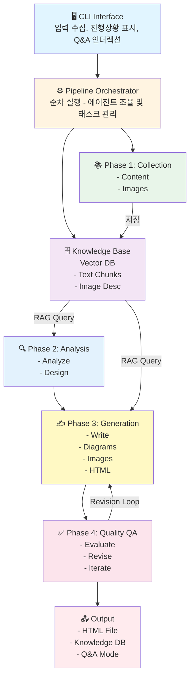

# LectureForge Pro - AI-Powered Lecture Material Generator

> **프로젝트 상태**: 🌟 **Production Ready+** (RMC Self-Review)
> **버전**: 0.5.4 | **최종 수정**: 2026-04-03
> **PyPI**: https://pypi.org/project/lecture-forge/

## 📚 프로젝트 개요

### 목적
다양한 소스(PDF, URL, 인터넷 검색)로부터 정보를 자동 수집하여 고품질 강의자료를 생성하는 Multi-Agent 파이프라인 시스템

### 핵심 기능
1. **멀티소스 컨텐츠 수집**: PDF, URL, 키워드 검색을 통한 포괄적 정보 수집
2. **지식창고 + RAG 기반 Q&A**: 수집된 정보를 벡터 DB에 저장하고 대화형 탐색 지원
3. **다국어 지원**: 자동 언어 감지, Cross-lingual 검색, 한영 혼합 PDF 지원
4. **고급 RAG 품질**: 400단어 구조화 답변, 15+15 듀얼 쿼리, Rich 렌더링, 신뢰도 수정
5. **고성능 RAG 캐싱**: 쿼리 결과 캐싱으로 60% 성능 향상
6. **멀티모달 처리**: 텍스트 + 이미지 자동 추출 및 활용
7. **Location-based 이미지 매칭**: RAG 컨텍스트 페이지 기반 이미지 자동 배치 (+750% 활용률)
8. **대화형 이미지 편집**: 생성된 강의의 이미지 삭제/교체 (Vector DB 기반 대안 검색)
9. **자동 품질 보증**: 6차원 평가 + 반복적 개선 (최대 3회)
10. **구조화된 HTML 출력**: Mermaid 다이어그램, 검색 인덱스, 이미지/다이어그램 클릭 확대
11. **프레젠테이션 슬라이드**: Reveal.js 기반 자동 슬라이드 변환 (`--to-slides`, `--with-notes`) — 섹션별 LLM 재작성 기본 포함 (≤35자, 말줄임표 없음)
12. **KB 기반 재평가·보충**: 기존 강의 품질 재평가 + 미반영 청크 보충 추가 (`--re-evaluate`, `→ *_enhanced.html`)
13. **영문 PDF 번역** (v0.4.1+): 영어 PDF → 한국어 강의자료 (`translate` 명령어) — TOC 감지, 아티팩트 제거, 용어 사전, 이미지 자동 배치
14. **사용자 친화적 디렉토리**: `~/Documents/LectureForge/` + `home` 커맨드로 빠른 접근
15. **예외 처리 시스템**: 구조화된 예외 계층 (9개 카테고리)
16. **템플릿 기반 프롬프트**: 재사용 가능한 프롬프트 템플릿
17. **Async I/O 지원**: 병렬 I/O 처리로 컨텐츠 수집 70% 성능 향상
18. **RMC 자기검토**: 에이전트 내부 2단계 자기반성 (커리큘럼 논리, 콘텐츠 품질, Q&A 할루시네이션 검출)
19. **웹 기반 강의 편집기**: 3-패널 SPA 에디터 — 섹션 CRUD, Markdown 편집 (EasyMDE), 이미지 갤러리·대안 검색 (`edit` 명령어, v0.5.0)

### 기술 스택
- **Framework**: LangChain
- **LLM**: OpenAI GPT-4o-mini (기본), GPT-4o (Vision)
- **Vector DB**: ChromaDB (로컬)
- **CLI**: Click, Rich, prompt-toolkit (Enhanced Input)
- **다국어**: langdetect (언어 감지), GPT-4o-mini (번역)
- **예외 처리**: 구조화된 예외 계층 (9개 카테고리)
- **프롬프트**: 템플릿 기반 관리 시스템
- **Async I/O**: httpx (async HTTP), aiofiles (async file I/O), asyncio
- **배포**: pip installable package
- **Python**: 3.11-3.13 (전체 지원)

---

## 🏗️ 시스템 아키텍처

### 전체 워크플로우



---

## 🤖 에이전트 시스템

### 12개 에이전트 구성

| 에이전트 | 역할 | 주요 기능 |
|---------|------|----------|
| **Content Collector** 📚 | 텍스트 수집 | PDF 파싱, 웹 크롤링, 검색, 벡터화 |
| **Image Collector** 🖼️ | 이미지 수집 | PDF/웹 이미지 추출, API 검색, 중복 제거 |
| **Content Analyzer** 🔍 | 컨텐츠 분석 | 엔티티 추출, 토픽 클러스터, 난이도 분석 |
| **Curriculum Designer** 📋 | 강의 설계 | 학습 목표, 섹션 분할, 시간 배분, RMC 검토 |
| **Content Writer** ✍️ | 컨텐츠 생성 | RAG 기반 섹션별 작성, 이미지 배치, RMC 검토 |
| **Content Enhancer** 🔧 | 콘텐츠 보강 | KB 기반 재평가·미반영 청크 보충 (`--re-evaluate`) |
| **Diagram Generator** 📊 | 다이어그램 | Mermaid 코드 자동 생성 |
| **HTML Assembler** 🎨 | HTML 생성 | 템플릿 렌더링, 스타일링, 검색 인덱스 |
| **Quality Evaluator** ✅ | 품질 평가 | 6차원 평가, LLM-as-Judge |
| **Revision Agent** 🔄 | 개선 | 자동/반자동 수정, 반복 개선 |
| **Q&A Agent** 🤖 | 대화형 Q&A | RAG 기반 질문 응답, 소스 인용, RMC 검토 |
| **PDF Translator** 🌐 | PDF 번역 | 영문 PDF → 한국어 강의자료, TOC 감지, 용어사전 |

---

## 📦 프로젝트 구조

### 소스 코드

```
lecture-forge/  (Git 저장소)
├── 📄 README.md                    ✅ 프로젝트 소개
├── 📄 CLAUDE.md                    ✅ 이 파일 (프로젝트 가이드)
├── 📄 .env.example                 ✅ 환경 변수 템플릿
├── ⚙️ setup.py                     ✅ pip 패키지 설정
├── ⚙️ pyproject.toml               ✅ 빌드 설정
├── 📄 requirements.txt             ✅ 의존성
│
└── 📂 src/lecture_forge/
    ├── 🤖 agents/                  ✅ 12개 에이전트 (+ async 변형 1개)
    ├── 🛠️ tools/                   ✅ 9개 도구 (+ async 변형 2개)
    ├── 📚 knowledge/               ✅ Vector DB & RAG (캐싱)
    ├── ✅ quality/                 ✅ 품질 평가 시스템
    ├── 📊 models/                  ✅ 데이터 모델
    ├── 🔧 utils/                   ✅ 유틸리티 (prompt_manager, retry, html_parser 포함)
    ├── 🎨 templates/               ✅ HTML 템플릿 + 프롬프트 템플릿 + 에디터 SPA
    ├── 💻 cli/                     ✅ CLI 모듈 (9개 명령어)
    ├── 🎬 slides/                  ✅ Reveal.js 슬라이드 변환
    ├── 🌐 editor/                  ✅ 웹 에디터 서버 (Flask, html_editor, server)
    ├── ⚙️ config.py                ✅ 설정 관리 (자동 마이그레이션)
    └── 🎯 exceptions.py            ✅ 예외 처리 시스템 (9개 카테고리)
```

### 사용자 데이터 (런타임 생성)

```
~/Documents/LectureForge/  (Mac/Linux)
%USERPROFILE%\Documents\LectureForge  (Windows)
│
├── 🔐 .env                         환경 변수 (API 키)
├── 📁 data/
│   ├── 🗄️ vector_db/               ChromaDB (지식베이스)
│   ├── 🖼️ images/                  수집 이미지
│   └── 💾 cache/                   RAG 쿼리 캐시
└── 📤 outputs/                     생성된 강의자료 (HTML)
```

```bash
lecture-forge home          # 메인 폴더 열기
lecture-forge home outputs  # 강의 결과물 확인
lecture-forge home data     # 데이터 폴더
lecture-forge home kb       # 최신 지식베이스
lecture-forge home env      # .env 편집
```

### 주요 모듈

#### 예외 처리 시스템 (`exceptions.py`)

```python
from lecture_forge.exceptions import (
    LectureForgeError,          # 기본 예외
    ContentCollectionError,     # 컨텐츠 수집 오류
    RAGError,                   # RAG/Vector DB 오류
    ImageProcessingError,       # 이미지 처리 오류
    ContentGenerationError,     # LLM 생성 오류
    QualityEvaluationError,     # 품질 평가 오류
    ConfigurationError,         # 설정 오류
    MissingAPIKeyError,         # API 키 누락
    ValidationError,            # 입력 검증 오류
)
```

#### 프롬프트 관리 시스템 (`utils/prompt_manager.py`)

```python
from lecture_forge.utils.prompt_manager import load_prompt

prompt = load_prompt(
    "content_generation",
    topic="Python Basics",
    min_words=1000,
    target_words=1500,
)
```

2개 템플릿: `content_generation`, `content_expansion`

---

## 🚀 빠른 시작

### 1. 설치

#### 방법 1: pipx (가장 간편 ⭐⭐)

```bash
pip install pipx && pipx ensurepath
pipx install lecture-forge
pipx inject lecture-forge playwright
playwright install chromium
```

#### 방법 2: PyPI + conda (권장 ⭐)

```bash
conda create -n lecture-forge python=3.11
conda activate lecture-forge
pip install lecture-forge
playwright install chromium
```

#### 방법 3: 개발 설치

```bash
conda create -n lecture-forge python=3.11
conda activate lecture-forge
pip install -e .
playwright install chromium
```

**Python 버전 지원**: 3.11 (권장) / 3.12 / 3.13 모두 지원

### 2. 환경 변수 설정

```bash
# 필수
OPENAI_API_KEY=sk-proj-...
SERPER_API_KEY=...

# 선택 (이미지 검색)
PEXELS_API_KEY=...
UNSPLASH_ACCESS_KEY=...
```

### 3. 강의 생성

```bash
lecture-forge create                              # 기본 대화형
lecture-forge create --image-search               # 이미지 검색 포함
lecture-forge create --quality-level strict       # 고품질 모드
```

### 4. Q&A 모드

```bash
lecture-forge chat
lecture-forge chat -kb ./data/vector_db/AI_Engineering_20260207_094851
```

---

## 💻 CLI 사용법

### 명령어 요약

```bash
# ===== CREATE: 강의 생성 =====
lecture-forge create                              # 기본 대화형
lecture-forge create --config config.yaml         # 설정 파일 (-c)
lecture-forge create --interactive                # 생성 중 대화형 Q&A (-i)
lecture-forge create --image-search               # 이미지 검색
lecture-forge create --quality-level strict       # 품질 레벨 (lenient/balanced/strict)
lecture-forge create --output my_lecture          # 출력 파일명 (-o)
lecture-forge create --async-mode                 # Async I/O (70% 빠름, 실험적)
lecture-forge create --existing-kb <path>         # 기존 지식베이스 재사용
lecture-forge create --existing-kb <path> --kb-mode extend  # 기존 KB 확장

# ===== CHAT: Q&A 모드 =====
lecture-forge chat                                # 자동 선택
lecture-forge chat -kb <path>                     # 지식베이스 지정

# ===== TRANSLATE: 영문 PDF → 한국어 강의자료 =====
lecture-forge translate paper.pdf                                    # 기본 번역
lecture-forge translate paper.pdf -o my_lecture_ko                  # 출력명 지정
lecture-forge translate paper.pdf --no-translate                     # 원문 구조만 (번역 없음, 빠름)
lecture-forge translate paper.pdf --audience-level beginner          # 초급 수준 번역
lecture-forge translate paper.pdf --quality-level strict --with-slides  # 고품질 + 슬라이드
lecture-forge translate paper.pdf --with-diagrams                    # Mermaid 다이어그램 생성 (opt-in)

# ===== EDIT: 웹 기반 강의 편집기 =====
lecture-forge edit <html_path>                    # 웹 편집기 실행 (포트 5757)
lecture-forge edit <html_path> --port 8080        # 커스텀 포트
lecture-forge edit <html_path> --no-browser       # 브라우저 자동 오픈 없이 실행

# ===== EDIT-IMAGES: 이미지 편집 =====
lecture-forge edit-images <html_path>             # 대화형 이미지 편집
lecture-forge edit-images <html_path> -o output   # 출력 파일 지정

# ===== IMPROVE: 강의 향상 =====
lecture-forge improve <html_path> --to-slides              # 슬라이드 변환
lecture-forge improve <html_path> --to-slides --with-notes # 발표자 노트 포함
lecture-forge improve <html_path> --re-evaluate            # KB 기반 재평가 + 보충 (→ *_enhanced.html)
lecture-forge improve <html_path> --re-evaluate --quality-level strict  # 엄격한 기준
lecture-forge improve <html_path> --re-evaluate --kb <vector_db_path>   # KB 수동 지정

# ===== CLEANUP: 지식베이스 정리 =====
lecture-forge cleanup                             # 대화형 선택
lecture-forge cleanup --all                       # 전체 삭제 (주의!)

# ===== HOME: 폴더 열기 =====
lecture-forge home                                # 메인 폴더
lecture-forge home outputs / data / kb / env

# ===== 기타 =====
lecture-forge --version
lecture-forge --help
```

---

## 🔧 환경 설정

### API 키 획득

| API | URL | 비용 | 용도 |
|-----|-----|------|------|
| **OpenAI** | [platform.openai.com](https://platform.openai.com) | 사용량 기반 | LLM, 임베딩 (필수) |
| **Serper** | [serper.dev](https://serper.dev) | 2,500회/월 무료 | 웹 검색 (필수) |
| **Pexels** | [pexels.com/api](https://pexels.com/api) | 무료 | 이미지 검색 (선택) |
| **Unsplash** | [unsplash.com/developers](https://unsplash.com/developers) | 50회/시간 무료 | 이미지 검색 (선택) |

### .env 파일 예시

```bash
OPENAI_API_KEY=sk-proj-...
DEFAULT_MODEL=gpt-4o-mini
EMBEDDING_MODEL=text-embedding-3-small
SERPER_API_KEY=...
PEXELS_API_KEY=...           # 선택
UNSPLASH_ACCESS_KEY=...      # 선택
QUALITY_THRESHOLD=80
MAX_ITERATIONS=3
```

---

## 📊 비용 추정 (180분 강의, GPT-4o-mini 기준)

| 작업 | 비용 |
|-----|------|
| Content Collection | $0.01 |
| Content Analysis | $0.02 |
| Curriculum Design | $0.01 |
| Content Writing | $0.06 |
| Diagram Generation | $0.01 |
| Quality Evaluation | $0.03 |
| Revision (1회) | $0.03 |
| **총계** | **~$0.17** (실측 $0.105) |

- 60분 강의: ~$0.035 (실측)
- 180분 강의: ~$0.105 (실측)

---

## 💡 FAQ

**Q: 현재 사용 가능한가요?**
A: **네! Production Ready 상태입니다.**

**Q: 비용이 얼마나 드나요?**
A: 60분 강의 약 $0.035, 180분 약 $0.105 (GPT-4o-mini 실측).

**Q: 오프라인에서 사용 가능한가요?**
A: 생성 시에는 API 필요. 생성된 HTML과 지식창고는 오프라인 사용 가능.

**Q: 이미지 API 없이도 되나요?**
A: 네, PDF/URL 이미지만으로도 작동합니다. Pexels/Unsplash는 선택사항.

**Q: Python 버전 호환성은?**
A: Python 3.11, 3.12, 3.13 모두 지원합니다 (v0.3.8+).

**Q: 강의 자료는 어디에 저장되나요?**
A: `~/Documents/LectureForge/outputs/`. `lecture-forge home outputs`로 바로 열기 가능.

**Q: Chat 모드 종료 방법은?**
A: `/exit` 또는 `/quit`, 또는 `Ctrl+C`.

**Q: 테스트 실행 방법은?**
A: `pytest tests/ -v` (1,837+ 테스트, ~81% 커버리지)

---

## 📚 참고 문서

- **README.md**: 사용자 안내, CLI 가이드, 변경 이력
- **docs/guides/getting-started.md**: 첫 사용 가이드
- **docs/api/cli.md**: CLI 명령어 상세
- **docs/architecture/system-overview.md**: 아키텍처 상세
- **DEPLOYMENT_GUIDE.md**: PyPI 배포 절차
- **.env.example**: 전체 환경변수 목록
- [LangChain 문서](https://python.langchain.com/docs/)
- [ChromaDB 문서](https://docs.trychroma.com/)
- [OpenAI API](https://platform.openai.com/docs/)

---

## 📊 프로젝트 통계

| 항목 | 수치 |
|------|------|
| 에이전트 | 12개 (+ async 변형 1개) |
| 도구 | 9개 (+ async 변형 2개) |
| CLI 명령어 | 9개 |
| 테스트 | 1,837+, ~81% 커버리지 |
| Type Hints | ~70% (340/489 함수) |
| Python 지원 | 3.11 / 3.12 / 3.13 |
| 비용 | ~$0.035 / 60분 강의 |
| 데이터 저장 | ~/Documents/LectureForge/ |

---

## 📝 변경 이력 (최근)

> 전체 변경 이력은 README.md 참조

### v0.5.4 (2026-04-03) - 🧪 테스트 커버리지 강화 & 코드 품질 개선

- 🧪 **테스트 커버리지 대폭 향상**: 1,436개 → 1,837개 (+401개), ~48% → ~81% — editor·slides·utils·server·enhancer·curriculum·pdf_translator·CLI 명령어 전체 커버
- 🔧 **JSON 펜스 제거 유틸리티**: 4개 에이전트에 중복 분산된 패턴을 `utils/json_utils.py`의 `strip_json_fence()` / `parse_json_response()`로 통합
- 🧹 **Techdebt safe fixes**: 불필요한 import 제거, 사문화된 commented-out 코드 삭제
- 🌐 **에디터 UX 개선**: '섹션 저장' 버튼 항상 표시, 편집 영역 배경색, 미리보기 마크다운 렌더링 CSS

### v0.5.3 (2026-03-05) - 🔒 패키징 안정화

- 🐛 **`edit` TemplateNotFound 재발 방지**: `server.py`에서 Flask 템플릿 탐색 대신 `Path(__file__).parent.parent / "templates/editor/index.html"` 절대경로 직접 읽기 — 불완전한 wheel 배포 환경에서도 동작
- 🎨 **슬라이드 타이틀 개선**: 생성일 표시 + 가운데 정렬
- 🔒 **PyPI 배포 검증 절차 강화**: DEPLOYMENT_GUIDE.md에 `unzip -l dist/*.whl | grep templates/editor` 필수 단계 추가

### v0.5.2 (2026-03-03) - 🔧 안정성 & 비용 개선

- 🔧 **`BaseAgent` `max_tokens` 파라미터**: 모든 에이전트에 `max_tokens` 지원 추가 — `Config.MAX_LLM_TOKENS` (기본 4096) 환경변수로 제어
- 🔒 **RMC 루프 무한 반복 방지**: `Config.MAX_RMC_ROUNDS` (기본 1)로 상한 고정, `no_changes=True` 시 조기 종료
- ⚡ **다이어그램 병렬 생성**: `DiagramGeneratorAgent`에 `ThreadPoolExecutor` 도입 — 섹션당 다중 다이어그램 병렬 생성
- 🆔 **HTML 섹션 ID 중복 방지**: `HTMLAssemblerAgent._build_section_id_registry()` — 생성 시점에 중복 ID 제거 (suffix `_2`, `_3`)
- 🌐 **에디터 UI 개선**: `editor.js` 대규모 개선, CSS 추가, 서버 안정성 강화

### v0.5.0 (2026-02-26) - 🌐 웹 기반 강의 편집기

- 🌐 **웹 기반 강의 편집기** (`edit` 명령어): 3-패널 SPA 에디터 (포트 5757) — 섹션 CRUD, Markdown 편집 (EasyMDE), 이미지 갤러리·대안 검색, 브라우저 자동 오픈
- 📦 **의존성 추가**: `flask>=3.0.0`, `markdownify>=0.12.1`
- 📊 **CLI 명령어**: 8개 → 9개

### v0.5.0 버그수정 (2026-02-28)

- 🐛 **`edit` TemplateNotFound 수정**: `templates/editor/index.html` 누락으로 `edit` 명령어 실행 시 Flask 템플릿 오류 발생 → 파일 생성으로 수정
- 🐛 **`improve --to-slides` IndexError 수정**: `slides/parser.py`에서 LLM 응답이 빈 리스트를 반환할 때 `bullet_points[0]` 접근 시 IndexError 발생 → 빈 리스트 가드 추가 + 원본 텍스트 폴백

### v0.4.x (2026-02-22 ~ 2026-02-25) - 🔍 보강·번역·아키텍처 정리

- 🔍 **검색 커버리지** (v0.4.0): 섹션 전체 인덱싱, `--re-evaluate` HTML 통계 자동 업데이트, `--to-slides` 기본 LLM 재작성 (≤35자, 말줄임표 없음)
- 🌐 **translate 명령어** (v0.4.1): PDF 아티팩트 제거, TOC 감지, AI/ML 용어사전 25개, `--with-diagrams` opt-in, 빈 섹션 필터
- 🏗️ **아키텍처 정리** (v0.4.3): `agents/` → `cli/` import 위반 제거, config 안전 파싱, 단위 테스트 36개 추가

### v0.3.x (2026-02-12 ~ 2026-02-20) - 기반 기능 구축

- 🧠 **RMC 자기검토** (v0.3.8): CurriculumDesigner·ContentWriter·QAAgent 2단계 자기반성, 할루시네이션 항목 제거, Python 3.13 검증
- 🖼️ **UI & 슬라이드** (v0.3.7): Lightbox 클릭 확대, 한국어 서브스트링 검색, Mermaid 전체 너비, API 수정
- 🔧 **코드 품질** (v0.3.6): `make_api_retry()` 팩토리, `BaseImageSearchTool`, RAG 파라미터 환경변수화, Chat 로그
- 🎯 **RAG 품질** (v0.3.5): 400단어 구조화 답변, 15+15 듀얼쿼리(top-12), ChromaDB 신뢰도 수정, Rich 렌더링

---

## /techdebt 전용 아키텍처 규칙

글로벌 `/techdebt` skill이 이 섹션을 읽어 LectureForge 전용 검사를 추가로 수행합니다.

### 아키텍처 경계
- `cli/` 는 비즈니스 로직을 직접 포함하면 안 됨 — 모든 로직은 `agents/` 또는 `utils/`에 위치
- `agents/` 는 `cli/` 를 import하면 안 됨 (단방향 의존)
- `knowledge/` (ChromaDB)는 `agents/` 에서만 접근, `cli/` 직접 접근 금지

### RAG 파이프라인 검사
- ChromaDB 컬렉션 초기화 후 정리(`cleanup`)가 보장되지 않으면 🟡 Medium
- 임베딩 결과가 캐시되지 않고 동일 쿼리를 반복 호출하면 🟡 Medium
- RAG 쿼리 결과를 검증 없이 그대로 LLM 프롬프트에 삽입하면 🟡 Medium

### LLM 비용 최적화
- `agents/` 에서 `max_tokens` 없이 GPT 호출 시 🔴 High
- 루프 안에서 개별 GPT 호출 (배치 처리 대상) 시 🟡 Medium
- 프롬프트에 전체 문서를 삽입하면서 요약/청크 사용 가능한 경우 🟡 Medium
- RMC(자기검토) 루프가 무한 반복될 수 있는 종료 조건 없음 시 🔴 High

### 에이전트 시스템
- 에이전트 간 직접 결합 (agent A가 agent B를 직접 인스턴스화) 시 🟡 Medium
- `Pipeline Orchestrator` 밖에서 에이전트 실행 순서를 제어하면 🟡 Medium

### 자동 수정 금지 대상 (Manual Only)
- RAG 청킹 전략 (chunk_size, overlap) 변경
- Quality Evaluator 6차원 평가 임계값 수정
- CLI 커맨드 시그니처 변경
- ChromaDB 컬렉션 스키마 변경

**End of CLAUDE.md**
