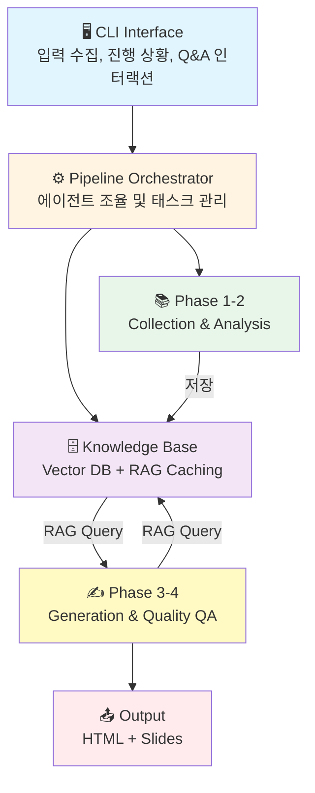
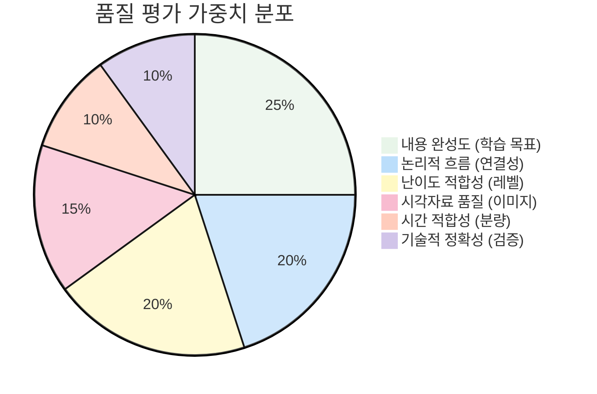

# LectureForge 🎓

**AI-Powered Lecture Material Generator using Multi-Agent Pipeline System**

[](https://www.python.org/downloads/)
[](https://github.com/bullpeng72/Lecture_forge)
[](https://opensource.org/licenses/MIT)
[](https://github.com/bullpeng72/Lecture_forge)
[](https://github.com/bullpeng72/Lecture_forge)

> 🚀 **v0.5.9** | 이미지 단일 저장 & 배포 구조 개선 + Vision AI 이미지 설명

PDF, 웹페이지, 인터넷 검색에서 정보를 수집하여 고품질 강의자료를 자동 생성하는 AI 시스템입니다.

**핵심 통계**: 12개 에이전트 | 9개 도구 | 9개 CLI 명령 | 1,881+ 테스트 (~81% 커버리지) | ~$0.035/60분 강의 | **Python 3.11 권장**

**데이터 위치**: `~/Documents/LectureForge/` (일반 폴더, Finder/탐색기에서 바로 접근)

---

## 📋 목차

- [주요 기능](#-주요-기능)
- [빠른 시작](#-빠른-시작)
- [사용법](#-사용법)
- [명령어 가이드](#-명령어-가이드)
- [FAQ](#-faq)
- [변경 이력](#-변경-이력)
- [기여하기](#-기여하기)

---

## ✨ 주요 기능

### 컨텐츠 생성
- 📚 **멀티소스 수집**: PDF, URL, 웹 검색을 통한 포괄적 정보 수집
- 📍 **Location-based 이미지 매칭**: RAG 컨텍스트 기반 자동 이미지 배치 (+750% 활용률)
- 🖼️ **대화형 이미지 편집**: 생성된 강의의 이미지 삭제/교체 (Vector DB 기반 대안 검색)
- 🎨 **구조화된 HTML 출력**: Mermaid 다이어그램, 검색 인덱스, 코드 하이라이팅
- 🎬 **프레젠테이션 슬라이드**: Reveal.js 기반 자동 변환 (`--to-slides`) — 섹션별 LLM 재작성 (≤35자, 말줄임표 없음), 발표자 노트 기본 포함 (`--without-notes`로 제외)

### 품질 보증
- ✅ **6차원 품질 평가**: 완성도, 흐름, 시간, 난이도, 시각자료, 정확성
- 🔄 **자동 개선**: 품질 기준 미달 시 최대 3회 자동 수정
- 🧠 **RMC 자기검토** (v0.3.8+): 에이전트 내부 2단계 자기반성 (Layer 1 검토 + Layer 2 검토의 검토)
  - **CurriculumDesigner**: 섹션 순서 논리성, 학습목표 커버리지, 선수 내용 순서 자동 검증 및 수정
  - **ContentWriter**: 개념 비약, 설명 모호성, 흐름 단절 등 의미론적 품질 검토 후 수정
  - **QAAgent**: 각 주장을 소스 컨텍스트와 대조 → 할루시네이션 항목 제거 또는 경고 표시
- 🧪 **테스트 커버리지**: 1,881+ 테스트 함수 (~81% 커버리지)

### 지식 관리
- 🗄️ **RAG 기반 지식창고**: ChromaDB 벡터 DB로 대화형 Q&A 지원
- 🌐 **다국어 지원**: 한영 혼합 PDF 지원, 자동 언어 감지, Cross-lingual 검색 (v0.3.2+)
- 🎯 **고급 RAG 품질** (v0.3.5+):
  - 400단어 구조화 답변 (5개 Markdown 섹션 강제)
  - 15+15 듀얼 쿼리 검색 (다국어, top-12 결과)
  - Rich Markdown 패널 렌더링 (터미널에서 아름다운 출력)
  - 동적 신뢰도 점수 (ChromaDB L2 거리 올바른 변환)
- ⚡ **쿼리 캐싱**: 동일 질문 60% 빠른 응답
- 💬 **소스 인용**: 자동 참조 및 페이지 번호 제공

### 안정성 & 성능
- 🔄 **자동 재시도**: API 실패 시 지수 백오프 (최대 3회)
- 💰 **비용 추적**: 실시간 토큰 사용량 및 비용 추정
- 🔧 **타입 힌트**: ~70% 타입 안정성 (340/489 함수)
- 🎯 **예외 처리**: 구조화된 예외 시스템 (9개 카테고리)
- 📝 **프롬프트 관리**: 템플릿 기반 프롬프트 시스템
- 🦙 **Ollama 지원** (v0.5.5+): `LLM_PROVIDER=ollama`로 로컬 LLM 사용 — OpenAI API 키 없이 강의 생성 가능

---

## 🚀 최근 개선사항 (v0.5.9)

- 🔭 **Vision AI 이미지 설명**: `PDFImageDescriber`가 Vision LLM(gpt-4o / qwen3.5:9b 등)으로 PDF 이미지를 직접 설명 — 페이지 텍스트 추론 대비 이미지 내용 정확도 대폭 향상, Vision 미지원 모델은 자동 폴백
- 📦 **이미지 단일 저장**: PDF/웹 이미지를 `data/images/` 없이 `outputs/{stem}_images/`에 직접 저장 — 복사 단계 제거, 이미지 한 벌만 생성
- 🗂️ **배포 용이성**: HTML + `{stem}_images/` 폴더가 항상 같은 `outputs/` 위치 — 폴더 하나로 완전 배포
- 🧹 **cleanup 개선**: 레거시 `data/images/` 잔존 데이터 감지 및 정리 추가

> 전체 변경 이력은 [아래 변경 이력](#-변경-이력) 참조

---

## 🚀 빠른 시작

### 1️⃣ 설치

#### 방법 1: pipx로 설치 (가장 간편 ⭐⭐)

```bash
# pipx 설치 (아직 없는 경우)
pip install pipx
pipx ensurepath

# lecture-forge 설치 (격리된 환경에서 자동 설치)
pipx install lecture-forge

# playwright 설치 (pipx 환경에 주입 후 브라우저 다운로드)
pipx inject lecture-forge playwright
playwright install chromium

# 사용
lecture-forge create
```

**pipx의 장점**:
- ✅ 격리된 환경에서 자동 설치
- ✅ 시스템 전역에서 `lecture-forge` 명령 사용 가능
- ✅ 다른 Python 프로젝트와 의존성 충돌 없음
- ✅ conda/venv 환경 관리 불필요

#### 방법 2: PyPI + conda 환경 (권장 ⭐)

```bash
# Python 3.11 환경 생성 (강력 권장)
conda create -n lecture-forge python=3.11
conda activate lecture-forge

# PyPI에서 설치
pip install lecture-forge

# 웹 스크래핑용 브라우저 설치
playwright install chromium
```

#### 방법 3: 개발 설치 (소스 코드 수정 시)

```bash
# Git 클론
git clone https://github.com/bullpeng72/Lecture_forge.git
cd Lecture_forge

# Python 3.11 환경 생성
conda create -n lecture-forge python=3.11
conda activate lecture-forge

# 로컬 소스에서 설치
pip install -e .

# 웹 스크래핑용 브라우저 설치
playwright install chromium
```

> **Python 버전 호환성**:
> - ✅ **Python 3.11**: **강력 권장** - 모든 의존성 완벽 지원
> - ✅ **Python 3.12**: **완벽 지원** - v0.3.3부터 공식 지원
> - ✅ **Python 3.13**: **지원됨** - v0.3.8부터 검증 완료
>
> **Python 3.11, 3.12, 3.13 모두 지원합니다.**

### 2️⃣ 환경 설정

#### 방법 1: 대화형 설정 (권장 ⭐)

```bash
# 대화형 설정 마법사 실행
lecture-forge init
```

이 명령어는 다음을 수행합니다:
- ✅ 플랫폼별 최적 위치에 `.env` 파일 자동 생성
  - **Windows**: `%USERPROFILE%\Documents\LectureForge\.env`
  - **Mac/Linux**: `~/Documents/LectureForge/.env`
- ✅ LLM 공급자 선택 (OpenAI / Ollama) 및 API 키 입력 안내 — Ollama 선택 시 OpenAI 불필요
- ✅ 선택적 이미지 검색 API 설정 (Pexels, Unsplash)
- ✅ 파일 권한 자동 설정 (Unix/Mac: 600)

#### 방법 2: 수동 설정

```bash
# .env 파일 생성 (프로젝트 개발 시)
cp .env.example .env
```

`.env` 파일을 열어 다음 항목을 설정하세요:

**필수 API 키 (OpenAI 사용 시)**:
```bash
# OpenAI API (OpenAI 사용 시 필수, Ollama 사용 시 불필요)
OPENAI_API_KEY=sk-proj-...

# 검색 API (필수)
SERPER_API_KEY=...                # 무료: 2,500회/월
```

**Ollama 로컬 LLM 사용 시** (OpenAI API 키 불필요):
```bash
LLM_PROVIDER=ollama
OLLAMA_BASE_URL=http://localhost:11434
OLLAMA_MODEL=llama3.2
OLLAMA_EMBEDDING_MODEL=nomic-embed-text
SERPER_API_KEY=...                # 웹 검색은 여전히 필요
```

**선택 사항**:
```bash
# 이미지 검색 API (선택)
PEXELS_API_KEY=...                # 무료 무제한
UNSPLASH_ACCESS_KEY=...           # 무료: 50회/시간

# 검색 및 크롤링 설정 (기본값으로 충분)
SEARCH_NUM_RESULTS=10             # 검색 결과 수 (최대 100)
DEEP_CRAWLER_MAX_PAGES=10         # 크롤링 페이지 수
IMAGE_SEARCH_PER_PAGE=10          # 이미지 검색 결과 수

# 품질 설정
QUALITY_THRESHOLD=80              # 품질 임계값 (70-90)
MAX_ITERATIONS=3                  # 최대 개선 반복 횟수
```

💡 **더 많은 설정 옵션은 `.env.example` 파일 참조**

#### .env 파일 위치

LectureForge는 다음 순서로 `.env` 파일을 탐색합니다:

1. **환경 변수**: `LECTURE_FORGE_ENV_FILE`로 지정한 경로
2. **현재 디렉토리**: `./.env`
3. **사용자 디렉토리** (권장):
   - Windows: `%USERPROFILE%\Documents\LectureForge\.env`
   - Mac/Linux: `~/Documents/LectureForge/.env`

**API 키 획득**:
- **OpenAI**: [platform.openai.com](https://platform.openai.com/) (사용량 기반 과금)
- **Serper**: [serper.dev](https://serper.dev/) (무료 2,500회/월)
- **Pexels**: [pexels.com/api](https://www.pexels.com/api/) (무료)
- **Unsplash**: [unsplash.com/developers](https://unsplash.com/developers) (무료 50회/시간)
- **Ollama**: [ollama.com](https://ollama.com/) (무료, 로컬 실행) — `OPENAI_API_KEY` 불필요

### 3️⃣ 첫 강의 생성

```bash
lecture-forge create
```

대화형으로 강의 정보를 입력하면 자동으로 강의자료가 생성됩니다! 🎉

---

## 💻 사용법

### 명령어 개요

| 명령어 | 설명 | 주요 옵션 |
|--------|------|----------|
| **init** | 초기 설정 | `--path`, `--reconfigure/-r`, `--show/-s` |
| **create** | 강의 생성 | `--interactive`, `--image-search`, `--quality-level`, `--existing-kb` |
| **translate** | 영문 PDF → 한국어 강의자료 (v0.4.1+) | `--no-translate`, `--with-diagrams`, `--audience-level` |
| **chat** | Q&A 모드 | `--knowledge-base` |
| **edit** | 웹 기반 강의 편집기 (v0.5.0+) | `--port`, `--no-browser` |
| **edit-images** | 이미지 편집 (CLI) | `--output` |
| **improve** | 강의 향상 / 재평가 | `--to-slides`, `--without-notes`, `--re-evaluate` |
| **cleanup** | 지식베이스 관리 | `--all` (`-a`) |
| **home** | 폴더 열기 (v0.3.1+) | `outputs`, `data`, `kb`, `env` |

### 빠른 실행 예제

```bash
# 🚀 초기 설정 (처음 한 번만)
lecture-forge init

# 🎓 강의 생성 (대화형 - 가장 간단)
lecture-forge create

# 🎓 고품질 강의 (이미지 검색 포함)
lecture-forge create --image-search --quality-level strict

# 💬 Q&A 모드 (자동으로 최신 지식베이스 선택)
lecture-forge chat

# 🌐 영문 PDF 번역 (한국어 강의자료 생성)
lecture-forge translate paper.pdf
lecture-forge translate paper.pdf --no-translate   # 원문 구조 확인 (번역 없음)

# 🎨 슬라이드 변환
lecture-forge improve outputs/lecture.html --to-slides

# 🖼️ 이미지 편집
lecture-forge edit-images outputs/lecture.html

# 🧹 지식베이스 정리 (대화형 선택)
lecture-forge cleanup

# 📂 폴더 열기 (강의 결과물 확인)
lecture-forge home outputs
```

### 명령어 상세 가이드

#### 🚀 `init` - 초기 설정

**기본 사용:**
```bash
lecture-forge init
```
대화형 마법사가 API 키 입력을 안내하고 자동으로 `.env` 파일을 생성합니다.

**옵션:**

| 옵션 | 설명 | 사용 예 |
|------|------|---------|
| `--path PATH` | 커스텀 디렉토리 지정 | `--path /custom/path` |
| `-r, --reconfigure` | 기존 설정 유지하며 항목별 수정 | `--reconfigure` |
| `-s, --show` | 현재 설정값 출력 (수정 없음) | `--show` |

**기본 저장 위치:**
- **Windows**: `C:\Users\<username>\Documents\LectureForge\.env`
- **Mac/Linux**: `~/Documents/LectureForge/.env`

**예제:**
```bash
# 처음 설정 (권장)
lecture-forge init

# 특정 항목만 수정 (기존 API 키 유지)
lecture-forge init --reconfigure

# 현재 설정 확인
lecture-forge init --show

# 커스텀 디렉토리 사용
lecture-forge init --path /my/config/dir
```

**하는 일 (기본 모드):**
1. LLM 공급자 선택 (OpenAI / Ollama)
2. 필수 API 키 입력 (OpenAI, Serper) — Ollama 사용 시 OpenAI 불필요
3. 품질 설정 (기본값으로 건너뛰기 가능)
4. 선택적 이미지 API 설정 (Pexels, Unsplash)
5. `.env` 파일 자동 생성
6. 기본 설정 값 자동 설정
7. 파일 권한 보안 설정 (Unix/Mac)

---

#### 📚 `create` - 강의 생성

**기본 사용:**
```bash
lecture-forge create
```
대화형으로 정보를 입력하면 자동으로 강의를 생성합니다.

**옵션:**

| 옵션 | 설명 | 사용 예 |
|------|------|---------|
| `-c, --config FILE` | YAML 설정 파일 사용 | `--config lecture.yaml` |
| `-i, --interactive` | 생성 중 대화형 Q&A 모드 활성화 | `--interactive` |
| `--image-search` / `--no-image-search` | 웹 이미지 검색 활성화 (Pexels 등, 기본: 활성화) | `--no-image-search` |
| `--quality-level LEVEL` | 품질 기준 설정 | `--quality-level strict` |
| `-o, --output FILE` | 출력 파일명 지정 (확장자 제외) | `--output my_lecture` |
| `--async-mode` | Async I/O 사용 (70% 빠름, 실험적) | `--async-mode` |
| `--include-pdf-images` | PDF 이미지 추출 및 location-based 자동 배치 (기본 활성화) | `--no-include-pdf-images` |
| `--auto-describe-images` | PDF 이미지 GPT-4o-mini 설명 자동 생성 (기본 활성화) | `--no-auto-describe-images` |
| `--existing-kb PATH` | 기존 지식베이스 재사용 또는 확장 | `--existing-kb data/vector_db/...` |
| `--kb-mode MODE` | KB 사용 방식: `reuse_only`(읽기 전용, 기본값) / `extend`(확장) | `--kb-mode extend` |

**품질 레벨:**
- `lenient` (70점): 빠른 초안
- `balanced` (80점): 기본값 ✅
- `strict` (90점): 고품질

**예제:**
```bash
# 기본 생성
lecture-forge create

# 고품질 + 이미지 검색
lecture-forge create --image-search --quality-level strict

# Async 모드 (70% 빠름, 실험적)
lecture-forge create --async-mode

# YAML 설정 사용
lecture-forge create --config my_config.yaml
```

---

#### 💬 `chat` - Q&A 모드

**기본 사용:**
```bash
lecture-forge chat
```
자동으로 최신 지식베이스를 선택합니다.

**옵션:**

| 옵션 | 설명 | 사용 예 |
|------|------|---------|
| `--knowledge-base PATH` | 특정 지식베이스 지정 | `-kb ./data/vector_db/AI_xxx` |

**대화형 명령어:**
- `/help`: 도움말 표시
- `/exit`, `/quit`: 종료
- `Ctrl+C`: 강제 종료

**예제:**
```bash
# 자동 선택
lecture-forge chat

# 특정 지식베이스 사용
lecture-forge chat -kb ./data/vector_db/lecture_20260209_123456
```

---

#### ✏️ `edit` - 웹 기반 강의 편집기 (v0.5.0+)

**기본 사용:**
```bash
lecture-forge edit outputs/lecture.html
```
로컬 Flask 서버(기본 포트 5757)를 실행하고 브라우저를 자동으로 엽니다.

**옵션:**

| 옵션 | 설명 | 사용 예 |
|------|------|---------|
| `--port INTEGER` | 서버 포트 지정 (기본: 5757) | `--port 8080` |
| `--no-browser` | 브라우저 자동 오픈 없이 서버만 실행 | `--no-browser` |

**3-패널 에디터 구성:**
- **왼쪽 패널**: 섹션 목록 — 섹션 추가·삭제·순서 변경
- **중앙 패널**: Markdown 편집기 (EasyMDE) — HTML ↔ Markdown 자동 변환
- **오른쪽 패널**: 이미지 갤러리 — 대안 검색 (Vector DB), 교체, 업로드

**예제:**
```bash
# 기본 실행 (포트 5757, 브라우저 자동 오픈)
lecture-forge edit outputs/my_lecture.html

# 커스텀 포트
lecture-forge edit outputs/my_lecture.html --port 8080

# 서버만 시작 (원격 접속 등)
lecture-forge edit outputs/my_lecture.html --no-browser
```

> ⚠️ Reveal.js 슬라이드 파일(`*_slides.html`)은 지원하지 않습니다.

---

#### 🖼️ `edit-images` - 이미지 편집

**기본 사용:**
```bash
lecture-forge edit-images outputs/lecture.html
```

**옵션:**

| 옵션 | 설명 | 사용 예 |
|------|------|---------|
| `--output FILE` | 출력 파일 경로 | `-o outputs/edited.html` |

**대화형 명령어:**

| 명령어 | 설명 | 예시 |
|--------|------|------|
| `d <번호>` | 이미지 삭제 | `d 3` |
| `u <번호>` | 삭제 취소 | `u 3` |
| `r <번호>` | 이미지 교체 (Vector DB 검색) | `r 5` |
| `s` | 변경사항 저장 | `s` |
| `/exit`, `/quit` (또는 `q`) | 종료 (저장 안 함) | `/exit` |
| `h` | 도움말 | `h` |

**예제:**
```bash
# 기본 (원본_edited.html로 저장)
lecture-forge edit-images outputs/my_lecture.html

# 출력 파일 지정
lecture-forge edit-images outputs/my_lecture.html -o outputs/final.html
```

---

#### 🌐 `translate` - 영문 PDF → 한국어 강의자료 (v0.4.1+)

**기본 사용:**
```bash
lecture-forge translate paper.pdf
```
영어 PDF에서 챕터 구조를 추출하고, 한국어로 번역하여 HTML 강의자료를 생성합니다.

**옵션:**

| 옵션 | 설명 | 사용 예 |
|------|------|---------|
| `--output FILE` | 출력 파일명 지정 (확장자 제외) | `-o my_lecture_ko` |
| `--quality-level LEVEL` | 품질 기준: `lenient`(70) / `balanced`(80) / `strict`(90) | `--quality-level strict` |
| `--audience-level LEVEL` | 대상 수준: `beginner` / `intermediate` / `advanced` | `--audience-level beginner` |
| `--no-translate` | 번역 없이 원문 구조만 추출 (구조 디버깅용, 빠름) | `--no-translate` |
| `--with-slides` | 슬라이드 변환도 함께 수행 | `--with-slides` |
| `--with-diagrams` | Mermaid 다이어그램 자동 생성 (기본 OFF) | `--with-diagrams` |

**구조 추출 우선순위:**
1. **PDF TOC** — 가장 정확, 학술 PDF 80%+ 적용
2. **폰트 크기 분석** — 본문보다 큰 폰트 자동 감지
3. **페이지 그룹** (폴백) — 균등 페이지 범위 분할

**번역 특징:**
- 기술 용어: `한국어(English)` 형식 유지 (예: `신경망(Neural Network)`)
- 코드 블록: `__CODE_BLOCK_N__` 플레이스홀더로 원문 보존
- AI/ML 표준 용어 사전 25개 적용 (일관된 번역)
- PDF 아티팩트 자동 제거 (페이지 번호, 워터마크 등)

**예제:**
```bash
# 기본 번역 (→ paper_ko.html)
lecture-forge translate paper.pdf

# 출력 파일명 지정
lecture-forge translate paper.pdf -o my_lecture_ko

# 원문 구조 확인 (번역 없음, 빠름)
lecture-forge translate paper.pdf --no-translate

# 고품질 + 슬라이드 변환
lecture-forge translate paper.pdf --quality-level strict --with-slides

# 초급 대상 번역
lecture-forge translate paper.pdf --audience-level beginner

# Mermaid 다이어그램 생성 포함 (기본 OFF)
lecture-forge translate paper.pdf --with-diagrams
```

---

#### 🎨 `improve` - 강의 향상

**기본 사용:**
```bash
lecture-forge improve outputs/lecture.html --to-slides
```

**옵션:**

| 옵션 | 설명 | 사용 예 |
|------|------|---------|
| `--to-slides` | Reveal.js 슬라이드 변환 (`*_slides.html`) — 섹션별 LLM 재작성 기본 포함 (≤35자, 말줄임표 없음) | `--to-slides` |
| `--without-notes` | 발표자 노트 없이 슬라이드 생성 (`--to-slides` 시 노트는 기본 포함) | `--to-slides --without-notes` |
| `--re-evaluate` | KB 기반 품질 재평가 + 미반영 내용 보충 추가 (`*_enhanced.html`) | `--re-evaluate` |
| `--quality-level LEVEL` | 재평가 품질 기준: `lenient`(70) / `balanced`(80) / `strict`(90) | `--quality-level strict` |
| `--kb PATH` | KB 경로 수동 지정 (HTML 메타데이터 없는 기존 파일용 fallback) | `--kb /path/to/vector_db/...` |

**예제:**
```bash
# 슬라이드 변환 (기본)
lecture-forge improve outputs/lecture.html --to-slides

# 발표자 노트 없이 슬라이드 변환
lecture-forge improve outputs/lecture.html --to-slides --without-notes

# KB 기반 품질 재평가 + 보충 (→ *_enhanced.html)
lecture-forge improve outputs/lecture.html --re-evaluate

# 엄격한 기준으로 재평가
lecture-forge improve outputs/lecture.html --re-evaluate --quality-level strict

# 기존 파일 (메타데이터 없음) — KB 경로 수동 지정
lecture-forge improve outputs/lecture.html --re-evaluate --kb ~/Documents/LectureForge/data/vector_db/MyTopic_...

# 재평가 + 슬라이드 변환 동시 적용
lecture-forge improve outputs/lecture.html --re-evaluate --to-slides
```

---

#### 🧹 `cleanup` - 지식베이스 관리

**기본 사용:**
```bash
lecture-forge cleanup
```
대화형으로 삭제할 지식베이스를 선택합니다.

**옵션:**

| 옵션 | 설명 | 사용 예 |
|------|------|---------|
| `-a, --all` | 모든 지식베이스 삭제 (⚠️ 주의!) | `--all` |

**예제:**
```bash
# 대화형 선택 (안전)
lecture-forge cleanup

# 전체 삭제 (복구 불가능!)
lecture-forge cleanup --all
```

### 📤 출력 결과

강의 생성 완료 후 다음 파일들이 생성됩니다:

```
outputs/
├── [주제]_[날짜시간].html           # 📄 HTML 강의자료
└── [주제]_[날짜시간]_slides.html   # 🎬 슬라이드 (--to-slides 사용 시)

data/
└── vector_db/
    └── [주제]_[날짜시간]/           # 🗄️ 지식베이스 (Q&A용)
        ├── chroma.sqlite3
        └── ...
```

**포함 내용:**
- ✅ **HTML 강의자료**: 이미지, Mermaid 다이어그램, 코드 하이라이팅, 검색 인덱스
- ✅ **지식베이스**: ChromaDB 벡터 DB (대화형 Q&A 지원)
- ✅ **통계 정보**: 품질 점수, 토큰 사용량, 예상 비용
- ✅ **슬라이드**: Reveal.js 프레젠테이션 (선택 사항)

### 🔧 고급 설정 (.env 파일)

더 많은 제어가 필요한 경우 `.env` 파일에서 다음 설정을 조정할 수 있습니다:

```bash
# 검색 및 크롤링
SEARCH_NUM_RESULTS=20              # 기본: 10, 최대: 100
DEEP_CRAWLER_MAX_PAGES=30          # 기본: 10
DEEP_CRAWLER_MAX_DEPTH=3           # 기본: 2

# 이미지
IMAGE_SEARCH_PER_PAGE=15           # 기본: 10
MAX_IMAGES_PER_SEARCH=20           # 기본: 10

# 품질
QUALITY_THRESHOLD=90               # 기본: 80 (70-90)
MAX_ITERATIONS=5                   # 기본: 3

# 성능
CHUNK_SIZE=800                     # 기본: 1000 (작을수록 정밀)
WEB_SCRAPER_TIMEOUT=60             # 기본: 30초
```

💡 **전체 설정 목록**: `.env.example` 파일 참조 (15+ 환경변수)

---

## 🏗️ 시스템 아키텍처

### Multi-Agent 파이프라인 (12개 전문 에이전트)



### 12개 전문 에이전트

| # | 에이전트 | 역할 | 파일 |
|---|---------|------|------|
| 1 | **Content Collector** 📚 | 텍스트 수집 및 벡터화 | content_collector.py |
| 2 | **Image Collector** 🖼️ | 이미지 수집 및 Vision AI 분석 | image_collector.py |
| 3 | **Content Analyzer** 🔍 | 내용 분석 및 토픽 클러스터 | content_analyzer.py |
| 4 | **Curriculum Designer** 📋 | 강의 구조 설계 | curriculum_designer.py |
| 5 | **Content Writer** ✍️ | RAG 기반 컨텐츠 생성 | content_writer.py |
| 6 | **Content Enhancer** 🔧 | KB 기반 콘텐츠 보강·재평가 | content_enhancer.py |
| 7 | **Diagram Generator** 📊 | Mermaid 다이어그램 생성 | diagram_generator.py |
| 8 | **Quality Evaluator** ✅ | 6차원 품질 평가 | quality_evaluator.py |
| 9 | **Revision Agent** 🔄 | 자동/반자동 수정 | revision_agent.py |
| 10 | **Q&A Agent** 🤖 | 지식창고 기반 대화 (RAG 캐싱) | qa_agent.py |
| 11 | **HTML Assembler** 🎨 | 최종 HTML 생성 | html_assembler.py |
| 12 | **PDF Translator** 🌐 | 영문 PDF → 한국어 강의자료 | pdf_translator.py |

### 9개 도구 (Tools)

| # | 도구 | 역할 | 파일 |
|---|------|------|------|
| 1 | **PDF Parser** 📄 | PDF 텍스트 추출 | pdf_parser.py |
| 2 | **Image Extractor** 🖼️ | PDF/HTML 이미지 추출 | image_extractor.py |
| 3 | **Web Scraper** 🌐 | 웹 페이지 스크래핑 | web_scraper.py |
| 4 | **Playwright Crawler** 🎭 | 동적 웹 크롤링 | playwright_crawler.py |
| 5 | **Deep Web Crawler** 🕷️ | 다층 웹 크롤링 (Hada.io) | deep_web_crawler.py |
| 6 | **Search Tool** 🔍 | Serper 검색 API | search_tool.py |
| 7 | **Image Search** 🎨 | Pexels/Unsplash 검색 | image_search.py |
| 8 | **PDF Image Describer** 📝 | GPT-4o Vision 이미지 설명 | pdf_image_describer.py |
| 9 | **Image Editor** ✂️ | 대화형 이미지 편집 | image_editor.py |

### 품질 평가 시스템 (6차원)



| 차원 | 가중치 | 평가 기준 | 세부 항목 |
|------|--------|----------|----------|
| 📝 내용 완성도 | **25%** | 학습 목표 달성도 | 주제 커버리지, 깊이, 예제 |
| 🔗 논리적 흐름 | **20%** | 섹션 간 연결성 | 구조, 전개, 응집성 |
| 🎯 난이도 적합성 | **20%** | 수강생 레벨 일치 | 용어, 복잡도, 사전 지식 |
| 🖼️ 시각자료 품질 | **15%** | 이미지/다이어그램 충분성 | 관련성, 품질, 배치 |
| ⏱️ 시간 적합성 | **10%** | 강의 시간 vs 분량 | 단어 수, 밀도, 페이싱 |
| ✅ 기술적 정확성 | **10%** | 사실 관계 검증 | 코드, 개념, 용어 |

**합격 기준**: 80점 이상 (자동 반복 개선, 최대 3회)

---

## ❓ FAQ

### 설치 및 설정

<details>
<summary><b>Q: 어떤 Python 버전이 필요한가요?</b></summary>

A: **Python 3.11, 3.12, 3.13 모두 지원합니다.**

- ✅ Python 3.11: 완벽 지원 (권장)
- ✅ Python 3.12: 완벽 지원 (v0.3.3+)
- ✅ Python 3.13: 지원됨 (v0.3.8+, 검증 완료)

```bash
# 버전 확인
python --version

# Python 3.11 환경 생성 (권장)
conda create -n lecture-forge python=3.11
conda activate lecture-forge
pip install lecture-forge
```
</details>

<details>
<summary><b>Q: API 키가 꼭 필요한가요?</b></summary>

A:
- **OpenAI 모드** — 필수: OpenAI API, Serper API
- **Ollama 모드** (로컬 LLM, `LLM_PROVIDER=ollama`) — 필수: Serper API만 (OpenAI API 불필요)
- **선택**: Pexels API, Unsplash API (이미지 검색용)

이미지 API(Pexels, Unsplash) 없이도 PDF/웹 이미지만으로 작동합니다.
</details>

<details>
<summary><b>Q: 비용이 얼마나 드나요?</b></summary>

A: **실제 측정 비용** (OpenAI GPT-4o-mini 사용 시):
- 60분 강의: 약 **$0.035**
- 180분 강의: 약 **$0.105**

(보수적 이론 추정: $0.22/180분)

💡 **Ollama 사용 시**: `LLM_PROVIDER=ollama`로 로컬 LLM을 사용하면 LLM 비용 무료 (하드웨어만 필요)

생성 완료 후 정확한 비용이 표시됩니다.
</details>

<details>
<summary><b>Q: .env 파일 설정을 바꾸려면?</b></summary>

A: `.env` 파일을 열어 원하는 값을 수정하세요:
```bash
# 검색 결과 증가
SEARCH_NUM_RESULTS=20

# 크롤링 범위 확대
DEEP_CRAWLER_MAX_PAGES=30

# 타임아웃 증가
WEB_SCRAPER_TIMEOUT=60
```

변경 후 재시작하면 바로 적용됩니다.
</details>

### 사용법

<details>
<summary><b>Q: 오프라인에서 사용 가능한가요?</b></summary>

A:
- **Ollama 사용 시** (`LLM_PROVIDER=ollama`): 강의 생성도 오프라인 가능 (웹 검색 기능 제외)
- **OpenAI 사용 시**: 생성 시 API 필요 (OpenAI, Serper)
- **생성 후**: HTML 파일과 지식창고는 어느 모드에서든 오프라인 사용 가능
- **Chat 모드**: Ollama라면 완전 오프라인 가능, OpenAI라면 LLM API 필요
</details>

<details>
<summary><b>Q: 품질 레벨의 차이는?</b></summary>

A:
| 레벨 | 임계값 | 용도 | 시간 |
|------|--------|------|------|
| `lenient` | 70점 | 빠른 초안 | 짧음 |
| `balanced` | 80점 | **기본값** ✅ | 보통 |
| `strict` | 90점 | 고품질 프로덕션 | 김 |

임계값 미달 시 최대 3회 자동 개선합니다.
</details>

<details>
<summary><b>Q: Chat 모드 종료 방법은?</b></summary>

A: 다음 중 하나 사용:
- `/exit` 또는 `/quit` (권장)
- `Ctrl+C` (강제 종료)
</details>

<details>
<summary><b>Q: 이미지가 제대로 매칭되지 않으면?</b></summary>

A: v0.2.0의 Location-based 매칭이 자동으로 작동합니다:
1. PDF 이미지: 85% 자동 매칭 (페이지 기반)
2. 웹 이미지: 키워드 기반 보완
3. 수동 편집: `lecture-forge edit-images`로 교체 가능
</details>

### 기술적 질문

<details>
<summary><b>Q: 테스트는 어떻게 실행하나요?</b></summary>

```bash
# 전체 테스트
pytest tests/ -v

# 커버리지 확인
pytest tests/ --cov=lecture_forge --cov-report=html

# 특정 테스트
pytest tests/unit/agents/test_content_writer.py -v

# 특정 에이전트만
pytest tests/unit/agents/ -v
```
</details>

<details>
<summary><b>Q: API 호출이 실패하면 어떻게 되나요?</b></summary>

A: v0.2.0부터 **자동 재시도** 기능이 있습니다:
- 최대 3회 재시도
- 지수 백오프: 2초 → 4초 → 10초
- 일시적 오류 자동 복구
- OpenAI, Serper, Pexels, Unsplash 모두 지원
</details>

<details>
<summary><b>Q: RAG 쿼리 캐싱은 어떻게 작동하나요?</b></summary>

A:
- 쿼리와 결과 개수를 MD5 해시로 변환하여 메모리 캐시
- 동일 질문은 **60% 빠른 응답**
- 캐시 히트/미스 통계 자동 추적
- 세션 동안 유지 (프로세스 종료 시 초기화)
</details>

<details>
<summary><b>Q: 설정을 환경별로 다르게 하려면?</b></summary>

A: `.env` 파일을 환경별로 분리하세요:
```bash
# 개발 환경
.env.development

# 프로덕션 환경
.env.production

# 사용
cp .env.production .env
lecture-forge create
```
</details>

---

## 📝 변경 이력

### v0.5.9 (2026-04-17) - 📦 이미지 단일 저장 & 배포 구조 개선 + 🔭 Vision AI 이미지 설명

- 🔭 **Vision AI 이미지 설명** (`tools/pdf_image_describer.py`): `PDFImageDescriber`가 Vision LLM으로 PDF 이미지를 직접 설명 — base64 multimodal 방식. `_vision_available` 플래그로 낙관적 실행, 첫 실패 시 텍스트 추론 자동 폴백
- 🔭 **Vision 모델 라우팅** (`config.py`): `get_vision_model()` — OpenAI: `VISION_MODEL`(gpt-4o), Ollama: `OLLAMA_VISION_MODEL`(미설정 시 `OLLAMA_MODEL` 사용)
- 🔧 **`init` Vision 설정**: Ollama 브랜치 `OLLAMA_VISION_MODEL`, OpenAI 브랜치 `VISION_MODEL` 입력 추가
- 📦 **이미지 단일 저장**: `ImageCollectorAgent`에 `output_dir` 파라미터 추가 — `data/images/` 임시 경로 없이 `outputs/{stem}_images/`에 직접 저장, `_bundle_images()` 복사 단계 완전 제거
- 🗂️ **배포 용이성**: HTML 파일과 이미지 폴더가 항상 같은 `outputs/` 위치 — 폴더 하나만 복사해도 완전 배포 가능
- 🔧 **create / translate / create_async**: `output_stem` Phase 1 전 조기 결정, 이미지·HTML 경로 일관성 확보
- 🎨 **`_render_image_html` 개선**: `OUTPUT_DIR` 내 이미지 우선 처리, 레거시 `DATA_DIR` 경로 fallback 유지
- 🔍 **`image_selector` 맵 탐색 확장**: `outputs/*_images/image_page_map.json`도 검색
- 🧹 **cleanup 개선**: 레거시 `data/images/` 잔존 세션 감지·삭제 추가

### v0.5.8 (2026-04-16) - 🖼 이미지 번들링 & 커버리지 개선

- 📦 **이미지 번들링** (`html_assembler.py`): `_bundle_images()` 메서드 추가 — HTML 생성 시 참조 이미지를 `{강의명}_images/` 폴더로 복사, `cleanup` 후에도 이미지 보존
- 🔍 **토픽 추출 균형 배분** (`content_analyzer.py`): `_extract_key_topics` 프롬프트에 문서 전체 균형 배분 규칙 명시 — 초반·중반·후반 섹션 모두 포함 요구
- 🔍 **probe query 확장**: 10개 → 14개 — `optimization/evaluation`, `deployment/production`, `fine-tuning/training`, `safety/alignment` 쿼리 추가로 PDF 후반부 샘플링 강화

### v0.5.7 (2026-04-15) - 🧹 코드 품질 개선

- 🧹 **미사용 import 20개 파일 정리**: slides/notes·section_rewriter·utils, tools/async_web_scraper·image_extractor, utils/language_utils·prompt_manager, agents/content_writer·curriculum_designer·qa_agent, models/curriculum, cli/commands 전체 — 불필요한 typing/rich/pathlib import 제거 (기능 변경 없음)

### v0.5.6 (2026-04-15) - 🐛 Ollama 호환 버그수정 & 문서 정확도

- 🐛 **PDFImageDescriber Ollama 호환**: `translate` 실행 시 `LLM_PROVIDER=ollama`이면 `pdf_image_describer.py`가 OpenAI API를 직접 호출해 401 에러 발생하던 버그 수정 — `create_llm()` 팩토리로 교체 (텍스트 전용, 모든 프로바이더 호환)
- 🐛 **토큰 사용량 Ollama 모델명 오표시 수정**: Ollama 모델(`qwen3.5:9b`, `llama3.2` 등)이 `gpt-4o-mini`로 잘못 표시되던 버그 수정 — 원본 모델명 유지, 비용 $0.00, `로컬 LLM — API 비용 없음` 표시
- 📝 **README FAQ 수정**: "API 키 필수" 항목을 OpenAI/Ollama 모드로 구분, 비용 FAQ에 Ollama 무료 안내, 오프라인 FAQ에 Ollama 생성 오프라인 가능 반영
- 📝 **docs/ 현행화**: api/cli.md ToC 재구성, `select_pdf_files` 문서 추가, `generate_lecture()` 반환값 문서화, init 3모드 반영

### v0.5.5 (2026-04-13) - 🔧 CLI 안정성 & 도움말 현행화 & Ollama 지원

- 🦙 **Ollama LLM 지원**: `LLM_PROVIDER=ollama`로 로컬 LLM 사용 — `create_llm()` 팩토리 추상화, `BaseAgent`/`EmbeddingManager`/slides/language_utils 전체 적용, OpenAI API 키 없이 강의 생성 가능
- 🦙 **Ollama Thinking 모드**: `OLLAMA_THINKING=auto` (qwen3/qwq/deepseek-r1 자동 감지), `reasoning=` 파라미터 수정, qwen3.5:9b 기본값
- 🐛 **Ollama reasoning 파라미터 수정**: `ChatOllama`에서 `think=` 대신 `reasoning=` 사용 — thinking이 꺼지지 않아 빈 응답 생성되던 버그 수정
- 🐛 **gpt-4o-mini 404 수정**: `language_utils.translate_text(model=None)` — Ollama 모드에서 OpenAI 모델명으로 ChatOllama 호출하던 버그 수정
- ⚡ **5개 에이전트 thinking=False**: ContentAnalyzer·DiagramGenerator·HTMLAssembler·RevisionAgent·PDFTranslator — deep reasoning 불필요한 에이전트 응답 속도 개선
- 🔧 **`init` LLM-first 설정 순서**: Phase 1=LLM, Phase 2=API 키 (Ollama 모드는 OpenAI 키 스킵), Phase 3=품질
- 🔧 **`init` 명령어 3모드**: `--reconfigure/-r` (기존 값 유지하며 항목별 수정), `--show/-s` (설정 출력)
- ✏️ **`improve --to-slides` 노트 기본 포함**: `--with-notes` 제거, 발표자 노트 기본 ON — `--without-notes`로 opt-out
- 🐛 **AuthenticationError 즉시 실패**: tenacity retry에서 인증·권한·404 오류는 재시도 없이 즉시 실패 (`reraise=True`)
- 🖥️ **`create` Progress 개선**: Phase 4a 섹션별 진행률 표시, RichHandler Console 공유로 이중 렌더링 제거
- 📝 **도움말 현행화**: `--help` 통계 수정 (12 Agents, 1,870+ Tests), init `--reconfigure`/`--show` 반영
- 🧪 **테스트 추가**: retry 정책 8개, init_helpers 43개 (총 1,877개)
- 🐛 **slides 모듈 `thinking=False`**: `section_rewriter`·`notes`·`utils` — `num_predict=800~1000`에서 qwen3.5 thinking이 전체 토큰 소비 → empty result 후 원문 사용 버그 수정
- 🐛 **`language_utils.translate_text` `thinking=False`**: `max_tokens=2000`에서 thinking phase가 토큰 전부 소비 → 번역 결과 빈 문자열 버그 수정
- 🔧 **4개 에이전트 `thinking=False` 방어적 고정**: ContentCollector·ImageCollector·AsyncBase·ContentExpander — invoke_llm 미사용이지만 일관성 확보

### v0.5.4 (2026-04-03) - 🧪 테스트 커버리지 강화

- 🧪 **테스트 401개 추가**: editor·slides·utils·server·enhancer·curriculum·pdf_translator·CLI 전체 커버 → 1,837개 (~81%)
- 🔧 **`utils/json_utils.py`**: `strip_json_fence()` / `parse_json_response()` — 4개 에이전트 중복 패턴 통합
- 🌐 **에디터 UX**: '섹션 저장' 버튼 항상 표시, 편집 영역 배경색, 미리보기 마크다운 렌더링 CSS

### v0.5.x (2026-02-26 ~ 2026-03-05) - 🌐 웹 편집기 · 안정성 & 비용 개선

- 🐛 **`edit` TemplateNotFound 재발 방지** (v0.5.3): `server.py`에서 `Path(__file__)` 절대경로로 `index.html` 직접 읽기
- 🎨 **슬라이드 타이틀 개선** (v0.5.3): 생성일 표시 + 가운데 정렬
- 🔒 **PyPI 배포 검증 강화** (v0.5.3): wheel 내용 필수 확인 절차 추가 (`unzip -l dist/*.whl | grep templates/editor`)
- 🌐 **웹 기반 강의 편집기** (`edit` 명령어, v0.5.0): 3-패널 SPA 에디터 (포트 5757) — 섹션 CRUD, Markdown 편집 (EasyMDE), 이미지 갤러리·대안 검색
- 📦 **의존성 추가**: `flask>=3.0.0`, `markdownify>=0.12.1` · CLI 명령어 8개 → 9개
- 🐛 **버그수정** (v0.5.1): `edit` TemplateNotFound, `improve --to-slides` IndexError
- 🔧 **`BaseAgent` `max_tokens` 전역화** (v0.5.2): `MAX_LLM_TOKENS` (기본 4096) 환경변수 제어
- 🔒 **RMC 루프 상한** (v0.5.2): `MAX_RMC_ROUNDS` (기본 1) — 무한 반복 방지
- ⚡ **다이어그램 병렬 생성** (v0.5.2): `ThreadPoolExecutor`로 섹션당 다중 다이어그램 병렬 처리
- 🆔 **HTML 섹션 ID 중복 방지** (v0.5.2): 생성 시점 중복 제거 (`_2`, `_3` suffix)

### v0.4.x (2026-02-22 ~ 2026-02-25) - 🔍 보강·번역·아키텍처 정리

- 🔍 **검색 커버리지** (v0.4.0): 섹션 전체 인덱싱, `--re-evaluate` HTML 통계 자동 업데이트, `--to-slides` 기본 LLM 재작성 (≤35자)
- 🌐 **translate 명령어** (v0.4.1): PDF 아티팩트 제거, TOC 감지, AI/ML 용어사전 25개, `--with-diagrams` opt-in
- 🏗️ **아키텍처 정리** (v0.4.3): `agents/` → `cli/` import 위반 제거, config 안전 파싱, 테스트 36개 추가

### v0.3.x (2026-02-12 ~ 2026-02-20) - 기반 기능 구축

- 🧠 **RMC 자기검토** (v0.3.8): CurriculumDesigner·ContentWriter·QAAgent 2단계 자기반성, 할루시네이션 항목 제거, Python 3.13 검증
- 🖼️ **UI & 슬라이드** (v0.3.7): Lightbox 클릭 확대, 한국어 서브스트링 검색, Mermaid 전체 너비, API 수정
- 🔧 **코드 품질** (v0.3.6): `make_api_retry()` 팩토리, `BaseImageSearchTool`, RAG 파라미터 환경변수화, Chat 로그
- 🎯 **RAG 품질** (v0.3.5): 400단어 구조화 답변, 15+15 듀얼쿼리(top-12), ChromaDB 신뢰도 수정, Rich 렌더링
- ⚡ **Async I/O** (v0.3.4): `--async-mode`, httpx 병렬 수집 70% 향상
- ⌨️ **입력 시스템** (v0.3.3): prompt-toolkit, 한국어 완벽 지원, 히스토리·자동완성
- 🌐 **다국어** (v0.3.2): langdetect, Cross-lingual 듀얼쿼리, 지능형 재랭킹
- 📂 **디렉토리** (v0.3.1): `~/Documents/LectureForge/`, `home` 커맨드, 자동 마이그레이션
- 🎨 **프레젠테이션** (v0.3.0): Mermaid 다이어그램, 예외처리 시스템(9개), 슬라이드 최적화

### v0.2.x (2026-02-09 ~ 2026-02-12) - 품질·안정성

- ⚡ RAG 쿼리 캐싱(60%), 자동 API 재시도(지수 백오프), Config 리팩토링(15+ 환경변수)
- 🐛 이미지 크기 버그 수정(원본 보존), Visual score·슬라이드 버그 수정, Full HD WebP 지원
- 🧪 77+ 단위 테스트, 타입 힌트 40% → 75%

### v0.1.0 (2026-02-08) - 🎉 Initial Release

- 10개 전문 에이전트, 멀티소스 수집 (PDF·URL·검색)
- Location-based 이미지 매칭 (+750%), ChromaDB 지식창고
- 6차원 품질 평가, HTML 출력, Reveal.js 슬라이드 변환

---

## 🤝 기여하기

기여를 환영합니다! 다음 절차를 따라주세요:

1. **이슈 생성**: 변경사항을 먼저 논의
2. **포크 & 브랜치**: feature 브랜치 생성
3. **테스트 작성**: 새 기능에 대한 테스트 추가
4. **PR 제출**: 변경사항 설명과 함께 제출

자세한 내용은 `CONTRIBUTING.md`를 참조하세요.

---

## 📄 라이선스

MIT License - 자세한 내용은 [LICENSE](LICENSE) 참조

---

## 📞 지원 및 문의

- **이슈 트래커**: [GitHub Issues](https://github.com/bullpeng72/Lecture_forge/issues)
- **프로젝트 가이드**: [CLAUDE.md](CLAUDE.md)
- **기술 분석**: [INPUT_LIMITS_ANALYSIS.md](docs/INPUT_LIMITS_ANALYSIS.md)
- **테스트 가이드**: [tests/README.md](tests/README.md)

---

## 🙏 감사의 말

이 프로젝트는 다음 오픈소스 프로젝트들을 활용합니다:

- [LangChain](https://github.com/langchain-ai/langchain) - Multi-Agent 프레임워크
- [ChromaDB](https://github.com/chroma-core/chroma) - 벡터 데이터베이스
- [OpenAI](https://openai.com) - GPT-4o 모델
- [Serper](https://serper.dev) - 검색 API
- [Pexels](https://pexels.com) & [Unsplash](https://unsplash.com) - 이미지 API

---

<p align="center">
  <b>Made with ❤️ by Sungwoo Kim</b><br>
  ⭐ 이 프로젝트가 도움이 되었다면 GitHub Star를 눌러주세요!
</p>
