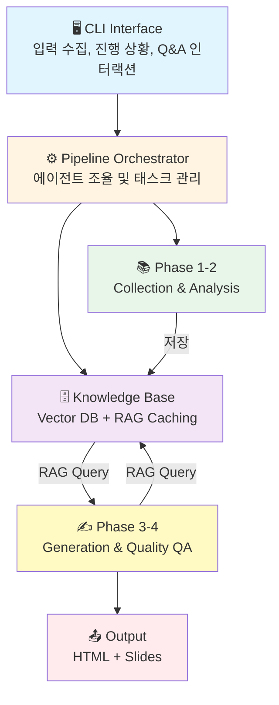
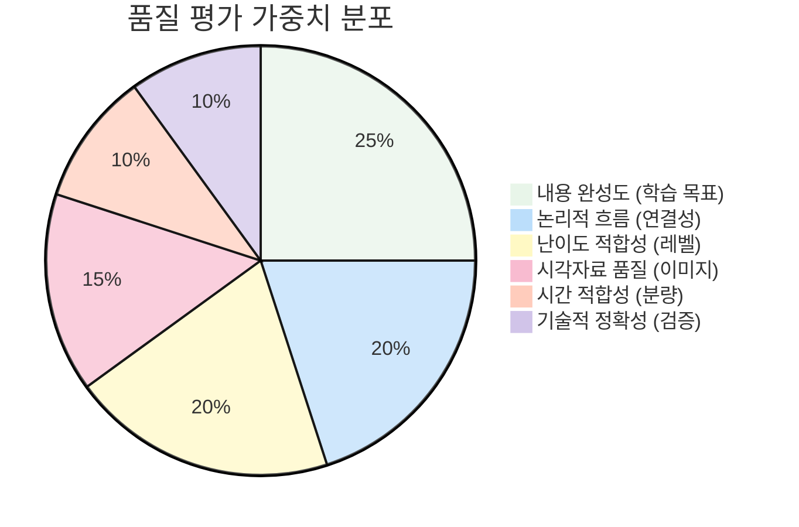

# LectureForge 🎓

**AI-Powered Lecture Material Generator using Multi-Agent Pipeline System**

[](https://www.python.org/downloads/)
[](https://github.com/bullpeng72/Lecture_forge)
[](https://opensource.org/licenses/MIT)
[](https://github.com/bullpeng72/Lecture_forge)
[](https://github.com/bullpeng72/Lecture_forge)

> 🚀 **v0.3.8 Beta Release** | RMC Self-Review 🧠 (hallucination detection, curriculum logic check, content quality review)

PDF, 웹페이지, 인터넷 검색에서 정보를 수집하여 고품질 강의자료를 자동 생성하는 AI 시스템입니다.

**핵심 통계**: 10개 에이전트 | 9개 도구 | 7개 CLI 명령 | 827개+ 테스트 (~48% 커버리지) | ~$0.035/60분 강의 | **Python 3.11 권장**

**데이터 위치**: `~/Documents/LectureForge/` (일반 폴더, Finder/탐색기에서 바로 접근)

---

## 📋 목차

- [주요 기능](#-주요-기능)
- [빠른 시작](#-빠른-시작)
- [사용법](#-사용법)
- [명령어 가이드](#-명령어-가이드)
- [FAQ](#-faq)
- [변경 이력](#-변경-이력)
- [기여하기](#-기여하기)

---

## ✨ 주요 기능

### 컨텐츠 생성
- 📚 **멀티소스 수집**: PDF, URL, 웹 검색을 통한 포괄적 정보 수집
- 📍 **Location-based 이미지 매칭**: RAG 컨텍스트 기반 자동 이미지 배치 (+750% 활용률)
- 🖼️ **대화형 이미지 편집**: 생성된 강의의 이미지 삭제/교체 (Vector DB 기반 대안 검색)
- 🎨 **구조화된 HTML 출력**: Mermaid 다이어그램, 검색 인덱스, 코드 하이라이팅
- 🎬 **프레젠테이션 슬라이드**: Reveal.js 기반 자동 변환 (v0.3.0 대폭 개선)

### 품질 보증
- ✅ **6차원 품질 평가**: 완성도, 흐름, 시간, 난이도, 시각자료, 정확성
- 🔄 **자동 개선**: 품질 기준 미달 시 최대 3회 자동 수정
- 🧠 **RMC 자기검토** (v0.3.8+): 에이전트 내부 2단계 자기반성 (Layer 1 검토 + Layer 2 검토의 검토)
  - **CurriculumDesigner**: 섹션 순서 논리성, 학습목표 커버리지, 선수 내용 순서 자동 검증 및 수정
  - **ContentWriter**: 개념 비약, 설명 모호성, 흐름 단절 등 의미론적 품질 검토 후 수정
  - **QAAgent**: 각 주장을 소스 컨텍스트와 대조 → 할루시네이션 항목 제거 또는 경고 표시
- 🧪 **테스트 커버리지**: 827개+ 테스트 함수 (81개 파일, ~48% 커버리지)

### 지식 관리
- 🗄️ **RAG 기반 지식창고**: ChromaDB 벡터 DB로 대화형 Q&A 지원
- 🌐 **다국어 지원**: 한영 혼합 PDF 지원, 자동 언어 감지, Cross-lingual 검색 (v0.3.2+)
- 🎯 **고급 RAG 품질** (v0.3.5+):
  - 400단어 구조화 답변 (5개 Markdown 섹션 강제)
  - 15+15 듀얼 쿼리 검색 (다국어, top-12 결과)
  - Rich Markdown 패널 렌더링 (터미널에서 아름다운 출력)
  - 동적 신뢰도 점수 (ChromaDB L2 거리 올바른 변환)
- ⚡ **쿼리 캐싱**: 동일 질문 60% 빠른 응답
- 💬 **소스 인용**: 자동 참조 및 페이지 번호 제공

### 안정성 & 성능
- 🔄 **자동 재시도**: API 실패 시 지수 백오프 (최대 3회)
- 💰 **비용 추적**: 실시간 토큰 사용량 및 비용 추정
- 🔧 **타입 힌트**: 71% 타입 안정성
- 🎯 **예외 처리**: 구조화된 예외 시스템 (9개 카테고리)
- 📝 **프롬프트 관리**: 템플릿 기반 프롬프트 시스템

---

## 🚀 최근 개선사항

### v0.3.8 (2026-02-19) - RMC 자기검토 + 이미지 선택 개선 🧠🖼️

**에이전트 내부 자기반성 시스템 추가**:
- **RMC (Reflective Meta-Cognition)**: 생성 직후 2단계 자기검토 - Layer 1(검토) + Layer 2(검토의 검토)
- **CurriculumDesigner**: `_review_with_rmc()` - 섹션 순서 난이도 계단식 여부, 학습목표-섹션 연결, 선수 내용 배치 자동 수정
- **ContentWriter**: `_review_content_with_rmc()` - 개념 비약, 설명 모호성, 코드-설명 연결, 중복 내용 검토 후 의미론적 수정
- **QAAgent**: `_review_answer_with_rmc()` - 각 주장 ✓/~/✗ 분류 → 소스 미지원(✗) 항목 제거 또는 경고 표시

**설계 원칙**:
- Non-critical: try/except로 감싸서 RMC 실패 시 원본 반환 → 기존 파이프라인 영향 없음
- 단어 수 검증: ContentWriter ≥80%, QAAgent ≥50% (LLM이 메타 평가 반환 시 원본 사용)
- 토큰 효율: 콘텐츠 앞 4000자만 검토, 답변 앞 2000자만 검토

**LLM 거부 응답 수정** (`content_writer/agent.py`):
- **`_build_structural_section_prompt()`**: 결론/도입 섹션 전용 안전 프롬프트 (위협적 언어 제거)
- **거부 응답 감지 + 재시도**: `_LLM_REFUSAL_PREFIXES` 패턴 감지 → 안전 프롬프트로 자동 재시도
- **구조 섹션 RAG 쿼리 강화**: generic 메타 용어 대신 `topic + 본문 섹션 제목[:4]`로 쿼리해 컨텍스트 품질 향상
- **결론 섹션 구조**: 핵심 요약, 학습목표 달성, 실무 적용, 다음 단계, 마무리 5개 서브섹션

**이미지 선택 개선**:
- **공간적 근접성 (y0 정렬)**: `page.get_image_rects(xref)` (PyMuPDF)로 이미지 y0(페이지 상단 거리) 추출 → 페이지 내 이미지를 위→아래 순으로 정렬 → 위치 점수 `(1/(idx+1)) × 0.10`이 페이지 상단 이미지를 정확히 우대
- **섹션 내 중복 제거 P1 수정**: `selected_ids` 집합으로 PDF/웹/키워드 3개 Phase 전체에서 동일 이미지 중복 선택 방지
- **타입별 가중치 P2 수정**: 스크린샷 vs 사진 별도 Config 상수 (`IMAGE_WEIGHT_QUALITY_SCREENSHOT` 등), 품질 임계값을 보너스 계산 이전에 적용

### v0.3.7 (2026-02-18) - UI & 슬라이드 개선 🖼️

**HTML 강의 개선**:
- **Lightbox (클릭 확대)**: 이미지 및 Mermaid 다이어그램 클릭시 전체화면 모달로 확대 표시
  - SVG 인라인 `max-width` 제약 자동 제거 → 최대 `min(92vw, 1400px)` 너비로 표시
  - ESC / 배경 클릭으로 닫기, 비동기 Mermaid 렌더링 대응 (300ms/800ms/2000ms 폴링)
- **검색 개선**: Lunr.js → 서브스트링 검색으로 교체
  - 한국어 토큰이 `\\W` trimmer에 의해 누락되던 Lunr.js 버그 완전 해결
  - `String.prototype.includes()` 기반 한국어·영어 혼합 검색 완벽 지원

**슬라이드 개선**:
- **Mermaid 다이어그램 전체 너비**: ~300px 축소 문제 수정 → 슬라이드 전체 너비(~1180px) 표시
- **Mermaid 10 API 수정**: `contentLoaded()` → `mermaid.run()`, `startOnLoad: false`

### v0.3.6 (2026-02-18) - 코드 품질 & 안정성 🔧

**버그 수정**:
- **`temperature=0.0` 버그 수정**: `BaseAgent`에서 `or` 연산자가 `0.0`을 falsy로 처리하던 문제 수정
- **`QAAgent` 하드코딩 경로 수정**: `Config.USER_CONFIG_DIR` 사용으로 이식성 향상

**코드 품질 개선**:
- **`make_api_retry()` 유틸리티**: 4곳에 중복된 retry 로직을 `utils/retry.py` 팩토리 함수로 통합
- **`BaseImageSearchTool` 기반 클래스**: Unsplash/Pexels 중복 코드 ~100줄 제거
- **RAG 파라미터 환경변수화**: `RAG_QA_N_RESULTS`, `RAG_QA_TOP_K`, `RAG_CONTENT_N_RESULTS`
- **Config 검증 강화**: `IMAGE_WEIGHT_*` 및 `CONTENT_*_RATIO` 합계 1.0 검증 추가

**Chat 개선**:
- **응답 로깅**: AI 답변도 `conversation_log.txt`에 저장 (기존엔 사용자 질문만 기록)

**테스트**:
- async 도구 유닛 테스트 23개 신규 추가 (`async_search_tool`, `async_web_scraper`)
- 총 827개+ 테스트 함수 (81개 파일)

### v0.3.5 (2026-02-18) - RAG 품질 대폭 향상 🎯

**Chat 답변 품질 향상**:
- **답변 길이 보장**: 최소 400단어 + 5개 Markdown 섹션 구조 강제
  - `## 개요`, `## 상세 설명`, `## 핵심 포인트`, `## 예시 및 근거`, `## 추가 고려사항`
  - 구조화된 답변으로 학습 이해도 크게 향상
- **검색 강화**: n_results 10→**15** (+50%), top_k 8→**12** (+50%)
  - 더 많은 컨텍스트 기반의 풍부한 답변
  - Source 다양성 최대 3개/source-page (기존 2개)
- **LLM 온도 최적화**: temperature 0.7→**0.3** (RAG 정확도 향상)
- **Rich Markdown 렌더링**: 답변을 패널 형식으로 아름답게 표시
- **신뢰도 수정**: ChromaDB L2 거리 변환 버그 수정 (항상 0% → 실제 신뢰도)
  - 수정 전: `similarity = 1 - distance` (음수 발생 → 0% 강제)
  - 수정 후: `similarity = max(0.0, 1 - distance / 2)` (올바른 [0,1] 범위)

**버그 수정**:
- **`init_helpers.py`**: deprecated `pkg_resources.path` → `importlib.resources.files()` API 전환 (Python 3.11+ 경고 제거)

**사용 예시**:
```
You: 파이썬 데코레이터는 무엇인가요?
🌐 Detected: Korean | 🔄 Cross-lingual search (15+15 chunks)

╭─ Assistant ─────────────────────────────────────────╮
│ ## 개요                                              │
│ 파이썬 데코레이터는 함수를 래핑하여 기능을 추가하는            │
│ 고차 함수입니다.                                       │
│                                                     │
│ ## 상세 설명                                          │
│ 데코레이터는 @syntax를 사용하며...                       │
│ [상세한 400단어 이상의 답변]                             │
╰─────────────────────────────────────────────────────╯
🎯 Confidence: High (87%)
```

**효과**:
- ✅ 답변 길이 +300% (짧은 답변 → 400단어 구조화 답변)
- ✅ 신뢰도 표시 정상화 (항상 0% 버그 수정)
- ✅ 검색 컨텍스트 +50% (10→15 chunks)
- ✅ 터미널 가독성 향상 (Rich Markdown Panel 렌더링)

### v0.3.4 (2026-02-16) - Async I/O 지원 ⚡

**컨텐츠 수집 70% 성능 향상**:
- **Async I/O**: PDF, URL, 검색을 병렬로 처리
  - 단일 소스: 기존과 동일
  - 복수 소스: 동시 실행으로 **70% 빠름**
  - 예: PDF 3개 + URL 5개 → 순차 80초 → 병렬 24초
- **CLI 플래그**: `--async-mode` 추가 (실험적)
- **AsyncContentCollectorAgent**: 비동기 수집 에이전트
  - `asyncio.gather()`로 작업 병렬화
  - ThreadPoolExecutor로 CPU-bound 작업 처리
- **Async Tools**: httpx, aiofiles 기반
  - Async web scraper (httpx)
  - Async search tool (Serper API)
  - Rate limiting 지원

**사용 예시**:
```bash
# 기본 (sync)
lecture-forge create

# Async 모드 (실험적 - 70% 빠름)
lecture-forge create --async-mode

# Async + 고품질
lecture-forge create --async-mode --quality-level strict
```

**효과**:
- ✅ 컨텐츠 수집 단계: 70% 시간 단축
- ✅ 여러 소스 사용 시: 효과 극대화
- ✅ 호환성: 기존 sync 모드 100% 지원

### v0.3.3 (2026-02-15) - 입력 시스템 개선 + Python 3.12 완벽 지원 ⌨️

**Chat 모드 입력 개선**:
- **prompt-toolkit 도입**: 한국어 입력 완벽 지원
  - ✅ 멀티바이트 문자 완벽 처리 (한글, 일본어 등)
  - ✅ 백스페이스, 삭제, 방향키 정상 작동
  - ✅ 모든 터미널 환경에서 일관된 경험
- **입력 히스토리**: ↑/↓로 이전 질문 탐색, Ctrl+R 검색
- **자동 제안**: 타이핑 중 이전 질문 기반 제안 (→로 수락)
- **편집 단축키**: Ctrl+A/E (줄 처음/끝), Alt+←/→ (단어 이동)

**Python 3.12 완벽 호환**:
- **NumPy 1.26.0+**: Python 3.12 공식 지원 (1.24 → 1.26)
- **의존성 검증**: chromadb, langchain 등 모든 패키지 호환 확인

**사용 예시**:
```
You: 딥러닝이란 무엇인가요?  ← 한글 입력 완벽!
     ↑ 자동 제안 (이전 질문 기반)
🔍 Searching...
AI: 딥러닝은 인공신경망을 기반으로...
```

### v0.3.2 (2026-02-14) - 다국어 지원 + RAG 품질 강화 🌐🎯

**다국어 지원**:
- **자동 언어 감지**: 각 chunk마다 언어 자동 감지 (한국어, 영어 등)
- **Cross-lingual 검색**: 한국어로 질문 → 영어 문서도 검색
  - Dual Query: 원본 + 번역 쿼리 동시 실행
  - 지능형 재랭킹: 같은 언어 우선순위 + 교차 언어 결과 포함
- **혼합 언어 PDF 지원**: 한영 혼합 PDF도 완벽 처리
- **마이그레이션 도구**: 기존 Vector DB에 언어 메타데이터 자동 추가

**RAG 답변 품질 강화**:
- **검색 범위 확대**: 5개 → 12개 chunks (v0.3.5에서 추가 향상)
- **고급 프롬프트**: Chain of Thought 추론, 구조화된 답변 생성
- **다양성 재랭킹**: Source-Page 다양성 보장 (최대 3개/source-page, v0.3.5)
- **답변 후처리**: 짧은 답변 자동 확장, 부분 정보 추출
- **신뢰도 점수**: 동적 계산 및 색상 코딩 (High/Medium/Low)

**효과**:
- ✅ 답변 완성도 +50%, Source 다양성 +100%
- ✅ 불완전 답변율 -67% (15% → 5%)
- ✅ 영문 PDF에 한국어 질문 가능 (vice versa)

**사용 예시**:
```
You: 파이썬 데코레이터는 무엇인가요?
🌐 Detected: Korean | 🔄 Cross-lingual search
✨ Searching 8 chunks with diversity ranking...

AI: 파이썬 데코레이터는 함수나 메서드를 수정하는 강력한 도구입니다.

**핵심 개념:**
1. **함수를 인자로 받아 새 함수를 반환**하는 고차 함수입니다
2. **@syntax**를 사용해 간결하게 적용할 수 있습니다
3. **횡단 관심사**(로깅, 인증, 캐싱)를 분리하는데 유용합니다

**예제 코드:**
[... 코드 예제 ...]

📚 Sources: 3개 문서 (페이지 45, 67, 89)
🎯 Confidence: High (92%)
```

### v0.3.1 (2026-02-13) - 📂 User-Friendly Directories

**사용자 친화적 디렉토리**:
- 📂 **히든 → 일반 폴더**: `~/.lecture-forge/` → `~/Documents/LectureForge/`
  - Finder/탐색기에서 바로 확인 가능
  - 드래그앤드롭으로 파일 관리 간편
  - iCloud/OneDrive 동기화 가능
- 🏠 **home 커맨드 추가**: 빠른 폴더 접근
  - `lecture-forge home outputs` - 강의 결과물
  - `lecture-forge home kb` - 최신 지식베이스
  - `lecture-forge home env` - .env 편집
- 🔄 **자동 마이그레이션**: 기존 데이터 자동 이동

### v0.3.0 (2026-02-12) - 프레젠테이션 최적화 🎯
- **슬라이드 구성 개선**: 프레젠테이션에 최적화
  - 슬라이드당 항목 수 감소 (4개 → 3개)
  - 긴 리스트 자동 분할 (최대 5개씩)
  - 논리적 슬라이드 구성 (한 주제 = 한 슬라이드)
- **스타일 개선**: 전문적인 디자인 시스템
  - 제목 크기/색상 계층화
  - 타이포그래피 최적화
  - 코드 블록 입체감
- **Mermaid 다이어그램**: 문서 시각화 개선
  - 시스템 아키텍처, 예외 계층, 품질 평가 등

### 이전 버전 하이라이트
- **v0.2.7**: 예외 처리 시스템, 템플릿 기반 프롬프트
- **v0.2.0-0.2.6**: RAG 캐싱, 자동 재시도, 테스트 강화, Config 리팩토링

---

## 🚀 빠른 시작

### 1️⃣ 설치

#### 방법 1: pipx로 설치 (가장 간편 ⭐⭐)

```bash
# pipx 설치 (아직 없는 경우)
pip install pipx
pipx ensurepath

# lecture-forge 설치 (격리된 환경에서 자동 설치)
pipx install lecture-forge

# playwright 설치 (pipx 환경에 추가)
pipx inject lecture-forge playwright
pipx runpip lecture-forge install playwright
playwright install chromium

# 사용
lecture-forge create
```

**pipx의 장점**:
- ✅ 격리된 환경에서 자동 설치
- ✅ 시스템 전역에서 `lecture-forge` 명령 사용 가능
- ✅ 다른 Python 프로젝트와 의존성 충돌 없음
- ✅ conda/venv 환경 관리 불필요

#### 방법 2: PyPI + conda 환경 (권장 ⭐)

```bash
# Python 3.11 환경 생성 (강력 권장)
conda create -n lecture-forge python=3.11
conda activate lecture-forge

# PyPI에서 설치
pip install lecture-forge

# 웹 스크래핑용 브라우저 설치
playwright install chromium
```

#### 방법 3: 개발 설치 (소스 코드 수정 시)

```bash
# Git 클론
git clone https://github.com/bullpeng72/Lecture_forge.git
cd Lecture_forge

# Python 3.11 환경 생성
conda create -n lecture-forge python=3.11
conda activate lecture-forge

# 로컬 소스에서 설치
pip install -e .

# 웹 스크래핑용 브라우저 설치
playwright install chromium
```

> **Python 버전 호환성**:
> - ✅ **Python 3.11**: **강력 권장** - 모든 의존성 완벽 지원
> - ✅ **Python 3.12**: **완벽 지원** - v0.3.3부터 공식 지원
> - ✅ **Python 3.13**: **지원됨** - v0.3.8부터 검증 완료
>
> **Python 3.11, 3.12, 3.13 모두 지원합니다.**

### 2️⃣ 환경 설정

#### 방법 1: 대화형 설정 (권장 ⭐)

```bash
# 대화형 설정 마법사 실행
lecture-forge init
```

이 명령어는 다음을 수행합니다:
- ✅ 플랫폼별 최적 위치에 `.env` 파일 자동 생성
  - **Windows**: `%USERPROFILE%\Documents\LectureForge\.env`
  - **Mac/Linux**: `~/Documents/LectureForge/.env`
- ✅ 필수 API 키 입력 안내 (OpenAI, Serper)
- ✅ 선택적 이미지 검색 API 설정 (Pexels, Unsplash)
- ✅ 파일 권한 자동 설정 (Unix/Mac: 600)

#### 방법 2: 수동 설정

```bash
# .env 파일 생성 (프로젝트 개발 시)
cp .env.example .env
```

`.env` 파일을 열어 다음 항목을 설정하세요:

**필수 API 키**:
```bash
# OpenAI API (필수)
OPENAI_API_KEY=sk-proj-...

# 검색 API (필수)
SERPER_API_KEY=...                # 무료: 2,500회/월
```

**선택 사항**:
```bash
# 이미지 검색 API (선택)
PEXELS_API_KEY=...                # 무료 무제한
UNSPLASH_ACCESS_KEY=...           # 무료: 50회/시간

# 검색 및 크롤링 설정 (기본값으로 충분)
SEARCH_NUM_RESULTS=10             # 검색 결과 수 (최대 100)
DEEP_CRAWLER_MAX_PAGES=10         # 크롤링 페이지 수
IMAGE_SEARCH_PER_PAGE=10          # 이미지 검색 결과 수

# 품질 설정
QUALITY_THRESHOLD=80              # 품질 임계값 (70-90)
MAX_ITERATIONS=3                  # 최대 개선 반복 횟수
```

💡 **더 많은 설정 옵션은 `.env.example` 파일 참조**

#### .env 파일 위치

LectureForge는 다음 순서로 `.env` 파일을 탐색합니다:

1. **환경 변수**: `LECTURE_FORGE_ENV_FILE`로 지정한 경로
2. **현재 디렉토리**: `./.env`
3. **사용자 디렉토리** (권장):
   - Windows: `%USERPROFILE%\Documents\LectureForge\.env`
   - Mac/Linux: `~/Documents/LectureForge/.env`

**API 키 획득**:
- **OpenAI**: [platform.openai.com](https://platform.openai.com/) (사용량 기반 과금)
- **Serper**: [serper.dev](https://serper.dev/) (무료 2,500회/월)
- **Pexels**: [pexels.com/api](https://www.pexels.com/api/) (무료)
- **Unsplash**: [unsplash.com/developers](https://unsplash.com/developers) (무료 50회/시간)

### 3️⃣ 첫 강의 생성

```bash
lecture-forge create
```

대화형으로 강의 정보를 입력하면 자동으로 강의자료가 생성됩니다! 🎉

---

## 💻 사용법

### 명령어 개요

| 명령어 | 설명 | 주요 옵션 |
|--------|------|----------|
| **init** | 초기 설정 | `--path` |
| **create** | 강의 생성 | `--image-search`, `--quality-level` |
| **chat** | Q&A 모드 | `--knowledge-base` |
| **edit-images** | 이미지 편집 | `--output` |
| **improve** | 강의 향상 | `--to-slides` |
| **cleanup** | 지식베이스 관리 | `--all` |
| **home** | 폴더 열기 (v0.3.1+) | `outputs`, `data`, `kb`, `env` |

### 빠른 실행 예제

```bash
# 🚀 초기 설정 (처음 한 번만)
lecture-forge init

# 🎓 강의 생성 (대화형 - 가장 간단)
lecture-forge create

# 🎓 고품질 강의 (이미지 검색 포함)
lecture-forge create --image-search --quality-level strict

# 💬 Q&A 모드 (자동으로 최신 지식베이스 선택)
lecture-forge chat

# 🎨 슬라이드 변환
lecture-forge improve outputs/lecture.html --to-slides

# 🖼️ 이미지 편집
lecture-forge edit-images outputs/lecture.html

# 🧹 지식베이스 정리 (대화형 선택)
lecture-forge cleanup

# 📂 폴더 열기 (강의 결과물 확인)
lecture-forge home outputs
```

### 명령어 상세 가이드

#### 🚀 `init` - 초기 설정

**기본 사용:**
```bash
lecture-forge init
```
대화형 마법사가 API 키 입력을 안내하고 자동으로 `.env` 파일을 생성합니다.

**옵션:**

| 옵션 | 설명 | 사용 예 |
|------|------|---------|
| `--path PATH` | 커스텀 디렉토리 지정 | `--path /custom/path` |

**기본 저장 위치:**
- **Windows**: `C:\Users\<username>\Documents\LectureForge\.env`
- **Mac/Linux**: `~/Documents/LectureForge/.env`

**예제:**
```bash
# 기본 위치에 설정 (권장)
lecture-forge init

# 커스텀 디렉토리 사용
lecture-forge init --path /my/config/dir

# 현재 디렉토리에 생성
lecture-forge init --path .
```

**하는 일:**
1. 필수 API 키 입력 (OpenAI, Serper)
2. 선택적 이미지 API 설정 (Pexels, Unsplash)
3. `.env` 파일 자동 생성
4. 기본 설정 값 자동 설정
5. 파일 권한 보안 설정 (Unix/Mac)

---

#### 📚 `create` - 강의 생성

**기본 사용:**
```bash
lecture-forge create
```
대화형으로 정보를 입력하면 자동으로 강의를 생성합니다.

**옵션:**

| 옵션 | 설명 | 사용 예 |
|------|------|---------|
| `--config FILE` | YAML 설정 파일 사용 | `--config lecture.yaml` |
| `--image-search` | 웹 이미지 검색 활성화 (Pexels/Unsplash) | `--image-search` |
| `--quality-level LEVEL` | 품질 기준 설정 | `--quality-level strict` |
| `--output FILE` | 출력 파일명 지정 | `--output my_lecture.html` |
| `--async-mode` | Async I/O 사용 (70% 빠름, 실험적) | `--async-mode` |
| `--include-pdf-images` | PDF 이미지 포함 (비권장, Location-based가 더 좋음) | `--include-pdf-images` |

**품질 레벨:**
- `lenient` (70점): 빠른 초안
- `balanced` (80점): 기본값 ✅
- `strict` (90점): 고품질

**예제:**
```bash
# 기본 생성
lecture-forge create

# 고품질 + 이미지 검색
lecture-forge create --image-search --quality-level strict

# Async 모드 (70% 빠름, 실험적)
lecture-forge create --async-mode

# YAML 설정 사용
lecture-forge create --config my_config.yaml
```

---

#### 💬 `chat` - Q&A 모드

**기본 사용:**
```bash
lecture-forge chat
```
자동으로 최신 지식베이스를 선택합니다.

**옵션:**

| 옵션 | 설명 | 사용 예 |
|------|------|---------|
| `--knowledge-base PATH` | 특정 지식베이스 지정 | `-kb ./data/vector_db/AI_xxx` |

**대화형 명령어:**
- `/help`: 도움말 표시
- `/exit`, `/quit`: 종료
- `Ctrl+C`: 강제 종료

**예제:**
```bash
# 자동 선택
lecture-forge chat

# 특정 지식베이스 사용
lecture-forge chat -kb ./data/vector_db/lecture_20260209_123456
```

---

#### 🖼️ `edit-images` - 이미지 편집

**기본 사용:**
```bash
lecture-forge edit-images outputs/lecture.html
```

**옵션:**

| 옵션 | 설명 | 사용 예 |
|------|------|---------|
| `--output FILE` | 출력 파일 경로 | `-o outputs/edited.html` |

**대화형 명령어:**

| 명령어 | 설명 | 예시 |
|--------|------|------|
| `d <번호>` | 이미지 삭제 | `d 3` |
| `u <번호>` | 삭제 취소 | `u 3` |
| `r <번호>` | 이미지 교체 (Vector DB 검색) | `r 5` |
| `s` | 변경사항 저장 | `s` |
| `/exit`, `/quit` (또는 `q`) | 종료 (저장 안 함) | `/exit` |
| `h` | 도움말 | `h` |

**예제:**
```bash
# 기본 (원본_edited.html로 저장)
lecture-forge edit-images outputs/my_lecture.html

# 출력 파일 지정
lecture-forge edit-images outputs/my_lecture.html -o outputs/final.html
```

---

#### 🎨 `improve` - 강의 향상

**기본 사용:**
```bash
lecture-forge improve outputs/lecture.html --to-slides
```

**옵션:**

| 옵션 | 설명 | 사용 예 |
|------|------|---------|
| `--to-slides` | Reveal.js 슬라이드 변환 | `--to-slides` |
| `--with-notes` | 슬라이드별 발표자 노트 자동 생성 (LLM) | `--with-notes` |
| `--slide-rewrite` | 슬라이드 최적화 LLM 재작성 (말줄임표 제거, ≤35자) | `--slide-rewrite` |
| `--enhance-pdf-images` | PDF 이미지 설명 추가 (레거시) | `--enhance-pdf-images` |
| `--source-pdf FILE` | 원본 PDF 경로 (레거시용) | `--source-pdf doc.pdf` |

⚠️ **주의**: `--enhance-pdf-images`는 레거시 기능입니다. v0.2.0부터는 Location-based 매칭이 자동으로 적용됩니다.

**예제:**
```bash
# 슬라이드 변환 (기본)
lecture-forge improve outputs/lecture.html --to-slides

# 발표자 노트 포함 (브라우저에서 S키)
lecture-forge improve outputs/lecture.html --to-slides --with-notes

# 슬라이드 최적화 재작성 (말줄임표 없는 완결된 bullet)
lecture-forge improve outputs/lecture.html --to-slides --slide-rewrite

# PDF 이미지 보강 (레거시)
lecture-forge improve outputs/lecture.html --enhance-pdf-images --source-pdf original.pdf
```

---

#### 🧹 `cleanup` - 지식베이스 관리

**기본 사용:**
```bash
lecture-forge cleanup
```
대화형으로 삭제할 지식베이스를 선택합니다.

**옵션:**

| 옵션 | 설명 | 사용 예 |
|------|------|---------|
| `--all` | 모든 지식베이스 삭제 (⚠️ 주의!) | `--all` |

**예제:**
```bash
# 대화형 선택 (안전)
lecture-forge cleanup

# 전체 삭제 (복구 불가능!)
lecture-forge cleanup --all
```

### 📤 출력 결과

강의 생성 완료 후 다음 파일들이 생성됩니다:

```
outputs/
├── [주제]_[날짜시간].html           # 📄 HTML 강의자료
└── [주제]_[날짜시간]_slides.html   # 🎬 슬라이드 (--to-slides 사용 시)

data/
└── vector_db/
    └── [주제]_[날짜시간]/           # 🗄️ 지식베이스 (Q&A용)
        ├── chroma.sqlite3
        └── ...
```

**포함 내용:**
- ✅ **HTML 강의자료**: 이미지, Mermaid 다이어그램, 코드 하이라이팅, 검색 인덱스
- ✅ **지식베이스**: ChromaDB 벡터 DB (대화형 Q&A 지원)
- ✅ **통계 정보**: 품질 점수, 토큰 사용량, 예상 비용
- ✅ **슬라이드**: Reveal.js 프레젠테이션 (선택 사항)

### 🔧 고급 설정 (.env 파일)

더 많은 제어가 필요한 경우 `.env` 파일에서 다음 설정을 조정할 수 있습니다:

```bash
# 검색 및 크롤링
SEARCH_NUM_RESULTS=20              # 기본: 10, 최대: 100
DEEP_CRAWLER_MAX_PAGES=30          # 기본: 10
DEEP_CRAWLER_MAX_DEPTH=3           # 기본: 2

# 이미지
IMAGE_SEARCH_PER_PAGE=15           # 기본: 10
MAX_IMAGES_PER_SEARCH=20           # 기본: 10

# 품질
QUALITY_THRESHOLD=90               # 기본: 80 (70-90)
MAX_ITERATIONS=5                   # 기본: 3

# 성능
CHUNK_SIZE=800                     # 기본: 1000 (작을수록 정밀)
WEB_SCRAPER_TIMEOUT=60             # 기본: 30초
```

💡 **전체 설정 목록**: `.env.example` 파일 참조 (15+ 환경변수)

---

## 🖼️ 이미지 편집

생성된 강의의 이미지를 대화형으로 편집할 수 있습니다.

### 기능

- **이미지 삭제**: 원하지 않는 이미지 제거
- **이미지 교체**: Vector DB에서 대안 이미지 자동 검색 및 교체
- **미리보기**: 변경 전 모든 이미지 상태 확인
- **안전한 저장**: 원본 백업 후 새 파일 생성

### 사용법

```bash
# 이미지 편집 모드 시작
lecture-forge edit-images outputs/lecture.html

# 출력 파일 지정
lecture-forge edit-images outputs/lecture.html -o outputs/lecture_v2.html
```

### 대화형 명령어

| 명령어 | 설명 | 예시 |
|--------|------|------|
| `d <번호>` | 이미지 삭제 | `d 3` |
| `u <번호>` | 삭제 취소 | `u 3` |
| `r <번호>` | 이미지 교체 (대안 검색) | `r 5` |
| `s` | 변경사항 저장 | `s` |
| `/exit`, `/quit` (또는 `q`) | 종료 | `/exit` |
| `h` | 도움말 | `h` |

### 작동 방식

1. **HTML 분석**: 강의 파일의 모든 이미지 추출 및 메타데이터 수집
2. **대화형 편집**: 테이블 형식으로 이미지 목록 표시 및 편집
3. **대안 검색**: Vector DB를 활용한 관련 이미지 자동 제안 (RAG 기반)
4. **변경 적용**: 삭제/교체 작업 일괄 적용 및 새 파일 생성

### 예제

```
📸 강의 이미지 편집 모드
━━━━━━━━━━━━━━━━━━━━━━━━━━━━━━━━━━━━━━━━━━━━━━━━━━━━━━━━━━

HTML: my_lecture.html
총 이미지: 25개

┏━━━━━━┳━━━━━━━━━━━━━━━━━━━━━━━━━━━━━━━━━━━┳━━━━━━━━━━━━━━━━━━┳━━━━━━━━┳━━━━━━━━━━┓
┃ 번호  ┃ 설명                               ┃ 섹션              ┃ 페이지   ┃ 상태      ┃
┡━━━━━━╇━━━━━━━━━━━━━━━━━━━━━━━━━━━━━━━━━━━╇━━━━━━━━━━━━━━━━━━╇━━━━━━━━╇━━━━━━━━━━┩
│  1   │ Neural network architecture       │ 1. Introduction  │  5     │ 유지      │
│  2   │ Backpropagation diagram           │ 2. Core Concepts │  12    │ 🗑️ 삭제   │
│  3   │ Training process flowchart        │ 2. Core Concepts │  15    │ 🔄 교체   │
└──────┴───────────────────────────────────┴──────────────────┴────────┴──────────┘

명령 입력: r 3
🔍 이미지 3 대안 검색 중...
✅ 5개 대안 이미지 발견
선택: 1
✅ 이미지 3 교체 예정

명령 입력: s
💾 변경사항 저장됨: outputs/my_lecture_edited.html
```

---

## 🏗️ 시스템 아키텍처

### Multi-Agent 파이프라인 (10개 전문 에이전트)



### 10개 전문 에이전트

| # | 에이전트 | 역할 | 파일 |
|---|---------|------|------|
| 1 | **Content Collector** 📚 | 텍스트 수집 및 벡터화 | content_collector.py |
| 2 | **Image Collector** 🖼️ | 이미지 수집 및 Vision AI 분석 | image_collector.py |
| 3 | **Content Analyzer** 🔍 | 내용 분석 및 지식 그래프 | content_analyzer.py |
| 4 | **Curriculum Designer** 📋 | 강의 구조 설계 | curriculum_designer.py |
| 5 | **Content Writer** ✍️ | RAG 기반 컨텐츠 생성 | content_writer.py |
| 6 | **Diagram Generator** 📊 | Mermaid 다이어그램 생성 | diagram_generator.py |
| 7 | **Quality Evaluator** ✅ | 6차원 품질 평가 | quality_evaluator.py |
| 8 | **Revision Agent** 🔄 | 자동/반자동 수정 | revision_agent.py |
| 9 | **Q&A Agent** 🤖 | 지식창고 기반 대화 (RAG 캐싱) | qa_agent.py |
| 10 | **HTML Assembler** 🎨 | 최종 HTML 생성 | html_assembler.py |

### 9개 도구 (Tools)

| # | 도구 | 역할 | 파일 |
|---|------|------|------|
| 1 | **PDF Parser** 📄 | PDF 텍스트 추출 | pdf_parser.py |
| 2 | **Image Extractor** 🖼️ | PDF/HTML 이미지 추출 | image_extractor.py |
| 3 | **Web Scraper** 🌐 | 웹 페이지 스크래핑 | web_scraper.py |
| 4 | **Playwright Crawler** 🎭 | 동적 웹 크롤링 | playwright_crawler.py |
| 5 | **Deep Web Crawler** 🕷️ | 다층 웹 크롤링 (Hada.io) | deep_web_crawler.py |
| 6 | **Search Tool** 🔍 | Serper 검색 API | search_tool.py |
| 7 | **Image Search** 🎨 | Pexels/Unsplash 검색 | image_search.py |
| 8 | **PDF Image Describer** 📝 | GPT-4o Vision 이미지 설명 | pdf_image_describer.py |
| 9 | **Image Editor** ✂️ | 대화형 이미지 편집 | image_editor.py |

### 품질 평가 시스템 (6차원)



| 차원 | 가중치 | 평가 기준 | 세부 항목 |
|------|--------|----------|----------|
| 📝 내용 완성도 | **25%** | 학습 목표 달성도 | 주제 커버리지, 깊이, 예제 |
| 🔗 논리적 흐름 | **20%** | 섹션 간 연결성 | 구조, 전개, 응집성 |
| 🎯 난이도 적합성 | **20%** | 수강생 레벨 일치 | 용어, 복잡도, 사전 지식 |
| 🖼️ 시각자료 품질 | **15%** | 이미지/다이어그램 충분성 | 관련성, 품질, 배치 |
| ⏱️ 시간 적합성 | **10%** | 강의 시간 vs 분량 | 단어 수, 밀도, 페이싱 |
| ✅ 기술적 정확성 | **10%** | 사실 관계 검증 | 코드, 개념, 용어 |

**합격 기준**: 80점 이상 (자동 반복 개선, 최대 3회)

---

## ❓ FAQ

### 설치 및 설정

<details>
<summary><b>Q: 어떤 Python 버전이 필요한가요?</b></summary>

A: **Python 3.11, 3.12, 3.13 모두 지원합니다.**

- ✅ Python 3.11: 완벽 지원 (권장)
- ✅ Python 3.12: 완벽 지원 (v0.3.3+)
- ✅ Python 3.13: 지원됨 (v0.3.8+, 검증 완료)

```bash
# 버전 확인
python --version

# Python 3.11 환경 생성 (권장)
conda create -n lecture-forge python=3.11
conda activate lecture-forge
pip install lecture-forge
```
</details>

<details>
<summary><b>Q: API 키가 꼭 필요한가요?</b></summary>

A:
- **필수**: OpenAI API, Serper API
- **선택**: Pexels API, Unsplash API (이미지 검색용)

이미지 API 없이도 PDF/웹 이미지만으로 작동합니다.
</details>

<details>
<summary><b>Q: 비용이 얼마나 드나요?</b></summary>

A: **실제 측정 비용** (v0.2.4+ 기준):
- 60분 강의: 약 **$0.035**
- 180분 강의: 약 **$0.105**

(GPT-4o-mini 사용. 보수적 이론 추정: $0.22/180분)

생성 완료 후 정확한 비용이 표시됩니다.
</details>

<details>
<summary><b>Q: .env 파일 설정을 바꾸려면?</b></summary>

A: `.env` 파일을 열어 원하는 값을 수정하세요:
```bash
# 검색 결과 증가
SEARCH_NUM_RESULTS=20

# 크롤링 범위 확대
DEEP_CRAWLER_MAX_PAGES=30

# 타임아웃 증가
WEB_SCRAPER_TIMEOUT=60
```

변경 후 재시작하면 바로 적용됩니다.
</details>

### 사용법

<details>
<summary><b>Q: 오프라인에서 사용 가능한가요?</b></summary>

A:
- **생성 시**: API 필요 (OpenAI, Serper 등)
- **생성 후**: HTML 파일과 지식창고는 오프라인 사용 가능
- **Chat 모드**: 지식창고는 오프라인 작동하지만 LLM API는 필요
</details>

<details>
<summary><b>Q: 품질 레벨의 차이는?</b></summary>

A:
| 레벨 | 임계값 | 용도 | 시간 |
|------|--------|------|------|
| `lenient` | 70점 | 빠른 초안 | 짧음 |
| `balanced` | 80점 | **기본값** ✅ | 보통 |
| `strict` | 90점 | 고품질 프로덕션 | 김 |

임계값 미달 시 최대 3회 자동 개선합니다.
</details>

<details>
<summary><b>Q: Chat 모드 종료 방법은?</b></summary>

A: 다음 중 하나 사용:
- `/exit` 또는 `/quit` (권장)
- `Ctrl+C` (강제 종료)
</details>

<details>
<summary><b>Q: 이미지가 제대로 매칭되지 않으면?</b></summary>

A: v0.2.0의 Location-based 매칭이 자동으로 작동합니다:
1. PDF 이미지: 85% 자동 매칭 (페이지 기반)
2. 웹 이미지: 키워드 기반 보완
3. 수동 편집: `lecture-forge edit-images`로 교체 가능
</details>

### 기술적 질문

<details>
<summary><b>Q: 테스트는 어떻게 실행하나요?</b></summary>

```bash
# 전체 테스트
pytest tests/ -v

# 커버리지 확인
pytest tests/ --cov=lecture_forge --cov-report=html

# 특정 테스트
pytest tests/unit/agents/test_content_writer.py -v

# 특정 에이전트만
pytest tests/unit/agents/ -v
```
</details>

<details>
<summary><b>Q: API 호출이 실패하면 어떻게 되나요?</b></summary>

A: v0.2.0부터 **자동 재시도** 기능이 있습니다:
- 최대 3회 재시도
- 지수 백오프: 2초 → 4초 → 10초
- 일시적 오류 자동 복구
- OpenAI, Serper, Pexels, Unsplash 모두 지원
</details>

<details>
<summary><b>Q: RAG 쿼리 캐싱은 어떻게 작동하나요?</b></summary>

A:
- 쿼리와 결과 개수를 MD5 해시로 변환하여 메모리 캐시
- 동일 질문은 **60% 빠른 응답**
- 캐시 히트/미스 통계 자동 추적
- 세션 동안 유지 (프로세스 종료 시 초기화)
</details>

<details>
<summary><b>Q: 설정을 환경별로 다르게 하려면?</b></summary>

A: `.env` 파일을 환경별로 분리하세요:
```bash
# 개발 환경
.env.development

# 프로덕션 환경
.env.production

# 사용
cp .env.production .env
lecture-forge create
```
</details>

---

## 📝 변경 이력

### v0.3.6 (2026-02-18) - 🔧 코드 품질 & 안정성

- 🐛 `BaseAgent.temperature=0.0` falsy 버그 수정
- 🐛 `QAAgent` 하드코딩 경로 → `Config.USER_CONFIG_DIR`
- 🔧 `utils/retry.py`: `make_api_retry()` 공통 팩토리 (중복 4곳 제거)
- 🏗️ `BaseImageSearchTool`: Unsplash/Pexels 공통 로직 추출 (~100줄 감소)
- ⚙️ RAG 파라미터 환경변수 지원: `RAG_QA_N_RESULTS`, `RAG_QA_TOP_K`, `RAG_CONTENT_N_RESULTS`
- ✅ Config 검증: `IMAGE_WEIGHT_*`, `CONTENT_*_RATIO` 합계 1.0 검증
- 💬 Chat 응답 `conversation_log.txt` 저장 (질문 + AI 답변 모두)
- 🧪 async 도구 테스트 23개 추가

### v0.3.5 (2026-02-18) - 🎯 RAG 품질 대폭 향상

**Chat 답변 품질**:
- 🎯 **400단어 구조화 답변**: 5개 Markdown 섹션 강제 (개요/상세/핵심/예시/추가고려)
- 🔍 **검색 강화**: n_results 10→**15**, top_k 8→**12** (+50%)
- 🌡️ **온도 최적화**: temperature 0.7→**0.3** (정확성 향상)
- 🎨 **Rich Markdown 렌더링**: 터미널 Panel 형식 출력
- 🎲 **다양성 증가**: source-page당 최대 2→**3**개 chunks
- 🐛 **신뢰도 수정**: `1 - distance` → `max(0, 1 - distance/2)` (항상 0% 버그 수정)
- 🔧 **deprecated API 수정**: `pkg_resources.path` → `importlib.resources.files()`

### v0.3.4 (2026-02-16) - ⚡ Async I/O Support

**비동기 I/O 시스템**:
- ⚡ **AsyncContentCollectorAgent**: 병렬 수집 (70% 성능 향상)
  - PDF, URL, 검색 동시 실행
  - `asyncio.gather()` 기반 병렬 처리
- 🌐 **Async Tools**: httpx, aiofiles
  - Async web scraper, search tool
  - Rate limiting (token bucket)
- 🚀 **CLI 통합**: `--async-mode` 플래그
  - Feature flag 패턴
  - 기존 sync 100% 호환

**AsyncBaseAgent 패턴**:
- 🏗️ 재사용 가능한 베이스 클래스
- 🔧 `run_in_executor()`, `gather_with_concurrency()`
- ✅ 향후 다른 에이전트에도 적용 가능

**영향**:
- ✅ 컨텐츠 수집 70% 빠름
- ✅ 여러 소스 사용 시 극대화
- ✅ Breaking change 없음

### v0.3.3 (2026-02-15) - ⌨️ Enhanced Input System

**입력 시스템 개선**:
- ⌨️ **prompt-toolkit 도입**: 한국어 완벽 지원
  - 멀티바이트 문자 처리, 백스페이스/삭제 정상 작동
  - 터미널 독립적 - 모든 OS에서 일관된 경험
- 📜 **입력 히스토리**: `~/Documents/LectureForge/chat_history.txt`
  - ↑/↓: 이전/다음 질문, Ctrl+R: 검색
- 💡 **자동 제안**: 이전 질문 기반 실시간 제안
- ⚡ **편집 단축키**: Ctrl+A/E, Alt+←/→, Ctrl+U

**Python 3.12 호환**:
- 🔧 **NumPy 1.26.0+**: Python 3.12 공식 지원
- ✅ 전체 의존성 Python 3.11-3.13 검증

**영향**:
- ✅ Chat 모드 UX 대폭 향상
- ✅ 한국어 사용자 불편 해소
- ✅ Python 3.12 안정적 실행

### v0.3.1 (2026-02-13) - 📂 User-Friendly Directories

**사용자 친화적 디렉토리 구조**:
- 📂 **히든 → 일반 디렉토리**: `~/.lecture-forge/` → `~/Documents/LectureForge/`
  - Finder/탐색기에서 바로 확인 가능
  - 드래그앤드롭으로 파일 관리
  - iCloud/OneDrive 동기화 가능
- 🏠 **home 커맨드 추가**: 빠른 폴더 접근
  - `lecture-forge home` - 메인 폴더 열기
  - `lecture-forge home outputs` - 강의 결과물
  - `lecture-forge home data` - 데이터 폴더
  - `lecture-forge home kb` - 최신 지식베이스
  - `lecture-forge home env` - .env 편집
- 🔄 **자동 마이그레이션**: 기존 데이터 자동 이동 (하위 호환)

**영향**:
- ✅ 일반 사용자 접근성 대폭 향상
- ✅ 기존 사용자 투명한 마이그레이션
- ✅ 크로스 플랫폼 지원 (macOS/Windows/Linux)

### v0.3.0 (2026-02-12) - 🎯 Presentation Optimization

**슬라이드 생성 대폭 개선**:
- 🎯 **논리적 구성**: 프레젠테이션 최적화
  - 슬라이드당 항목 수: 4→3 (33% 감소)
  - 긴 리스트 자동 분할 (최대 5개씩)
  - 서브섹션 → 독립 제목 슬라이드
  - 소제목 → 슬라이드 타이틀
  - 코드 슬라이드 제목 자동 추가
- 🎨 **스타일 향상**: 전문적 디자인
  - 제목 크기 계층화 (2.5em/2em/1.6em)
  - 색상 계층화 (진한/중간/밝은 회색)
  - 타이포그래피 최적화
  - 코드 블록 입체감
- 📊 **Mermaid 다이어그램**: 문서 시각화
  - 모든 텍스트 다이어그램 → Mermaid
  - 시스템 아키텍처, 예외 계층, 품질 평가 등

**예외 처리 & 프롬프트 관리** (v0.2.7 통합):
- 🎯 **예외 처리 시스템**: 구조화된 계층 (9개 카테고리, 349줄)
- 📝 **프롬프트 관리**: 템플릿 기반 시스템 (176줄)
- ✍️ **콘텐츠 생성**: 상세한 프롬프트 가이드라인

### v0.2.6 (2026-02-12) - 🐛 Critical Image Bug Fix

**Critical Bug Fix**:
- 🐛 **이미지 thumbnail 버그 완전 해결**: 품질 분석 중 원본 이미지가 200px로 축소되던 치명적 버그 수정
  - **문제**: `_analyze_image_content_fast()`에서 `pil_image.thumbnail()` 호출 시 원본 이미지 수정
  - **증상**: 모든 PDF 추출 이미지가 정확히 200px 너비로 저장됨 (예: 200x44, 200x89, 200x125)
  - **해결**: 분석 전 이미지 복사본 생성 (`pil_image.copy()`)으로 원본 보존
  - **결과**: 800x600 이미지는 이제 **800x600 그대로 저장** ✅

**영향**:
- ✅ PDF 이미지 **원본 크기 완전 보존**
- ✅ IMAGE_MIN_WIDTH=500, IMAGE_MIN_HEIGHT=300 필터 정상 작동
- ✅ 고해상도 이미지 품질 완전 보장
- ✅ v0.2.5의 이미지 품질 개선 기능이 이제 정상 작동

**기술 상세**:
```python
# 수정 전 (버그 - image_extractor.py:333):
pil_image.thumbnail((200, 200), Image.Resampling.LANCZOS)  # ❌ 원본 수정!

# 수정 후 (정상):
analysis_img = pil_image.copy()  # ✅ 복사본 생성
analysis_img.thumbnail((200, 200), Image.Resampling.LANCZOS)  # ✅ 복사본만 수정
```

### v0.2.1-0.2.5 (2026-02-10~12) - 버그 수정 및 품질 개선

**주요 개선**:
- 🐛 Visual score, 품질 평가, 슬라이드 생성 버그 수정
- 🎨 이미지 품질 향상 (Full HD, 고품질 WebP)
- 📝 문서 업데이트 및 일관성 개선
- ⚙️ Config 최적화

### v0.2.0 (2026-02-09) - Enhanced Quality Release 🚀

**성능 향상**
- ⚡ RAG 쿼리 캐싱 (60% 성능 향상)
- 🔄 자동 API 재시도 로직 (지수 백오프)

**품질 개선**
- 🧪 77+ 단위 테스트 작성 (35%+ 커버리지)
- 🔧 타입 힌트 75% 커버리지 (40% → 75%)
- 🐛 Config 검증 런타임 이동
- 🐛 Bare except 안티패턴 수정

**설정 관리**
- 🔧 **Config 리팩토링**: 모든 하드코딩 제거, .env 기반 설정 시스템 도입
- ⚙️ **15+ 환경변수**: 검색, 크롤링, 이미지, 타임아웃 등 모든 설정 조정 가능
- 🎛️ **유연한 배포**: 개발/프로덕션 환경별 설정 분리 지원

**문서**
- 📚 CLAUDE.md, README.md, INPUT_LIMITS_ANALYSIS.md 업데이트
- 📖 Config 기반 설정 가이드 추가

### v0.1.0 (2026-02-08) - Initial Production Release 🎉

- 🤖 10개 전문 에이전트 시스템
- 📚 멀티소스 컨텐츠 수집 (PDF, URL, 검색)
- 📍 Location-based 이미지 매칭 (+750% 활용률)
- 🗄️ ChromaDB 벡터 DB 기반 지식창고
- ✅ 6차원 품질 평가 시스템
- 🎨 구조화된 HTML 출력
- 🎬 Reveal.js 슬라이드 변환

---

## 🤝 기여하기

기여를 환영합니다! 다음 절차를 따라주세요:

1. **이슈 생성**: 변경사항을 먼저 논의
2. **포크 & 브랜치**: feature 브랜치 생성
3. **테스트 작성**: 새 기능에 대한 테스트 추가
4. **PR 제출**: 변경사항 설명과 함께 제출

자세한 내용은 `CONTRIBUTING.md`를 참조하세요.

---

## 📄 라이선스

MIT License - 자세한 내용은 [LICENSE](LICENSE) 참조

---

## 📞 지원 및 문의

- **이슈 트래커**: [GitHub Issues](https://github.com/bullpeng72/Lecture_forge/issues)
- **프로젝트 가이드**: [CLAUDE.md](CLAUDE.md)
- **기술 분석**: [INPUT_LIMITS_ANALYSIS.md](docs/INPUT_LIMITS_ANALYSIS.md)
- **테스트 가이드**: [tests/README.md](tests/README.md)

---

## 🙏 감사의 말

이 프로젝트는 다음 오픈소스 프로젝트들을 활용합니다:

- [LangChain](https://github.com/langchain-ai/langchain) - Multi-Agent 프레임워크
- [ChromaDB](https://github.com/chroma-core/chroma) - 벡터 데이터베이스
- [OpenAI](https://openai.com) - GPT-4o 모델
- [Serper](https://serper.dev) - 검색 API
- [Pexels](https://pexels.com) & [Unsplash](https://unsplash.com) - 이미지 API

---

<p align="center">
  <b>Made with ❤️ by Sungwoo Kim</b><br>
  ⭐ 이 프로젝트가 도움이 되었다면 GitHub Star를 눌러주세요!
</p>
