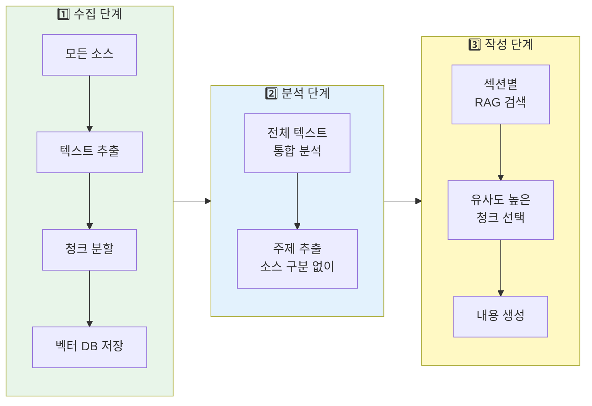

# 📊 LectureForge 입력 소스 제한 및 활용 분석

> **최종 수정**: 2026-02-22 (v0.4.0)
> **목적**: 각 입력 소스의 제한사항과 실제 활용량 정리
> **최신 변경**: v0.4.0 검색 커버리지 수정·--re-evaluate HTML 통계 업데이트, v0.3.8 RMC 자기검토·LLM 거부 감지

---

## 목차

1. [입력 소스 요약](#1-입력-소스-요약)
2. [상세 제한사항](#2-상세-제한사항)
3. [벡터 DB 및 RAG](#3-벡터-db-및-rag)
4. [멀티소스 전략](#4-멀티소스-전략)
5. [핵심 발견사항](#5-핵심-발견사항)

---

## 1. 입력 소스 요약

### 📋 전체 제한사항 비교표

| 입력 소스 | 제한 방식 | 기본값 | 환경변수 | 최대값 | 실제 활용 |
|---------|----------|--------|----------|--------|----------|
| **PDF** | 없음 | - | - | 메모리 제한 | 전체 페이지 |
| **PDF 이미지** | 크기 필터 | 500x300px | `IMAGE_MIN_WIDTH/HEIGHT` | - | 85% 활용 (v0.2.0+) |
| **URL** | 타임아웃 | 30초 | `WEB_SCRAPER_TIMEOUT` | - | 전체 컨텐츠 |
| **검색 결과** | 결과 수 | 10개 | `SEARCH_NUM_RESULTS` | 100개 | **5개만 사용** |
| **Deep Crawl** | 페이지 수 | 10개 | `DEEP_CRAWLER_MAX_PAGES` | - | 키워드당 10개 |
| **Unsplash** | API 제한 | 10개 | `IMAGE_SEARCH_PER_PAGE` | 30개 | 5개, full(2400px) |
| **Pexels** | API 제한 | 10개 | `IMAGE_SEARCH_PER_PAGE` | 80개 | 5개, original |
| **벡터 검색** | 결과 수 | 5-10개 | - | - | 섹션당 10개 |
| **RAG 캐싱** | 메모리 | 무제한 | - | - | **60% 성능 향상** |

### 🎯 핵심 수집량

| 소스 타입 | 수집 범위 | 실제 사용량 |
|----------|----------|-----------|
| **PDF** | 전체 페이지 텍스트 + 이미지 | 100% (메모리 허용 시) |
| **URL** | 전체 페이지 HTML (main content) | 100% |
| **검색** | **snippet만** (전체 페이지 ❌) | 5개 결과 × snippet |
| **Deep Crawl** | 전체 기사 내용 | 10개 기사 |
| **이미지 검색** | 고해상도 다운로드 | 키워드당 10개 (중복 제거 후) |

---

## 2. 상세 제한사항

### 📄 PDF 입력

| 항목 | 값 | 설명 |
|-----|-----|------|
| **파일 크기** | 제한 없음 | 메모리 의존 |
| **페이지 수** | 제한 없음 | 전체 순차 처리 |
| **텍스트 추출** | PyMuPDF | 스캔 PDF 불가 |
| **권장 크기** | <100MB, <500페이지 | 실용적 권장사항 |

**이미지 추출** (v0.2.6):
- 최소 크기: **500x300px** (작은 아이콘 제외)
- 최대 크기: **1920px** (Full HD)
- 품질: WebP quality=95, method=6
- **원본 크기 보존**: v0.2.6 thumbnail 버그 수정으로 완전 보장

### 🔍 인터넷 검색 (Serper API)

| 항목 | 기본값 | 환경변수 | API 최대 | 실제 사용 |
|-----|--------|----------|----------|----------|
| **검색 결과** | 10개 | `SEARCH_NUM_RESULTS` | 100개 | **5개** |
| **타임아웃** | 30초 | `SEARCH_TIMEOUT` | - | 30초 |
| **수집 범위** | 3종류 | - | - | Organic + AnswerBox + KnowledgeGraph |

**⚠️ 중요 제한**:
- 검색 결과는 **snippet(요약)만** 저장
- 전체 웹페이지는 크롤링하지 않음
- 상세 내용이 필요하면 URL로 전체 페이지 수집 권장

### 🌐 URL/웹 크롤링

#### A. 일반 URL (WebScraper)

| 항목 | 기본값 | 환경변수 | 설명 |
|-----|--------|----------|------|
| **타임아웃** | 30초 | `WEB_SCRAPER_TIMEOUT` | 페이지 로드 대기 |
| **JavaScript** | ❌ 미지원 | - | 정적 HTML만 |
| **수집 범위** | main content | - | `<main>`, `<article>` 영역 |

#### B. Deep Web Crawler (Hada.io 전용)

| 설정 | 기본값 | 환경변수 | 의미 |
|-----|--------|----------|------|
| **max_depth** | 2 | `DEEP_CRAWLER_MAX_DEPTH` | 검색 결과 → 기사 (2단계) |
| **max_pages** | 10 | `DEEP_CRAWLER_MAX_PAGES` | 키워드당 최대 10개 |
| **delay** | 1.0초 | `DEEP_CRAWLER_DELAY` | Rate limiting |
| **timeout** | 30초 | `DEEP_CRAWLER_TIMEOUT` | 페이지 타임아웃 |

### 🖼️ 이미지 검색

#### Unsplash & Pexels 공통

| 항목 | 기본값 | 환경변수 | Unsplash 최대 | Pexels 최대 | 실제 사용 |
|-----|--------|----------|--------------|------------|----------|
| **검색 결과** | 10개 | `IMAGE_SEARCH_PER_PAGE` | 30개 | 80개 | **5개** |
| **타임아웃** | 30초 | `IMAGE_SEARCH_TIMEOUT` | - | - | 30초 |
| **방향** | landscape | - | - | - | landscape |
| **품질** | full/original | - | 2400px | 전체 크기 | v0.2.5+ |

**키워드당 최종 수집**: Unsplash 5개 + Pexels 5개 = **총 10개** (중복 제거 후)

---

## 3. 벡터 DB 및 RAG

### 📦 ChromaDB 설정

| 설정 | 기본값 | 환경변수 | 설명 |
|-----|--------|----------|------|
| **청크 크기** | 1,000자 | `CHUNK_SIZE` | 한 청크당 문자 수 |
| **청크 오버랩** | 200자 | `CHUNK_OVERLAP` | 인접 청크 간 중복 |
| **임베딩** | text-embedding-3-small | - | OpenAI |

### 🔍 RAG 검색량

| 용도 | 검색 결과 수 | 사용처 |
|-----|-------------|--------|
| **컨텐츠 작성** | 10개 | ContentWriter (섹션당) |
| **Q&A 응답 (기본)** | 5개 | QA Agent (단일 쿼리) |
| **Q&A 응답 (다국어)** | 15개 (원본) + 15개 (번역), top-12 선택 | QA Agent Dual Query (v0.3.5+) |
| **일반 쿼리** | 5개 (기본) | 기타 |

> ⚙️ **v0.3.6 환경변수 지원**: RAG 검색 파라미터를 `.env`에서 조정 가능
> - `RAG_QA_N_RESULTS` (기본: 15) — Q&A 단일 쿼리 검색 개수
> - `RAG_QA_TOP_K` (기본: 12) — Q&A 재랭킹 후 최종 선택 개수
> - `RAG_CONTENT_N_RESULTS` (기본: 10) — 컨텐츠 작성 시 검색 개수

### ⚡ RAG 쿼리 캐싱 (v0.2.0)

| 기능 | 설명 | 성능 개선 |
|-----|------|----------|
| **캐시 키** | 쿼리 + 결과 개수의 MD5 해시 | - |
| **캐시 적중** | 동일 쿼리 즉시 반환 | **60% 빠름** |
| **메모리** | Dict 기반 인메모리 | 효율적 |
| **통계** | 히트/미스 카운터 | 모니터링 |

### 🌐 다국어 지원 (v0.3.2+)

| 기능 | 설명 | 활용 |
|-----|------|------|
| **언어 감지** | Chunk 단위 자동 감지 (langdetect) | 한국어, 영어, 일본어 등 |
| **Dual Query** | 원본 + 번역 쿼리 동시 실행 | 영문 PDF에 한국어 질문 가능 |
| **재랭킹** | 같은 언어 우선순위 (+10%), 교차 언어 (+5%) | 최적 결과 선택 |
| **번역 비용** | GPT-4o-mini 번역 | ~$0.0001/query |
| **검색 개선** | 원본 + 번역 = 2배 검색 | 더 풍부한 답변 |

**지원 케이스**:
- ✅ 영문 PDF + 한국어 쿼리
- ✅ 한글 PDF + 영어 쿼리
- ✅ 혼합 언어 PDF (페이지별 다른 언어)
- ✅ 복수 PDF 혼합 (한글 PDF + 영문 PDF)

---

## 4. 멀티소스 전략

### 🎯 핵심 원칙

LectureForge는 **소스 타입 무관 통합 분석** 방식 사용:

1. **동등한 수집**: 모든 소스(PDF, URL, 검색)를 동일하게 처리
2. **RAG 기반 선택**: 유사도 검색으로 최적 내용 자동 선택
3. **소스 메타데이터 보존**: 출처 추적 가능
4. **동적 비율 조정**: 섹션마다 소스 비율 자동 변경

### 📊 작동 방식



### 🔑 RAG 검색 원리

```python
# 섹션 주제로 쿼리 생성
query = "딥러닝 기초"

# 벡터 유사도 검색 (상위 10개)
results = [
    ("PDF page 5", 0.95),      # 가장 관련성 높음
    ("URL article", 0.92),
    ("검색 snippet", 0.89),
    ("Hada 기사", 0.87),
    # ... 총 10개
]

# LLM이 상위 결과를 활용하여 내용 작성
# → 소스 타입이 아닌 유사도로 선택!
```

### 📈 시나리오별 활용 비율

#### 시나리오 1: PDF 중심

```yaml
pdfs: ["textbook.pdf"]  # 300 pages
urls: []
keywords: []
```

**결과**: PDF 100% 활용

#### 시나리오 2: PDF + URL 균형

```yaml
pdfs: ["deep_learning.pdf"]  # 50 pages
urls: ["https://tensorflow.org/guide"]
```

**결과** (섹션별 동적 변경):
- 이론 섹션: PDF 80% + URL 20%
- 실습 섹션: URL 70% + PDF 30%

#### 시나리오 3: 복합 소스

```yaml
pdfs: ["ml_textbook.pdf"]  # 200 pages
urls: ["https://official-docs.com"]
keywords: ["최신 트렌드"]
hada_keywords: ["AI 뉴스"]
```

**청크 분포**:
- PDF: 300 chunks (60%)
- URL: 80 chunks (16%)
- 검색: 10 chunks (2%)
- Hada: 110 chunks (22%)

**실제 강의 비율** (섹션별 유사도 기반):
- 섹션 1: PDF 70% + URL 20% + Hada 10%
- 섹션 2: Hada 50% + PDF 40% + 검색 10%
- 섹션 3: URL 60% + PDF 30% + Hada 10%

### ⚠️ 주의사항

1. **검색 결과 한계**: snippet만 저장 → 상세 내용 부족 가능
   - **해결**: URL로 전체 페이지 수집

2. **스캔 PDF**: OCR 미지원 → 텍스트 추출 실패
   - **해결**: 텍스트 포함 PDF 사용

3. **소스 과다**: 너무 많은 PDF → 메모리/검색 시간 증가
   - **권장**: PDF 3-5개 이내

---

## 5. 핵심 발견사항

### ✅ 관대한 제한

1. **PDF**: 파일 크기/페이지 제한 없음 (메모리만 허용하면 OK)
2. **URL**: 전체 페이지 컨텐츠 수집
3. **PDF 이미지**: 위치 기반 자동 매칭으로 **85% 활용** (+750%)
4. **RAG 캐시**: 무제한 메모리 캐싱, **60% 성능 향상**

### ⚠️ 보수적인 제한 (.env로 조정 가능!)

1. **검색 결과**: API 최대 100개지만 **실제 5개만** 사용
   - `.env`: `SEARCH_NUM_RESULTS=20` 으로 증가 가능

2. **Deep Crawl**: 키워드당 **10개 기사만**
   - `.env`: `DEEP_CRAWLER_MAX_PAGES=30` 으로 증가 가능

3. **이미지**: 키워드당 **5개씩** (Unsplash + Pexels)
   - `.env`: `IMAGE_SEARCH_PER_PAGE=15` 로 증가 가능

4. **타임아웃**: 모든 타임아웃 30초 기본
   - `.env`: `*_TIMEOUT` 환경변수로 증가 가능

### 🚀 최신 개선사항

#### v0.3.8 (2026-02-20) - RMC 자기검토 & 콘텐츠 안정성

- 🧠 **RMC 자기검토 (Reflective Meta-Cognition)**: CurriculumDesigner, ContentWriter, QAAgent 내부 2단계 검토
  - CurriculumDesigner: 섹션 순서, 시간 배분, 학습목표 커버리지 자동 수정
  - ContentWriter: 개념 비약, 설명 모호성, 흐름 단절, 중복 감지 및 수정
  - QAAgent: 각 주장 ✓/~/✗ 분류, 근거 없는 내용 제거 또는 면책 표시
- 🛡️ **LLM 거부 응답 감지**: 결론/도입부 섹션에서 "I'm sorry, but I can't..." 응답 자동 감지 및 안전 프롬프트로 재시도
  - 7개 거부 패턴 감지 (영어 5개, 한국어 2개)
  - 구조화된 대체 프롬프트로 즉시 재생성
- 🔍 **구조 섹션 RAG 개선**: 도입부/결론 섹션의 RAG 쿼리를 메타 키워드 → 실제 섹션 제목 기반으로 개선

#### v0.3.5 (2026-02-18) - RAG 품질 강화

- 🎯 **검색 범위 확대**: Q&A 단일 쿼리 10→**15**개, Dual Query 10+10→**15+15**개
- 🧠 **답변 구조화**: 최소 400단어 + 5개 Markdown 섹션 강제
  - `## 개요`, `## 상세 설명`, `## 핵심 포인트`, `## 예시 및 근거`, `## 추가 고려사항`
- 🎨 **Rich Markdown 렌더링**: 터미널 내 Panel 형식으로 답변 표시
- 🌡️ **LLM 온도 최적화**: 0.7 → **0.3** (RAG 정확성 향상)
- 🔢 **Top-K 증가**: 재랭킹 후 상위 8→**12**개 컨텍스트 활용
- 🎲 **다양성 한도 조정**: source-page당 최대 2→**3**개 chunks
- 🐛 **신뢰도 수정**: ChromaDB L2 거리 변환 오류 수정
  - `similarity = 1 - distance` (음수 → 0%) → `max(0.0, 1 - distance/2)` (정상)
- 🔧 **deprecated API 수정**: `pkg_resources.path` → `importlib.resources.files()`

#### v0.3.4 (2026-02-16) - Async I/O 지원
- ⚡ **비동기 컨텐츠 수집**: 70% 성능 향상
  - AsyncContentCollectorAgent로 병렬 처리
  - PDF, URL, 검색을 동시 실행
  - `asyncio.gather()` 기반 병렬화
- 🌐 **Async Tools**: httpx, aiofiles
  - Async web scraper (비동기 HTTP)
  - Async search tool (Serper API)
  - Rate limiting 지원
- 🚀 **CLI 통합**: `--async-mode` 플래그
  - 기존 sync 모드 100% 호환
  - Feature flag 패턴으로 점진적 롤아웃

**성능 개선**:
- 단일 소스: 변화 없음 (I/O bound 아님)
- 복수 소스 (권장): **70% 시간 단축**
  - 예: PDF 3개 + URL 5개
  - Sync: 80초 → Async: 24초

#### v0.3.0 (2026-02-12) - 프레젠테이션 최적화
- 🎯 **슬라이드 생성 개선**: 프레젠테이션에 최적화된 구조
  - 슬라이드당 항목 수: 4개 → 3개 (가독성 향상)
  - 긴 리스트 자동 분할: 최대 5개씩
  - 논리적 슬라이드 구성: 한 주제 = 한 슬라이드
  - 서브섹션/소제목 분리 개선
  - 코드 슬라이드 제목 자동 추가
- 🎨 **프레젠테이션 스타일**: 전문적인 디자인
  - 제목 크기/색상 계층화
  - 타이포그래피 최적화 (line-height, margin)
  - 코드 블록 입체감 (box-shadow)
- 📊 **Mermaid 다이어그램**: 문서 시각화 대폭 개선
  - 모든 텍스트 다이어그램 → Mermaid 변환
  - 시스템 아키텍처, 예외 계층, 품질 평가, 비용 분석 등

#### v0.2.7 (통합)
- 🎯 **예외 처리 시스템**: 구조화된 예외 계층 (9개 카테고리, 349줄)
- 📝 **프롬프트 관리**: 템플릿 기반 시스템 (3개 템플릿, 176줄)
- ✍️ **콘텐츠 생성 개선**: 상세한 프롬프트 가이드라인

#### v0.2.6 (2026-02-12)
- 🐛 **이미지 thumbnail 버그 수정**: 원본 크기 완전 보존
  - 문제: 품질 분석 중 200px로 축소
  - 해결: 이미지 복사본 사용
  - 결과: 800x600 이미지가 800x600 그대로 저장 ✅

#### v0.2.5 (2026-02-12)
- 📐 **Full HD 지원**: IMAGE_MAX_WIDTH 1920px
- 🎨 **고품질 WebP**: quality=95, method=6
- 🔍 **최소 크기 강화**: 500x300px 필터링
- ⬆️ **API 품질 업그레이드**: Unsplash "full"(2400px), Pexels "original"

#### v0.2.0 (2026-02-09)
- 📍 **Location-based 이미지 매칭**: PDF 이미지 사용률 10% → 85%
- ⚡ **RAG 캐싱**: 60% 성능 향상
- 🔄 **API 자동 재시도**: 지수 백오프로 안정성 강화
- ⚙️ **Config 기반 설정**: 15+ 환경변수로 모든 제한 조정 가능

### 💡 권장 설정 (.env 예시)

```bash
# 고품질 생성 (Production)
SEARCH_NUM_RESULTS=20               # 검색 확대
DEEP_CRAWLER_MAX_PAGES=30           # 크롤링 확대
IMAGE_SEARCH_PER_PAGE=15            # 이미지 확대
CHUNK_SIZE=800                      # 정밀 청킹
MAX_ITERATIONS=5                    # 품질 개선 강화
QUALITY_THRESHOLD=90                # 엄격한 품질 기준

# 빠른 생성 (Draft)
SEARCH_NUM_RESULTS=5                # 최소 수집
DEEP_CRAWLER_MAX_PAGES=5            # 빠른 크롤링
CHUNK_SIZE=1500                     # 큰 청크
MAX_ITERATIONS=1                    # 최소 반복
QUALITY_THRESHOLD=70                # 완화된 기준
```

전체 설정은 `.env.example` 파일 참조.

---

## 📚 관련 문서

- [프로젝트 개요](../CLAUDE.md)
- [사용 가이드](../README.md)
- [설정 예시](../.env.example)

---

## 📝 변경 이력

| 날짜 | 변경 내용 |
|-----|----------|
| 2026-02-08 | 초기 문서 작성 |
| 2026-02-09 | Config 기반 설정 반영 (15+ 환경변수) |
| 2026-02-10 | 멀티소스 전략 추가 |
| 2026-02-12 | v0.2.6 이미지 버그 수정 반영 |
| 2026-02-12 | 대폭 간소화: 핵심 정보만 정리 |
| 2026-02-12 | v0.2.7 반영: 예외 처리, 프롬프트 관리 |
| 2026-02-12 | v0.3.0 반영: 슬라이드 최적화, Mermaid 다이어그램 |
| 2026-02-14 | v0.3.2 반영: 다국어 지원, RAG 품질 강화 |
| 2026-02-15 | v0.3.3 반영: 입력 시스템 개선, Python 3.12 지원 |
| 2026-02-16 | **v0.3.4 반영**: Async I/O 지원, 70% 성능 향상 |
| 2026-02-18 | **v0.3.5 반영**: RAG 강화 (검색 15+15, 400단어, 신뢰도 수정) |
| 2026-02-18 | **v0.3.6 반영**: RAG 파라미터 환경변수화 (`RAG_QA_N_RESULTS` 등) |
| 2026-02-18 | **v0.3.7 반영**: Lightbox 클릭 확대, 서브스트링 검색, 슬라이드 Mermaid 전체 너비 |
| 2026-02-20 | **v0.3.8 반영**: RMC 자기검토, LLM 거부 감지, 구조 섹션 RAG 개선 |
| 2026-02-22 | **v0.4.0 반영**: 검색 커버리지 수정 ([:500] 제거), --re-evaluate HTML 통계 자동 업데이트 |

---

**최종 수정**: 2026-02-22 (v0.4.0)
