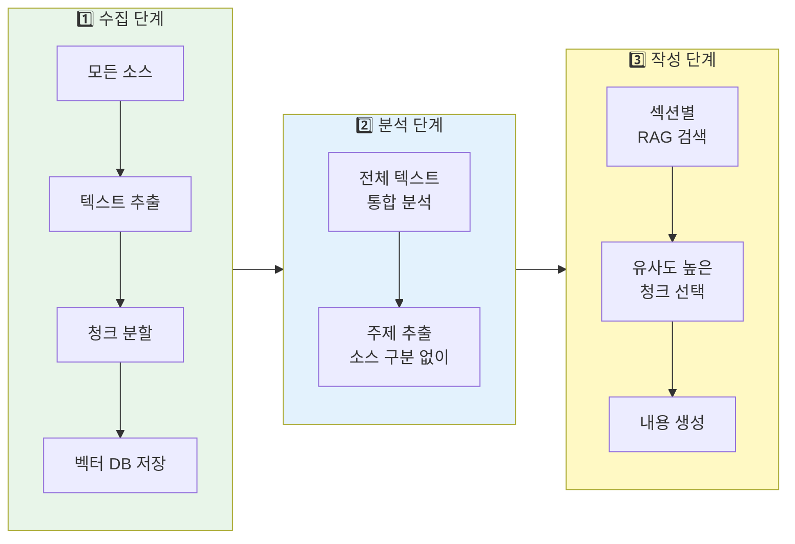

# 📊 LectureForge 입력 소스 제한 및 활용 분석

> **최종 수정**: 2026-03-03 (v0.5.2)
> **목적**: 각 입력 소스의 제한사항과 실제 활용량 정리
> **최신 변경**: v0.5.2 BaseAgent max_tokens·RMC 루프 상한·다이어그램 병렬 생성·검색 전체 페이지 병렬 fetch, v0.5.0 웹 편집기, v0.4.1 translate 명령어

---

## 목차

1. [입력 소스 요약](#1-입력-소스-요약)
2. [상세 제한사항](#2-상세-제한사항)
3. [벡터 DB 및 RAG](#3-벡터-db-및-rag)
4. [멀티소스 전략](#4-멀티소스-전략)
5. [핵심 발견사항](#5-핵심-발견사항)

---

## 1. 입력 소스 요약

### 📋 전체 제한사항 비교표

| 입력 소스 | 제한 방식 | 기본값 | 환경변수 | 최대값 | 실제 활용 |
|---------|----------|--------|----------|--------|----------|
| **PDF** | 없음 | - | - | 메모리 제한 | 전체 페이지 |
| **PDF 이미지** | 크기 필터 | 500x300px | `IMAGE_MIN_WIDTH/HEIGHT` | - | 85% 활용 (v0.2.0+) |
| **URL** | 타임아웃 | 30초 | `WEB_SCRAPER_TIMEOUT` | - | 전체 컨텐츠 |
| **검색 결과** | 결과 수 | 10개 | `SEARCH_NUM_RESULTS` | 100개 | 기본 10개 전량 사용 |
| **검색 전체 페이지** | 병렬 fetch | off (top 3개) | `SEARCH_FETCH_FULL_PAGES` / `SEARCH_FETCH_TOP_N` | - | opt-in (v0.5.2+) |
| **Deep Crawl** | 페이지 수 | 10개 | `DEEP_CRAWLER_MAX_PAGES` | - | 키워드당 10개 |
| **Unsplash** | API 제한 | 10개 | `IMAGE_SEARCH_PER_PAGE` | 30개 | 5개, full(2400px) |
| **Pexels** | API 제한 | 10개 | `IMAGE_SEARCH_PER_PAGE` | 80개 | 5개, original |
| **벡터 검색** | 결과 수 | 10개(작성) / 15개(Q&A) | `RAG_CONTENT_N_RESULTS` / `RAG_QA_N_RESULTS` | - | 섹션당 10개 / Q&A top-12 |
| **RAG 캐싱** | 메모리 | 무제한 | - | - | **60% 성능 향상** |

### 🎯 핵심 수집량

| 소스 타입 | 수집 범위 | 실제 사용량 |
|----------|----------|-----------|
| **PDF** | 전체 페이지 텍스트 + 이미지 | 100% (메모리 허용 시) |
| **URL** | 전체 페이지 HTML (main content) | 100% |
| **검색** | snippet + opt-in 전체 페이지 | `SEARCH_NUM_RESULTS`개 × snippet; 전체 페이지는 `SEARCH_FETCH_FULL_PAGES=true` 시 상위 N개 병렬 fetch |
| **Deep Crawl** | 전체 기사 내용 | 10개 기사 |
| **이미지 검색** | 고해상도 다운로드 | 키워드당 10개 (중복 제거 후) |

---

## 2. 상세 제한사항

### 📄 PDF 입력

| 항목 | 값 | 설명 |
|-----|-----|------|
| **파일 크기** | 제한 없음 | 메모리 의존 |
| **페이지 수** | 제한 없음 | 전체 순차 처리 |
| **텍스트 추출** | PyMuPDF | 스캔 PDF 불가 |
| **권장 크기** | <100MB, <500페이지 | 실용적 권장사항 |

**이미지 추출** (v0.2.6):
- 최소 크기: **500x300px** (작은 아이콘 제외)
- 최대 크기: **1920px** (Full HD)
- 품질: WebP quality=95, method=6
- **원본 크기 보존**: v0.2.6 thumbnail 버그 수정으로 완전 보장

### 🔍 인터넷 검색 (Serper API)

| 항목 | 기본값 | 환경변수 | API 최대 | 실제 사용 |
|-----|--------|----------|----------|----------|
| **검색 결과** | 10개 | `SEARCH_NUM_RESULTS` | 100개 | 기본 10개 전량 사용 |
| **타임아웃** | 30초 | `SEARCH_TIMEOUT` | - | 30초 |
| **수집 범위** | 3종류 | - | - | Organic + AnswerBox + KnowledgeGraph |
| **전체 페이지 fetch** | off | `SEARCH_FETCH_FULL_PAGES` | - | opt-in 병렬 fetch (v0.5.2+) |
| **fetch 대상 수** | 3개 | `SEARCH_FETCH_TOP_N` | - | 상위 N개 URL 병렬 수집 |

**기본 동작 (SEARCH_FETCH_FULL_PAGES=false)**:
- 검색 결과는 **snippet(요약)만** 저장 (각 결과별 개별 문서)
- 전체 웹페이지는 크롤링하지 않음

**opt-in 전체 페이지 fetch (SEARCH_FETCH_FULL_PAGES=true)**:
- 상위 `SEARCH_FETCH_TOP_N`개(기본 3개) URL을 `WebScraperTool`로 **병렬 수집**
- `source_type="search_full"` 문서로 RAG 저장 → 더 풍부한 컨텍스트
- 실패 URL은 경고 후 스킵 (snippet은 항상 보존)

### 🌐 URL/웹 크롤링

#### A. 일반 URL (WebScraper)

| 항목 | 기본값 | 환경변수 | 설명 |
|-----|--------|----------|------|
| **타임아웃** | 30초 | `WEB_SCRAPER_TIMEOUT` | 페이지 로드 대기 |
| **JavaScript** | ❌ 미지원 | - | 정적 HTML만 |
| **수집 범위** | main content | - | `<main>`, `<article>` 영역 |

#### B. Deep Web Crawler (Hada.io 전용)

| 설정 | 기본값 | 환경변수 | 의미 |
|-----|--------|----------|------|
| **max_depth** | 2 | `DEEP_CRAWLER_MAX_DEPTH` | 검색 결과 → 기사 (2단계) |
| **max_pages** | 10 | `DEEP_CRAWLER_MAX_PAGES` | 키워드당 최대 10개 |
| **delay** | 1.0초 | `DEEP_CRAWLER_DELAY` | Rate limiting |
| **timeout** | 30초 | `DEEP_CRAWLER_TIMEOUT` | 페이지 타임아웃 |

### 🖼️ 이미지 검색

#### Unsplash & Pexels 공통

| 항목 | 기본값 | 환경변수 | Unsplash 최대 | Pexels 최대 | 실제 사용 |
|-----|--------|----------|--------------|------------|----------|
| **검색 결과** | 10개 | `IMAGE_SEARCH_PER_PAGE` | 30개 | 80개 | **5개** |
| **타임아웃** | 30초 | `IMAGE_SEARCH_TIMEOUT` | - | - | 30초 |
| **방향** | landscape | - | - | - | landscape |
| **품질** | full/original | - | 2400px | 전체 크기 | v0.2.5+ |

**키워드당 최종 수집**: Unsplash 5개 + Pexels 5개 = **총 10개** (중복 제거 후)

---

## 3. 벡터 DB 및 RAG

### 📦 ChromaDB 설정

| 설정 | 기본값 | 환경변수 | 설명 |
|-----|--------|----------|------|
| **청크 크기** | 1,000자 | `CHUNK_SIZE` | 한 청크당 문자 수 |
| **청크 오버랩** | 200자 | `CHUNK_OVERLAP` | 인접 청크 간 중복 |
| **임베딩** | text-embedding-3-small | - | OpenAI |

### 🔍 RAG 검색량

| 용도 | 검색 결과 수 | 환경변수 | 사용처 |
|-----|-------------|----------|--------|
| **컨텐츠 작성** | 10개 | `RAG_CONTENT_N_RESULTS` | ContentWriter (섹션당) |
| **Q&A 응답 (다국어)** | 15개 (원본) + 15개 (번역), top-12 선택 | `RAG_QA_N_RESULTS` / `RAG_QA_TOP_K` | QA Agent Dual Query (v0.3.5+) |
| **일반 쿼리** | 5개 (기본) | - | 기타 |

> ⚙️ **v0.3.6 환경변수 지원**: RAG 검색 파라미터를 `.env`에서 조정 가능
> - `RAG_QA_N_RESULTS` (기본: 15) — Q&A 단일 쿼리 검색 개수
> - `RAG_QA_TOP_K` (기본: 12) — Q&A 재랭킹 후 최종 선택 개수
> - `RAG_CONTENT_N_RESULTS` (기본: 10) — 컨텐츠 작성 시 검색 개수

### ⚡ RAG 쿼리 캐싱 (v0.2.0)

| 기능 | 설명 | 성능 개선 |
|-----|------|----------|
| **캐시 키** | 쿼리 + 결과 개수의 MD5 해시 | - |
| **캐시 적중** | 동일 쿼리 즉시 반환 | **60% 빠름** |
| **메모리** | Dict 기반 인메모리 | 효율적 |
| **통계** | 히트/미스 카운터 | 모니터링 |

### 🌐 다국어 지원 (v0.3.2+)

| 기능 | 설명 | 활용 |
|-----|------|------|
| **언어 감지** | Chunk 단위 자동 감지 (langdetect) | 한국어, 영어, 일본어 등 |
| **Dual Query** | 원본 + 번역 쿼리 동시 실행 | 영문 PDF에 한국어 질문 가능 |
| **재랭킹** | 같은 언어 우선순위 (+10%), 교차 언어 (+5%) | 최적 결과 선택 |
| **번역 비용** | GPT-4o-mini 번역 | ~$0.0001/query |
| **검색 개선** | 원본 + 번역 = 2배 검색 | 더 풍부한 답변 |

**지원 케이스**:
- ✅ 영문 PDF + 한국어 쿼리
- ✅ 한글 PDF + 영어 쿼리
- ✅ 혼합 언어 PDF (페이지별 다른 언어)
- ✅ 복수 PDF 혼합 (한글 PDF + 영문 PDF)

---

## 4. 멀티소스 전략

### 🎯 핵심 원칙

LectureForge는 **소스 타입 무관 통합 분석** 방식 사용:

1. **동등한 수집**: 모든 소스(PDF, URL, 검색)를 동일하게 처리
2. **RAG 기반 선택**: 유사도 검색으로 최적 내용 자동 선택
3. **소스 메타데이터 보존**: 출처 추적 가능
4. **동적 비율 조정**: 섹션마다 소스 비율 자동 변경

### 📊 작동 방식



### 🔑 RAG 검색 원리

```python
# 섹션 주제로 쿼리 생성
query = "딥러닝 기초"

# 벡터 유사도 검색 (상위 10개)
results = [
    ("PDF page 5", 0.95),      # 가장 관련성 높음
    ("URL article", 0.92),
    ("검색 snippet", 0.89),
    ("Hada 기사", 0.87),
    # ... 총 10개
]

# LLM이 상위 결과를 활용하여 내용 작성
# → 소스 타입이 아닌 유사도로 선택!
```

### 📈 시나리오별 활용 비율

#### 시나리오 1: PDF 중심

```yaml
pdfs: ["textbook.pdf"]  # 300 pages
urls: []
keywords: []
```

**결과**: PDF 100% 활용

#### 시나리오 2: PDF + URL 균형

```yaml
pdfs: ["deep_learning.pdf"]  # 50 pages
urls: ["https://tensorflow.org/guide"]
```

**결과** (섹션별 동적 변경):
- 이론 섹션: PDF 80% + URL 20%
- 실습 섹션: URL 70% + PDF 30%

#### 시나리오 3: 복합 소스

```yaml
pdfs: ["ml_textbook.pdf"]  # 200 pages
urls: ["https://official-docs.com"]
keywords: ["최신 트렌드"]
hada_keywords: ["AI 뉴스"]
```

**청크 분포**:
- PDF: 300 chunks (60%)
- URL: 80 chunks (16%)
- 검색: 10 chunks (2%)
- Hada: 110 chunks (22%)

**실제 강의 비율** (섹션별 유사도 기반):
- 섹션 1: PDF 70% + URL 20% + Hada 10%
- 섹션 2: Hada 50% + PDF 40% + 검색 10%
- 섹션 3: URL 60% + PDF 30% + Hada 10%

---

## 📚 관련 문서

- [프로젝트 개요](../CLAUDE.md)
- [사용 가이드](../README.md)
- [설정 예시](../.env.example)

---

**최종 수정**: 2026-03-03 (v0.5.2)
