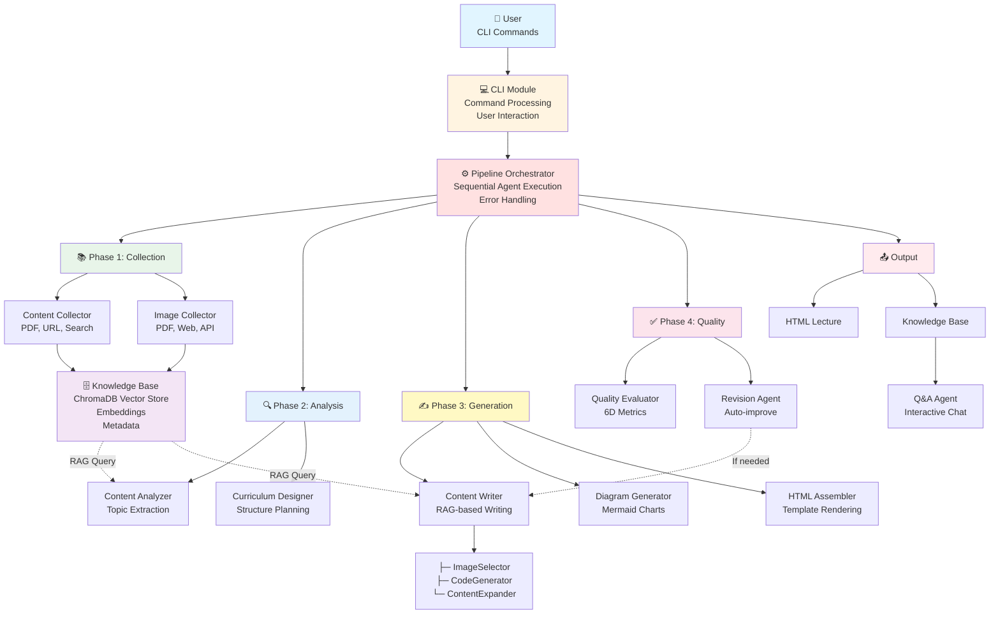

# System Architecture Overview

High-level architecture of the LectureForge system.

## Table of Contents

1. [Architecture Principles](#architecture-principles)
2. [System Diagram](#system-diagram)
3. [Component Overview](#component-overview)
4. [Data Flow](#data-flow)
5. [Technology Stack](#technology-stack)
6. [Recent Refactoring](#recent-refactoring)

---

## Architecture Principles

LectureForge follows these architectural principles:

### 1. Multi-Agent Pattern
- **10 specialized agents** each handle a specific task
- **Sequential pipeline** with clear data flow (async support in v0.3.4+)
- **Separation of concerns** - each agent has one responsibility
- **Async I/O support** - 70% faster content collection with parallel operations

### 2. RAG-First Design
- **ChromaDB vector store** at the core
- **Retrieval Augmented Generation** for all content
- **Hybrid search** (semantic + keyword)

### 3. Modular Architecture
- **Plugin-based tools** (PDF, web, images)
- **Swappable components** (LLM, embeddings)
- **Clean interfaces** between modules

### 4. Quality-Driven
- **Iterative improvement** with quality feedback
- **6-dimensional evaluation** metrics
- **Automated revision** loops

---

## System Diagram



---

## Component Overview

### 1. CLI Layer
**Purpose**: User interaction and command processing

**Components:**
- `cli/__init__.py` - Main entry point
- `cli/commands/` - 7 command modules
- `cli/utils/` - Shared utilities

**Responsibilities:**
- Parse user input
- Validate arguments
- Display progress
- Handle errors gracefully

### 2. Agent Layer
**Purpose**: Business logic and task execution

**10+ Agents:**
1. **ContentCollectorAgent** - Collect text from PDFs/URLs/search
2. **AsyncContentCollectorAgent** - Async version (70% faster, v0.3.4+)
3. **ImageCollectorAgent** - Collect images from multiple sources
4. **ContentAnalyzerAgent** - Extract topics and entities
5. **CurriculumDesignerAgent** - Design lecture structure
6. **ContentWriterAgent** - Write content using RAG (refactored)
7. **DiagramGeneratorAgent** - Generate Mermaid diagrams
8. **HTMLAssemblerAgent** - Assemble final HTML
9. **QualityEvaluatorAgent** - Evaluate quality (6 dimensions)
10. **RevisionAgent** - Improve content
11. **QAAgent** - Interactive Q&A with RAG

**Responsibilities:**
- Execute specific tasks
- Use RAG for content generation
- Maintain quality standards
- Handle errors and retries

### 3. Knowledge Layer
**Purpose**: Vector storage and RAG

**Components:**
- `knowledge/vector_store.py` - ChromaDB wrapper
- `knowledge/retriever.py` - RAG retrieval
- `knowledge/chunker.py` - Text chunking

**Responsibilities:**
- Store text chunks with embeddings
- Perform semantic search
- Cache query results (v0.3.2)
- Support multilingual search (v0.3.2)

### 4. Tools Layer
**Purpose**: External integrations

**9 Tools:**
1. **PDFProcessor** - Extract text/images from PDFs
2. **WebScraper** - Scrape web content
3. **SearchTool** - Web search (Serper API)
4. **ImageSearchTool** - Image APIs (Pexels, Unsplash)
5. **ImageDescriber** - GPT-4o Vision descriptions
6. **ImageEditor** - Interactive image editing
7. **SlideConverter** - Convert to Reveal.js slides
8. **LanguageDetector** - Detect text language (v0.3.2)
9. **Translator** - Cross-lingual translation (v0.3.2)

### 5. Models Layer
**Purpose**: Data structures

**Key Models:**
- `Curriculum` - Lecture structure plan
- `Section` - Individual lecture section
- `SectionContent` - Generated content
- `Lecture` - Complete lecture object
- `ImageReference` - Image metadata
- `CodeBlock` - Code example
- `QualityEvaluation` - Quality metrics

### 6. Utilities Layer
**Purpose**: Common utilities

**Components:**
- `logger` - Structured logging
- `token_tracker` - Track LLM usage
- `content_metrics` - Quality calculation
- `prompt_manager` - Template-based prompts
- `language_utils` - Language detection/translation

---

## Data Flow

### 1. Lecture Generation Flow

```
User Input (topic, duration, sources)
    ↓
ContentCollector (PDFs, URLs, Search)
    ↓
ChromaDB (text chunks + embeddings)
    ↓
ImageCollector (PDFs, Web, APIs)
    ↓
Image Directory + Metadata
    ↓
ContentAnalyzer (RAG query → topics/entities)
    ↓
CurriculumDesigner (structure planning)
    ├─ [RMC] _review_with_rmc: section order, objective coverage, prerequisites
    └─ Apply: reorder sections, revise objectives
    ↓
ContentWriter (RAG query → write sections)
    ├─ ImageSelector (select relevant images)
    ├─ CodeGenerator (generate code examples)
    ├─ ContentExpander (improve quality)
    └─ [RMC] _review_content_with_rmc: conceptual leaps, clarity, flow, repetition
    ↓
DiagramGenerator (create Mermaid diagrams)
    ↓
HTMLAssembler (render template)
    ↓
QualityEvaluator (6D metrics)
    ↓
RevisionAgent (if score < threshold)
    ↓
Final HTML Lecture + Knowledge Base
```

### 2. Q&A Flow (v0.3.5 Enhanced)

```
User Question
    ↓
Language Detection (ko/en/ja/zh)
    ↓
Dual Query Generation
    ├─ Original query (15 chunks)
    └─ Translated query (15 chunks, if cross-lingual)
    ↓
RAG Retrieval (top-12 after reranking)
    ↓
Diversity Reranking
    ├─ Max 3 chunks per source-page
    └─ Same-language bonus (+10%)
    ↓
Chain of Thought Generation (temperature=0.3)
    ├─ Structured answer: 5 Markdown sections
    └─ Min 400 words enforced
    ↓
Answer Post-processing
    ├─ Expand if too short (<200 chars)
    └─ Extract partial info if incomplete
    ↓
[RMC] _review_answer_with_rmc (v0.3.8)
    ├─ Classify each claim: ✓ (supported) / ~ (inferable) / ✗ (hallucination)
    └─ Remove or flag ✗ items with source-language disclaimer
    ↓
Confidence Calculation (ChromaDB L2 distance corrected)
    ├─ Search quality (30%)
    ├─ Result count (25%)
    ├─ Answer length (25%)
    └─ Uncertainty detection (20%)
    ↓
Rich Panel Rendering + Sources + Confidence
    ↓
Logged to conversation_log.txt (v0.3.6+)
```

---

## Technology Stack

### Core Technologies

| Category | Technology | Purpose |
|----------|-----------|---------|
| **Language** | Python 3.11-3.13 | Main language |
| **Framework** | LangChain | LLM orchestration |
| **LLM** | OpenAI GPT-4o-mini | Content generation |
| **Vector DB** | ChromaDB | Embeddings storage |
| **Embeddings** | text-embedding-3-small | Semantic search |
| **CLI** | Click + Rich + prompt-toolkit | User interface |
| **Async I/O** | asyncio + httpx + aiofiles | Parallel operations (v0.3.4+) |
| **Web** | Playwright | Web scraping |
| **PDF** | PyPDF2 | PDF processing |
| **Images** | PIL/Pillow | Image processing |
| **Diagrams** | Mermaid | Diagram generation |
| **Templates** | Jinja2 | HTML templating |

### New Dependencies (v0.3.2+)

| Library | Purpose |
|---------|---------|
| `langdetect` | Language detection |
| `rich-click` | Enhanced CLI help |
| `prompt-toolkit` | Enhanced input system (v0.3.3+) |
| `httpx` | Async HTTP client (v0.3.4+) |
| `aiofiles` | Async file I/O (v0.3.4+) |

### Development Tools

| Tool | Purpose |
|------|---------|
| `pytest` | Testing framework |
| `mypy` | Type checking |
| `black` | Code formatting |
| `ruff` | Fast linting |

---

## Recent Refactoring

### v0.3.0-0.3.4: Major Architecture Improvements

#### 1. CLI Refactoring (v0.3.0)
**Before**: Single file (3,603 lines)
**After**: Modular structure (13 files, 2,993 lines total)

**Impact:**
- ✅ Main file reduced by 95.4% (3,603 → 133 lines)
- ✅ 7 independent command modules
- ✅ 3 utility modules
- ✅ Better testability

#### 2. ContentWriter Refactoring (v0.3.1)
**Before**: Single class (1,611 lines, 24 methods)
**After**: 4 component classes (1,761 lines total)

**Components:**
- `agent.py` (519 lines) - Core orchestrator
- `image_selector.py` (955 lines) - Image selection
- `code_generator.py` (127 lines) - Code handling
- `content_expander.py` (139 lines) - Quality improvement

**Impact:**
- ✅ Main class reduced by 67.8%
- ✅ Single Responsibility Principle
- ✅ Easier to test independently
- ✅ Reusable components

#### 3. Slide Module Extraction (v0.3.0)
**Before**: Embedded in CLI (720 lines)
**After**: Dedicated module (798 lines)

**Components:**
- `parser.py` - HTML parsing
- `templates.py` - Reveal.js generation
- `converter.py` - Orchestration
- `utils.py` - Utilities

#### 4. Multilingual Support (v0.3.2)
**New Components:**
- Language detection per chunk
- Cross-lingual search (dual query)
- Translation integration
- Reranking with language bonuses

#### 5. RAG Quality Enhancements (v0.3.2)
**New Features:**
- Chain of Thought reasoning
- Diversity-based reranking
- Answer post-processing
- Dynamic confidence scoring

#### 6. Async I/O Architecture (v0.3.4)
**New Components:**
- `AsyncBaseAgent` - Base class with ThreadPoolExecutor
- `AsyncContentCollectorAgent` - Parallel content collection
- Concurrency control with semaphores
- Rate limiting per service
- `gather_with_concurrency()` pattern

**Performance Improvements:**
- Single source: ~same as sync (no parallelization benefit)
- Multiple sources: **70% faster** through parallel I/O
- Example: 3 PDFs + 5 URLs: sync 80s → async 24s

#### 7. RMC Self-Review (v0.3.8)
**Pattern**: Each modified agent calls an internal `_review_with_rmc()` / `_review_content_with_rmc()` / `_review_answer_with_rmc()` method **after** LLM generation, **before** the next pipeline stage.

**Two-layer structure**:
- Layer 1: Domain-specific quality check (5 criteria)
- Layer 2: Review of the review (prevent over-correction)

**Agents updated:**
- `CurriculumDesignerAgent` — section ordering, objective coverage, prerequisite logic
- `ContentWriterAgent` — conceptual leaps, clarity, flow, repetition
- `QAAgent` — hallucination grounding (✓/~/✗ per claim)

**Design principles:**
- All RMC methods wrapped in try/except → pipeline never fails due to RMC
- Word-count validation guards against LLM returning meta-evaluation text
- Uses `self.invoke_llm(phase="[agent]_rmc_review")` for token tracking

---

## Performance Characteristics

### Typical Execution Time (60-min lecture)

| Phase | Sync Time | Async Time (v0.3.4+) | % |
|-------|-----------|----------------------|---|
| Content Collection | 30-60s | **10-20s (-70%)** | 15% |
| Image Collection | 20-40s | 20-40s | 10% |
| Content Analysis | 10-20s | 10-20s | 5% |
| Curriculum Design | 5-10s | 5-10s | 2% |
| Content Writing | 120-180s | 120-180s | 50% |
| Diagram Generation | 10-20s | 10-20s | 5% |
| HTML Assembly | 5-10s | 5-10s | 2% |
| Quality Evaluation | 20-30s | 20-30s | 8% |
| Revision (if needed) | 30-60s | 30-60s | 8% |
| **Total** | **3-6 minutes** | **2-4 minutes** | **100%** |

### Resource Usage

- **Memory**: ~500MB-1GB (peak)
- **Disk**: ~50MB per lecture (vector DB)
- **API Calls**: ~100-200 LLM requests
- **Cost**: ~$0.035 per 60-min lecture (actual measured)

---

## Scalability Considerations

### Current Limitations

1. **Single-machine**: No distributed processing
2. **Sequential pipeline**: Mostly sequential (async I/O in v0.3.4+)
3. **Memory-bound**: ChromaDB in-memory
4. **API rate limits**: OpenAI rate limits apply

### Future Scalability Options

1. **Parallel Content Writing**: Process sections in parallel
2. **Distributed Vector Store**: Use remote ChromaDB/Pinecone
3. **Batch Processing**: Queue multiple lectures
4. **Caching**: Cache LLM responses aggressively

---

## Security Considerations

### API Key Management
- ✅ Environment variables (.env)
- ✅ Never committed to git
- ✅ Masked input for sensitive data
- ✅ File permissions (600 on .env)

### Input Validation
- ✅ PDF parsing sandboxed
- ✅ URL validation before scraping
- ✅ File path sanitization
- ✅ SQL injection prevention (none used)

### Output Sanitization
- ✅ HTML escaping in templates
- ✅ Safe Mermaid diagram rendering
- ✅ Image path validation

---

### v0.3.8: RMC Self-Review

**What changed**: Added `_review_with_rmc()` / `_review_content_with_rmc()` / `_review_answer_with_rmc()` to `CurriculumDesignerAgent`, `ContentWriterAgent`, and `QAAgent` respectively.

**Why**: External quality loops (QualityEvaluator) only run after full HTML assembly. RMC adds per-agent semantic quality checks inside the generation step itself — catching curriculum logic errors, content meaning issues, and answer hallucinations before they propagate downstream.

### v0.3.7: UI & Slides Enhancement

#### 7. Lightbox (Click-to-Zoom)
- **Images**: Click any `<figure img>` to open full-screen modal with zoom
- **Mermaid diagrams**: `cloneNode(true)` removes Mermaid's inline `max-width`, SVG fills `min(92vw, 1400px)`
- Async Mermaid render handled with polling retries (300ms / 800ms / 2000ms)
- ESC and backdrop click to close

#### 8. Substring Search (replaces Lunr.js)
- Lunr.js `\W` trimmer silently dropped all Korean tokens (treated as non-word characters)
- Replaced with `String.prototype.includes()` for Korean and English mixed search

#### 9. Slides: Mermaid Full-Width Fix
- `section { align-items: flex-start }` caused `.mermaid` div to shrink to content width (~300px)
- Fix: `.reveal .mermaid { width: 100%; box-sizing: border-box; }` breaks the circular dependency
- Result: diagrams render at full slide width (~1180px)

#### 10. Slides: Mermaid 10 API Fix
- `startOnLoad: true` + `mermaid.contentLoaded()` → `startOnLoad: false` + `mermaid.run()`
- Added `useMaxWidth: true` per diagram type (flowchart, sequence, gantt, etc.)

---

### v0.3.6: Code Quality & Reliability

#### 11. Retry Utility Extraction
**New**: `utils/retry.py` — `make_api_retry(service_name)` factory

#### 12. BaseImageSearchTool Extraction
Unsplash/Pexels shared `_download_and_save_image()` and `_error_response()` via base class.

#### 13. Config Centralization
- RAG parameters env-configurable: `RAG_QA_N_RESULTS`, `RAG_QA_TOP_K`, `RAG_CONTENT_N_RESULTS`
- Config validation: `IMAGE_WEIGHT_*` and `CONTENT_*_RATIO` must sum to 1.0

#### 14. Bug Fixes
- `BaseAgent.temperature=0.0` falsy bug fixed (used `or` operator)
- `QAAgent` hardcoded home directory replaced with `Config.USER_CONFIG_DIR`

#### 15. Chat Logging
- `conversation_log.txt` now records both user questions and AI responses

---

**Last Updated**: 2026-02-19
**Version**: 0.3.8
